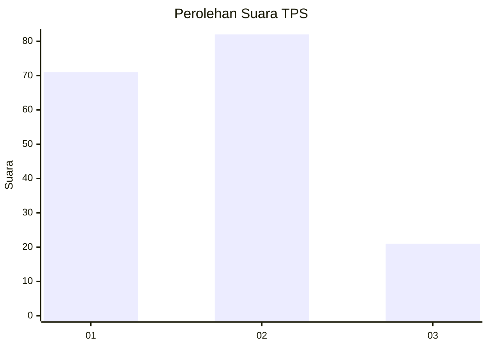
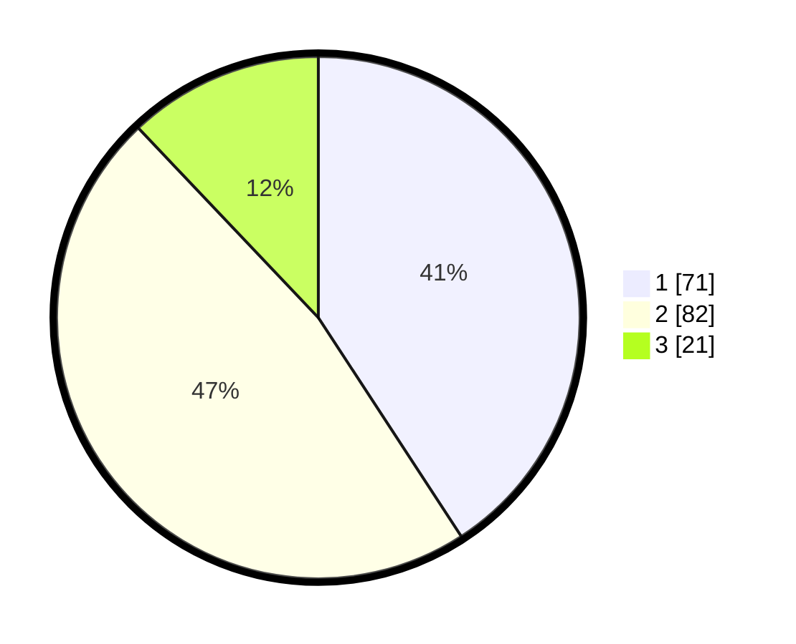

# Hasil

## Grafik

## Tabel

| No. | Nama Paslon    | Suara | Suara (raw) | Persentase |
|:--- |:-------------- | -----:| -----------:| ----------:|
| 1   | ANIES MUHAIMIN | 71    | [71][p-1]   | 40,80      |
| 2   | PRABOWO GIBRAN | 82    | [82][p-2]   | 47,13      |
| 3   | GANJAR MAHFUD  | 21    | [21][p-3]   | 12,07      |

[p-1]: https://github.com/gigit-pemilu/pemilu-2024-35-jawa-timur/blob/main/pilpres/hitung-suara/sub/35-jawa-timur/sub/09-jember/sub/03-sumberbaru/sub/2005-yosorati/sub/038-tps/sub/paslon-1.txt
[p-2]: https://github.com/gigit-pemilu/pemilu-2024-35-jawa-timur/blob/main/pilpres/hitung-suara/sub/35-jawa-timur/sub/09-jember/sub/03-sumberbaru/sub/2005-yosorati/sub/038-tps/sub/paslon-2.txt
[p-3]: https://github.com/gigit-pemilu/pemilu-2024-35-jawa-timur/blob/main/pilpres/hitung-suara/sub/35-jawa-timur/sub/09-jember/sub/03-sumberbaru/sub/2005-yosorati/sub/038-tps/sub/paslon-3.txt

## Foto C Plano

https://sirekap-obj-formc.kpu.go.id/7f82/pemilu/ppwp/35/09/03/20/05/3509032005038-20240214-213149--9bef0730-f61b-46c9-8a68-9c25fc16b61b.jpg

https://sirekap-obj-formc.kpu.go.id/7f82/pemilu/ppwp/35/09/03/20/05/3509032005038-20240214-213244--4e91ffe0-380f-4c52-a4c8-2a59b8a38282.jpg

https://sirekap-obj-formc.kpu.go.id/7f82/pemilu/ppwp/35/09/03/20/05/3509032005038-20240214-212953--b81681af-ce34-4095-b4c1-d57bb7680e91.jpg

## Metadata

| Key        | Value               |
| ---------- | ------------------- |
| Time Stamp | 2024-02-16 12:51:22 |

