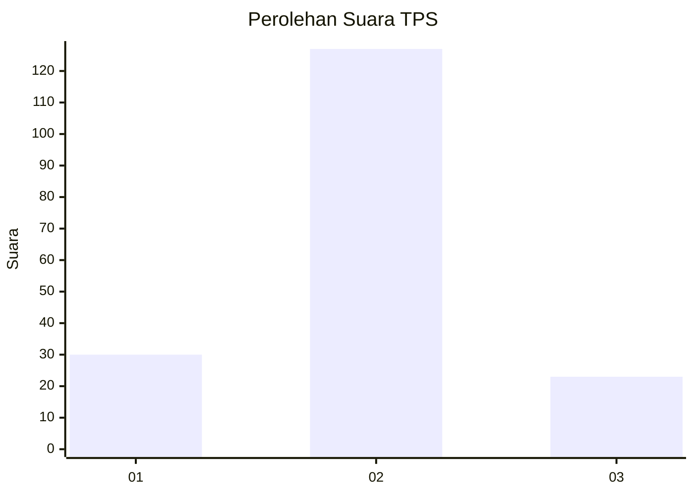
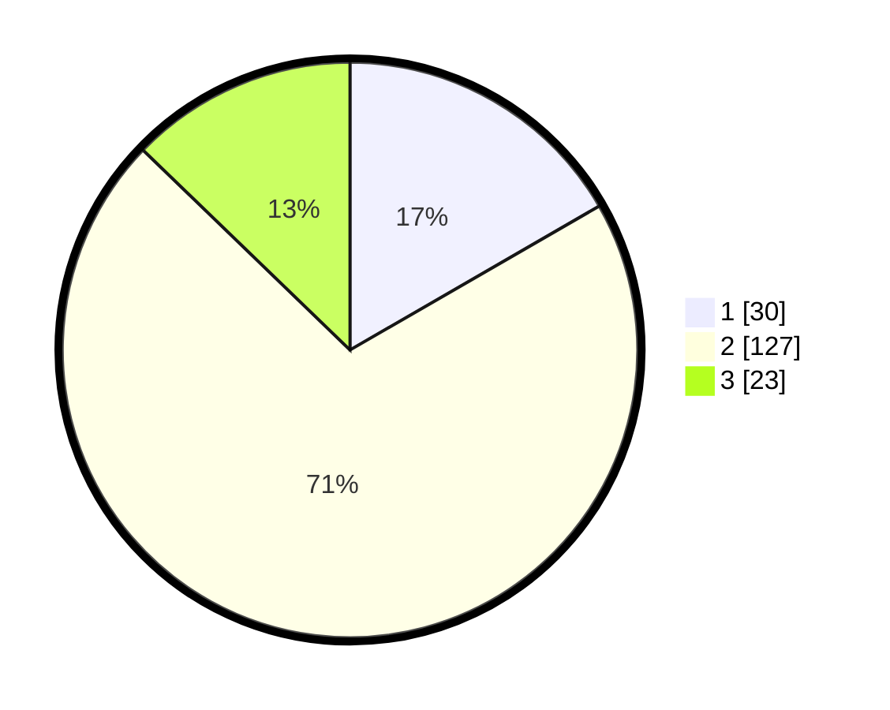

# Hasil

## Grafik

## Tabel

| No. | Nama Paslon    | Suara | Suara (raw) | Persentase |
|:--- |:-------------- | -----:| -----------:| ----------:|
| 1   | ANIES MUHAIMIN | 30    | [30][p-1]   | 16,67      |
| 2   | PRABOWO GIBRAN | 127   | [127][p-2]  | 70,56      |
| 3   | GANJAR MAHFUD  | 23    | [23][p-3]   | 12,78      |

[p-1]: https://github.com/gigit-pemilu/pemilu-2024/blob/main/pilpres/hitung-suara/sub/35-jawa-timur/sub/09-jember/sub/03-sumberbaru/sub/2005-yosorati/sub/040-tps/sub/paslon-1.txt
[p-2]: https://github.com/gigit-pemilu/pemilu-2024/blob/main/pilpres/hitung-suara/sub/35-jawa-timur/sub/09-jember/sub/03-sumberbaru/sub/2005-yosorati/sub/040-tps/sub/paslon-2.txt
[p-3]: https://github.com/gigit-pemilu/pemilu-2024/blob/main/pilpres/hitung-suara/sub/35-jawa-timur/sub/09-jember/sub/03-sumberbaru/sub/2005-yosorati/sub/040-tps/sub/paslon-3.txt

## Foto C Plano

https://sirekap-obj-formc.kpu.go.id/03a5/pemilu/ppwp/35/09/03/20/05/3509032005040-20240214-200241--2b20e9e4-5060-4b6c-b2e4-f0b2903a4669.jpg

https://sirekap-obj-formc.kpu.go.id/03a5/pemilu/ppwp/35/09/03/20/05/3509032005040-20240214-200522--73fe9315-ba63-4452-84b8-8bcdaa6ace4d.jpg

https://sirekap-obj-formc.kpu.go.id/03a5/pemilu/ppwp/35/09/03/20/05/3509032005040-20240214-200701--c93eb22d-291f-499a-a735-da7bf1ebe6ca.jpg

## Metadata

| Key        | Value               |
| ---------- | ------------------- |
| Time Stamp | 2024-02-15 15:00:29 |

