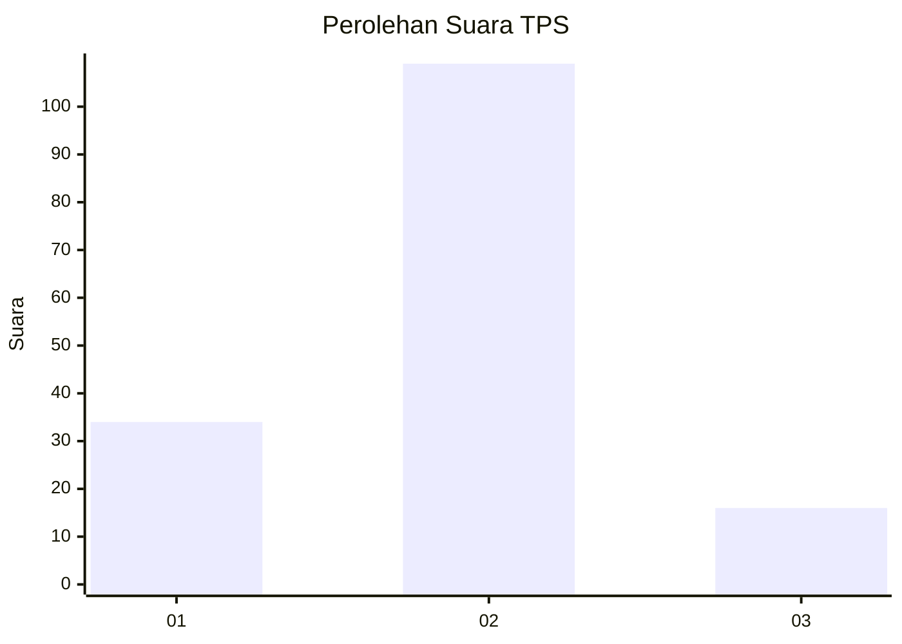

# Hasil

## Grafik

## Tabel

| No. | Nama Paslon    | Suara | Suara (raw) | Persentase |
|:--- |:-------------- | -----:| -----------:| ----------:|
| 1   | ANIES MUHAIMIN | 34    | [34][p-1]   | 21,38      |
| 2   | PRABOWO GIBRAN | 109   | [109][p-2]  | 68,55      |
| 3   | GANJAR MAHFUD  | 16    | [16][p-3]   | 10,06      |

[p-1]: https://github.com/gigit-pemilu/pemilu-2024/blob/main/pilpres/hitung-suara/sub/35-jawa-timur/sub/09-jember/sub/03-sumberbaru/sub/2005-yosorati/sub/044-tps/sub/paslon-1.txt
[p-2]: https://github.com/gigit-pemilu/pemilu-2024/blob/main/pilpres/hitung-suara/sub/35-jawa-timur/sub/09-jember/sub/03-sumberbaru/sub/2005-yosorati/sub/044-tps/sub/paslon-2.txt
[p-3]: https://github.com/gigit-pemilu/pemilu-2024/blob/main/pilpres/hitung-suara/sub/35-jawa-timur/sub/09-jember/sub/03-sumberbaru/sub/2005-yosorati/sub/044-tps/sub/paslon-3.txt

## Foto C Plano

https://sirekap-obj-formc.kpu.go.id/a6a3/pemilu/ppwp/35/09/03/20/05/3509032005044-20240214-205217--baa302cc-752c-4c79-8d02-5774e0e9b31d.jpg

https://sirekap-obj-formc.kpu.go.id/a6a3/pemilu/ppwp/35/09/03/20/05/3509032005044-20240214-205332--75ccd420-1df3-4cad-924a-cd8fc3f448bf.jpg

https://sirekap-obj-formc.kpu.go.id/a6a3/pemilu/ppwp/35/09/03/20/05/3509032005044-20240214-205528--f9c61808-d88c-40f9-b773-9a6c9fa8d563.jpg

## Metadata

| Key        | Value               |
| ---------- | ------------------- |
| Time Stamp | 2024-02-15 12:00:28 |

