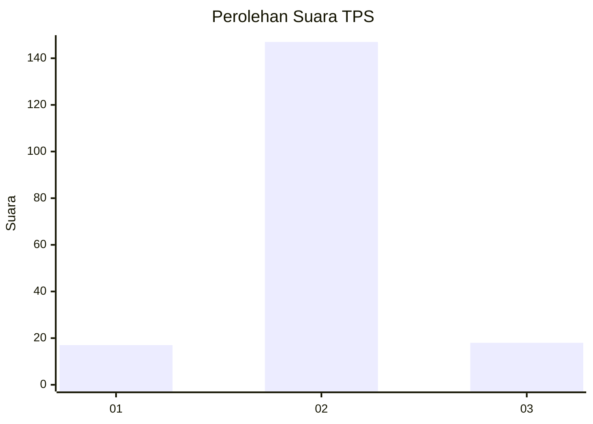
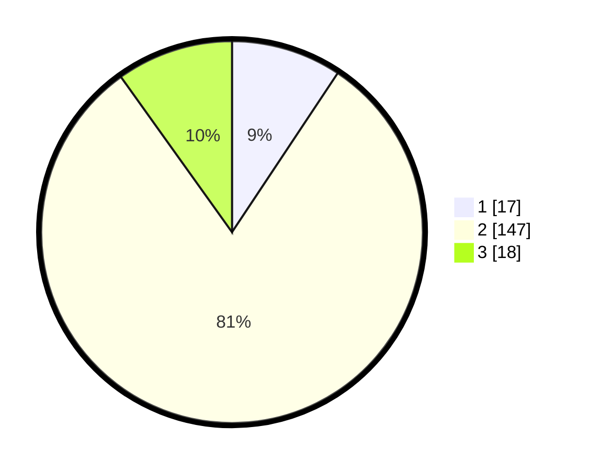

# Hasil

## Grafik

## Tabel

| No. | Nama Paslon    | Suara | Suara (raw) | Persentase |
|:--- |:-------------- | -----:| -----------:| ----------:|
| 1   | ANIES MUHAIMIN | 17    | [17][p-1]   | 9,34       |
| 2   | PRABOWO GIBRAN | 147   | [147][p-2]  | 80,77      |
| 3   | GANJAR MAHFUD  | 18    | [18][p-3]   | 9,89       |

[p-1]: https://github.com/gigit-pemilu/pemilu-2024-35-jawa-timur/blob/main/pilpres/hitung-suara/sub/35-jawa-timur/sub/09-jember/sub/03-sumberbaru/sub/2005-yosorati/sub/048-tps/sub/paslon-1.txt
[p-2]: https://github.com/gigit-pemilu/pemilu-2024-35-jawa-timur/blob/main/pilpres/hitung-suara/sub/35-jawa-timur/sub/09-jember/sub/03-sumberbaru/sub/2005-yosorati/sub/048-tps/sub/paslon-2.txt
[p-3]: https://github.com/gigit-pemilu/pemilu-2024-35-jawa-timur/blob/main/pilpres/hitung-suara/sub/35-jawa-timur/sub/09-jember/sub/03-sumberbaru/sub/2005-yosorati/sub/048-tps/sub/paslon-3.txt

## Foto C Plano

https://sirekap-obj-formc.kpu.go.id/2c63/pemilu/ppwp/35/09/03/20/05/3509032005048-20240215-022000--33ca0a9f-8bcd-4274-9532-51b97700f9d0.jpg

https://sirekap-obj-formc.kpu.go.id/2c63/pemilu/ppwp/35/09/03/20/05/3509032005048-20240214-214509--0a9712fd-9929-40ff-b35b-919c5bcd8de9.jpg

https://sirekap-obj-formc.kpu.go.id/2c63/pemilu/ppwp/35/09/03/20/05/3509032005048-20240214-214600--31993822-ddb3-47c8-99e4-e624545e9db8.jpg

## Metadata

| Key        | Value               |
| ---------- | ------------------- |
| Time Stamp | 2024-02-15 15:00:29 |

