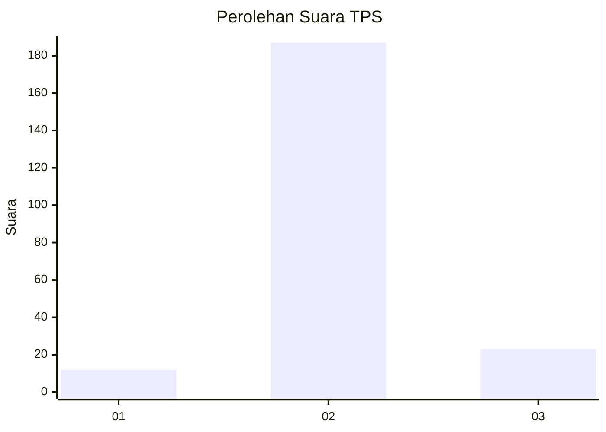
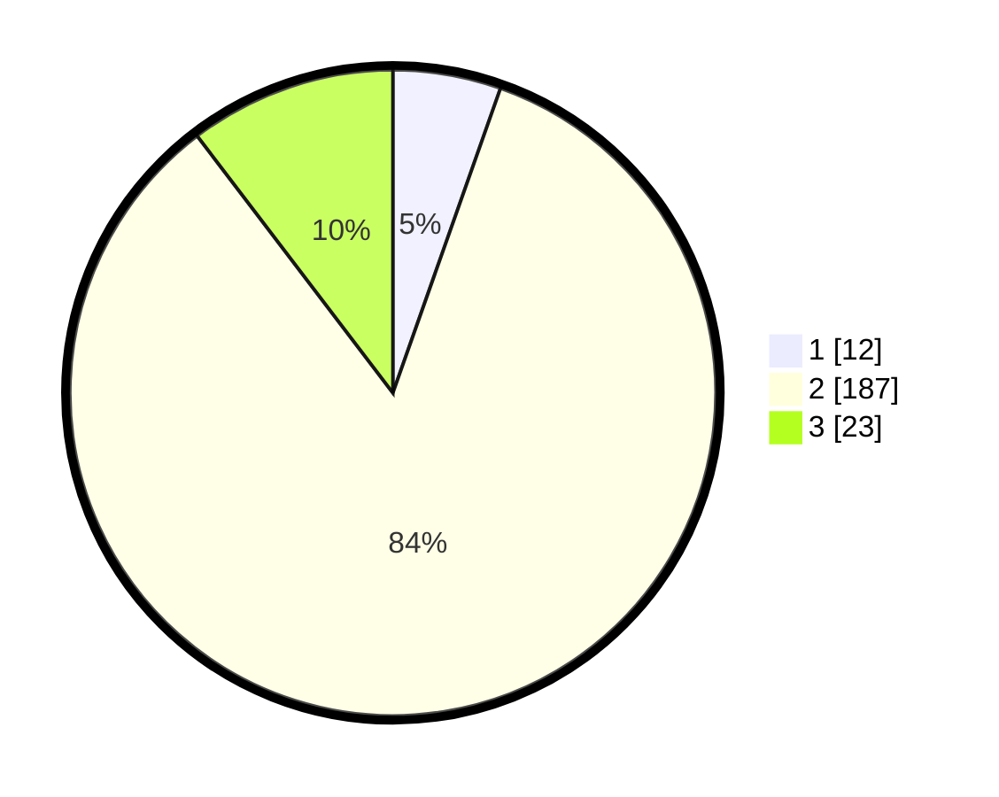

# Hasil

## Grafik

## Tabel

| No. | Nama Paslon    | Suara | Suara (raw) | Persentase |
|:--- |:-------------- | -----:| -----------:| ----------:|
| 1   | ANIES MUHAIMIN | 12    | [12][p-1]   | 5,41       |
| 2   | PRABOWO GIBRAN | 187   | [187][p-2]  | 84,23      |
| 3   | GANJAR MAHFUD  | 23    | [23][p-3]   | 10,36      |

[p-1]: https://github.com/gigit-pemilu/pemilu-2024/blob/main/pilpres/hitung-suara/sub/35-jawa-timur/sub/09-jember/sub/03-sumberbaru/sub/2006-sumberagung/sub/011-tps/sub/paslon-1.txt
[p-2]: https://github.com/gigit-pemilu/pemilu-2024/blob/main/pilpres/hitung-suara/sub/35-jawa-timur/sub/09-jember/sub/03-sumberbaru/sub/2006-sumberagung/sub/011-tps/sub/paslon-2.txt
[p-3]: https://github.com/gigit-pemilu/pemilu-2024/blob/main/pilpres/hitung-suara/sub/35-jawa-timur/sub/09-jember/sub/03-sumberbaru/sub/2006-sumberagung/sub/011-tps/sub/paslon-3.txt

## Foto C Plano

https://sirekap-obj-formc.kpu.go.id/0366/pemilu/ppwp/35/09/03/20/06/3509032006011-20240214-194927--e1df78f0-f78d-4659-80c8-37c8ede6e321.jpg

https://sirekap-obj-formc.kpu.go.id/0366/pemilu/ppwp/35/09/03/20/06/3509032006011-20240214-195102--a8629200-a7d9-4c4f-a320-09b50b11f4c2.jpg

https://sirekap-obj-formc.kpu.go.id/0366/pemilu/ppwp/35/09/03/20/06/3509032006011-20240214-195224--21165996-4f62-493c-badc-94a58cd5550c.jpg

## Metadata

| Key        | Value               |
| ---------- | ------------------- |
| Time Stamp | 2024-02-14 21:46:01 |

