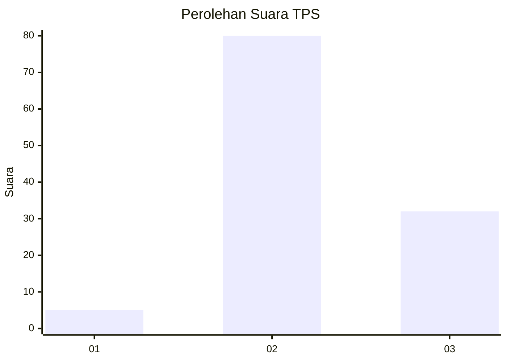
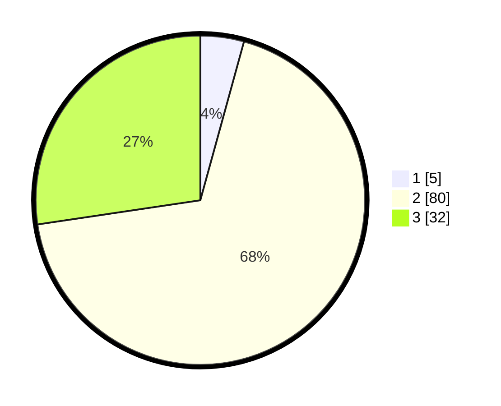

# Hasil

## Grafik

## Tabel

| No. | Nama Paslon    | Suara | Suara (raw) | Persentase |
|:--- |:-------------- | -----:| -----------:| ----------:|
| 1   | ANIES MUHAIMIN | 5     | [5][p-1]    | 4,27       |
| 2   | PRABOWO GIBRAN | 80    | [80][p-2]   | 68,38      |
| 3   | GANJAR MAHFUD  | 32    | [32][p-3]   | 27,35      |

[p-1]: https://github.com/gigit-pemilu/pemilu-2024/blob/main/pilpres/hitung-suara/sub/35-jawa-timur/sub/09-jember/sub/03-sumberbaru/sub/2006-sumberagung/sub/013-tps/sub/paslon-1.txt
[p-2]: https://github.com/gigit-pemilu/pemilu-2024/blob/main/pilpres/hitung-suara/sub/35-jawa-timur/sub/09-jember/sub/03-sumberbaru/sub/2006-sumberagung/sub/013-tps/sub/paslon-2.txt
[p-3]: https://github.com/gigit-pemilu/pemilu-2024/blob/main/pilpres/hitung-suara/sub/35-jawa-timur/sub/09-jember/sub/03-sumberbaru/sub/2006-sumberagung/sub/013-tps/sub/paslon-3.txt

## Foto C Plano

https://sirekap-obj-formc.kpu.go.id/ef5d/pemilu/ppwp/35/09/03/20/06/3509032006013-20240216-072105--546e4a9e-4a9f-46e6-acf5-e5e9ee93f6eb.jpg

https://sirekap-obj-formc.kpu.go.id/ef5d/pemilu/ppwp/35/09/03/20/06/3509032006013-20240216-072112--41e6f050-4b17-4fb3-9277-41431b5d400a.jpg

https://sirekap-obj-formc.kpu.go.id/ef5d/pemilu/ppwp/35/09/03/20/06/3509032006013-20240216-072126--b5e32fa9-72da-41cf-bf86-73eb92c0a30c.jpg

## Metadata

| Key        | Value               |
| ---------- | ------------------- |
| Time Stamp | 2024-02-16 11:00:29 |

