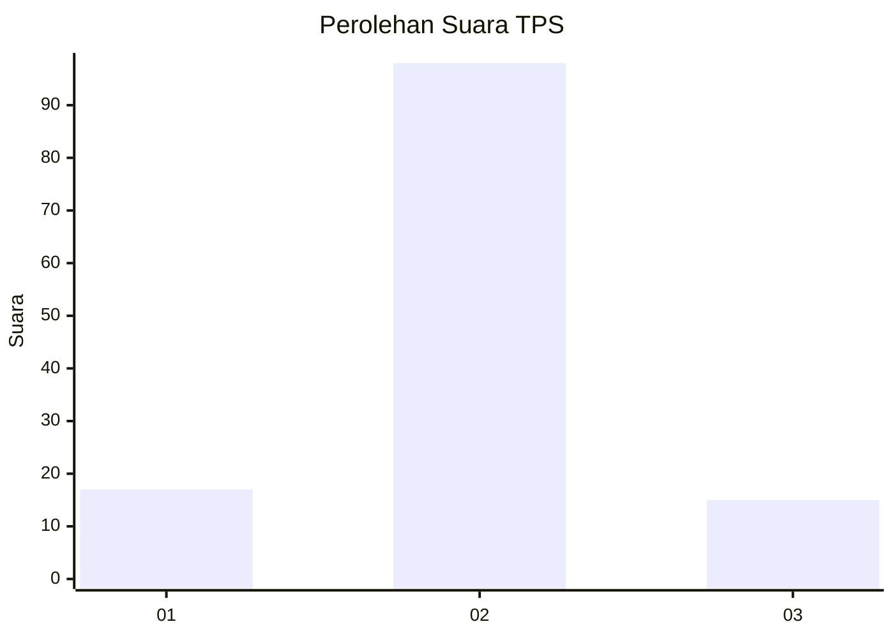
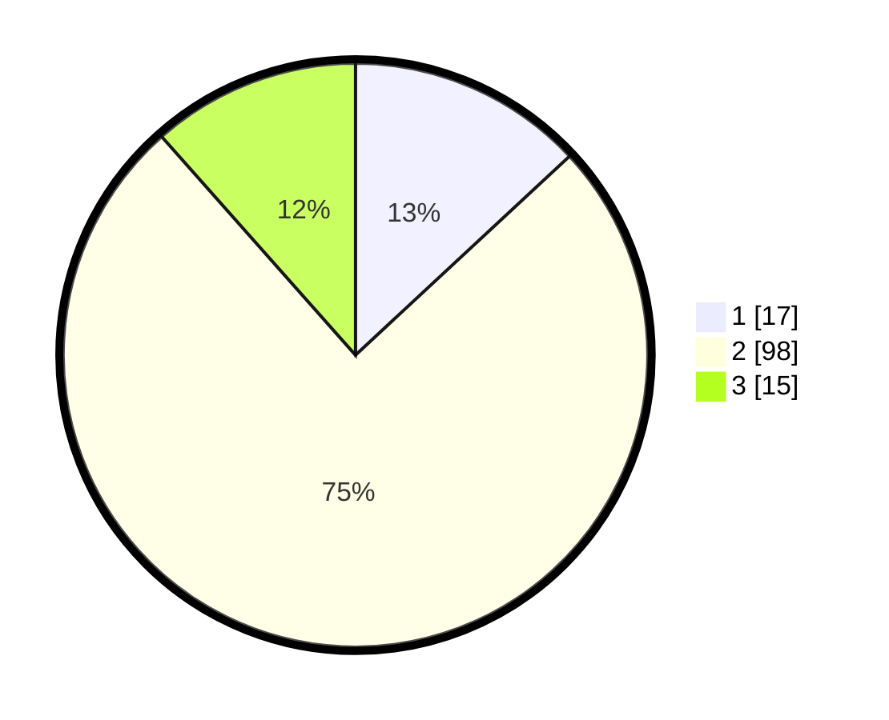

# Hasil

## Grafik

## Tabel

| No. | Nama Paslon    | Suara | Suara (raw) | Persentase |
|:--- |:-------------- | -----:| -----------:| ----------:|
| 1   | ANIES MUHAIMIN | 17    | [17][p-1]   | 13,08      |
| 2   | PRABOWO GIBRAN | 98    | [98][p-2]   | 75,38      |
| 3   | GANJAR MAHFUD  | 15    | [15][p-3]   | 11,54      |

[p-1]: https://github.com/gigit-pemilu/pemilu-2024/blob/main/pilpres/hitung-suara/sub/35-jawa-timur/sub/09-jember/sub/03-sumberbaru/sub/2006-sumberagung/sub/026-tps/sub/paslon-1.txt
[p-2]: https://github.com/gigit-pemilu/pemilu-2024/blob/main/pilpres/hitung-suara/sub/35-jawa-timur/sub/09-jember/sub/03-sumberbaru/sub/2006-sumberagung/sub/026-tps/sub/paslon-2.txt
[p-3]: https://github.com/gigit-pemilu/pemilu-2024/blob/main/pilpres/hitung-suara/sub/35-jawa-timur/sub/09-jember/sub/03-sumberbaru/sub/2006-sumberagung/sub/026-tps/sub/paslon-3.txt

## Foto C Plano

https://sirekap-obj-formc.kpu.go.id/4881/pemilu/ppwp/35/09/03/20/06/3509032006026-20240214-215805--cab1d8cd-4626-4ff1-8ae2-b58802b8d9ce.jpg

https://sirekap-obj-formc.kpu.go.id/4881/pemilu/ppwp/35/09/03/20/06/3509032006026-20240214-220057--77e6e2c2-8001-4777-894a-dc5b6cfcc227.jpg

https://sirekap-obj-formc.kpu.go.id/4881/pemilu/ppwp/35/09/03/20/06/3509032006026-20240214-215910--9db451d5-74bb-4fe2-a1fc-0d83087e6808.jpg

## Metadata

| Key        | Value               |
| ---------- | ------------------- |
| Time Stamp | 2024-02-15 17:00:25 |

