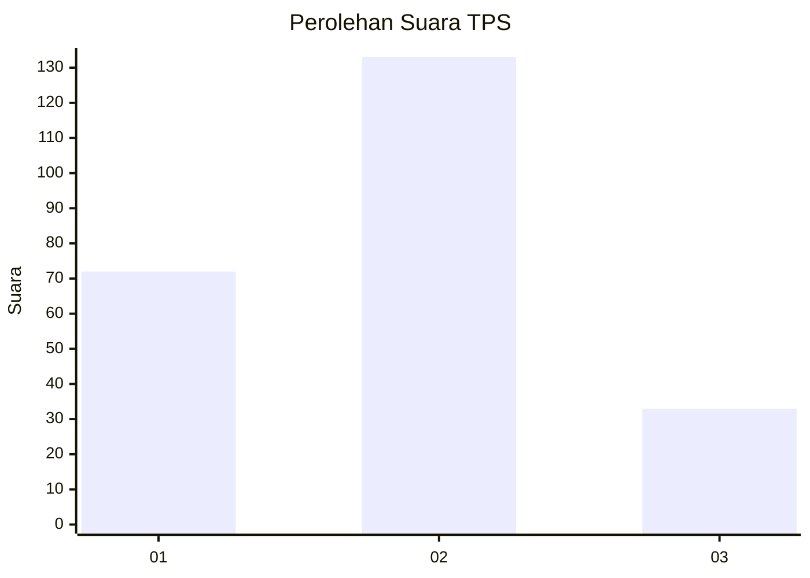
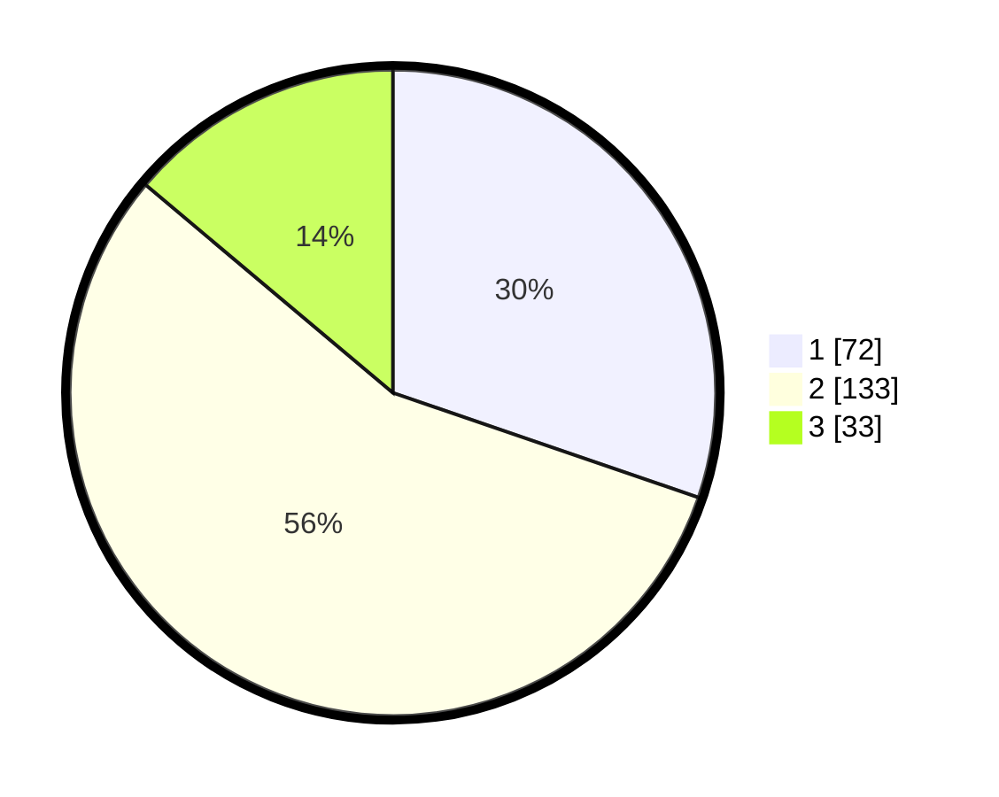

# Hasil

## Grafik

## Tabel

| No. | Nama Paslon    | Suara | Suara (raw) | Persentase |
|:--- |:-------------- | -----:| -----------:| ----------:|
| 1   | ANIES MUHAIMIN | 72    | [72][p-1]   | 30,25      |
| 2   | PRABOWO GIBRAN | 133   | [133][p-2]  | 55,88      |
| 3   | GANJAR MAHFUD  | 33    | [33][p-3]   | 13,87      |

[p-1]: https://github.com/gigit-pemilu/pemilu-2024/blob/main/pilpres/hitung-suara/sub/35-jawa-timur/sub/09-jember/sub/03-sumberbaru/sub/2007-gelang/sub/009-tps/sub/paslon-1.txt
[p-2]: https://github.com/gigit-pemilu/pemilu-2024/blob/main/pilpres/hitung-suara/sub/35-jawa-timur/sub/09-jember/sub/03-sumberbaru/sub/2007-gelang/sub/009-tps/sub/paslon-2.txt
[p-3]: https://github.com/gigit-pemilu/pemilu-2024/blob/main/pilpres/hitung-suara/sub/35-jawa-timur/sub/09-jember/sub/03-sumberbaru/sub/2007-gelang/sub/009-tps/sub/paslon-3.txt

## Foto C Plano

https://sirekap-obj-formc.kpu.go.id/a0bf/pemilu/ppwp/35/09/03/20/07/3509032007009-20240216-055601--8be55c3e-e620-43fe-93e1-01a61fbc4303.jpg

https://sirekap-obj-formc.kpu.go.id/a0bf/pemilu/ppwp/35/09/03/20/07/3509032007009-20240216-100827--2a75a69e-7c11-49be-a39a-067960947c46.jpg

https://sirekap-obj-formc.kpu.go.id/a0bf/pemilu/ppwp/35/09/03/20/07/3509032007009-20240216-100659--e56f1133-23fd-4bc0-93e3-8a4a818b2b46.jpg

## Metadata

| Key        | Value               |
| ---------- | ------------------- |
| Time Stamp | 2024-02-16 11:00:29 |

