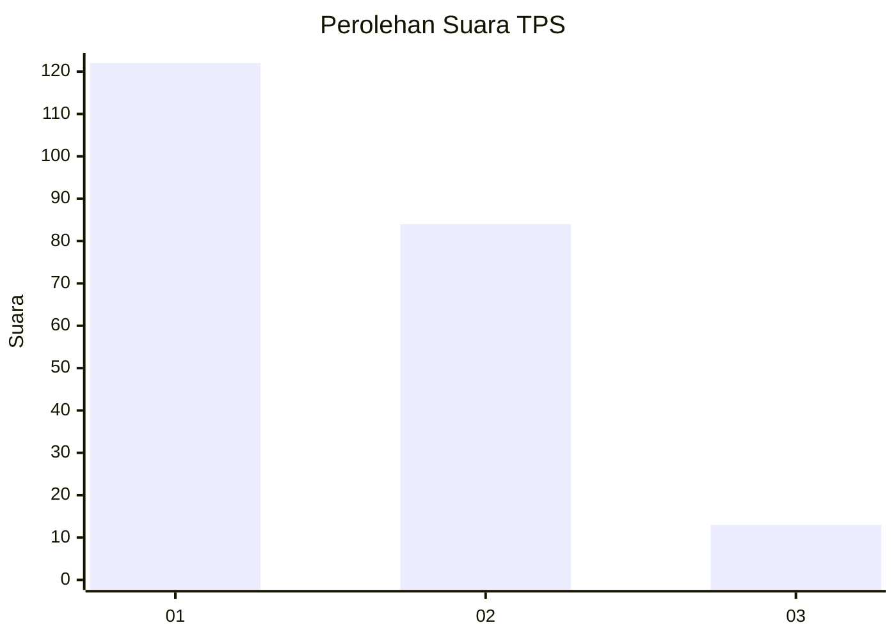
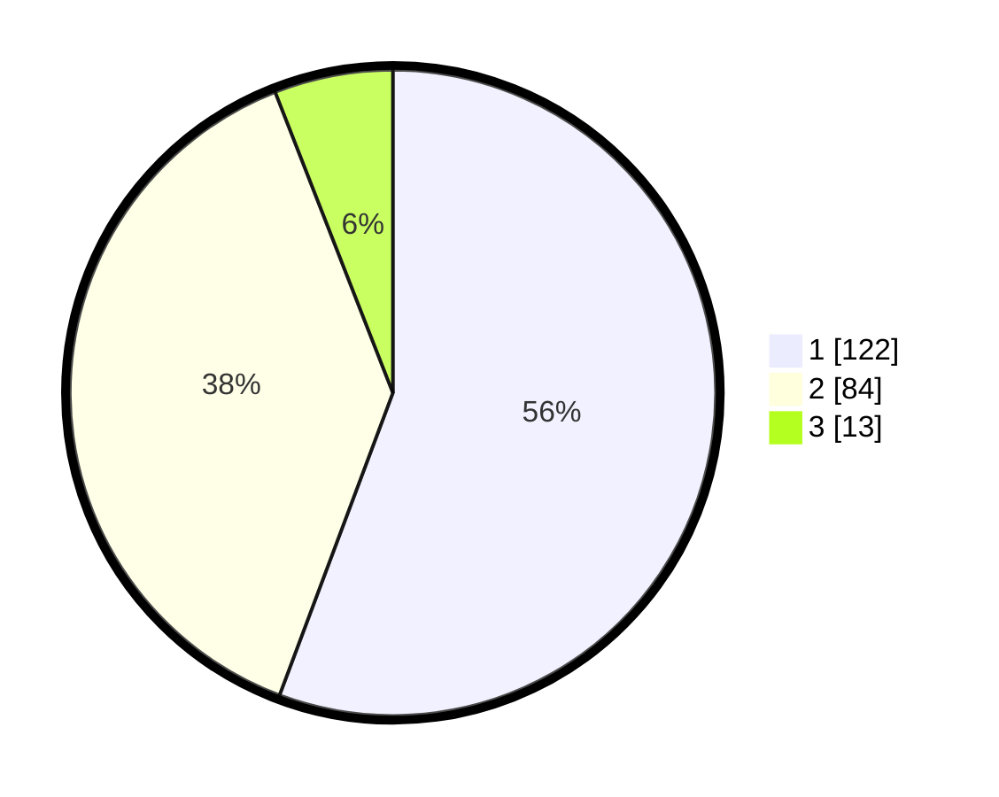

# Hasil

## Grafik

## Tabel

| No. | Nama Paslon    | Suara | Suara (raw) | Persentase |
|:--- |:-------------- | -----:| -----------:| ----------:|
| 1   | ANIES MUHAIMIN | 122   | [122][p-1]  | 55,71      |
| 2   | PRABOWO GIBRAN | 84    | [84][p-2]   | 38,36      |
| 3   | GANJAR MAHFUD  | 13    | [13][p-3]   | 5,94       |

[p-1]: https://github.com/gigit-pemilu/pemilu-2024/blob/main/pilpres/hitung-suara/sub/35-jawa-timur/sub/09-jember/sub/03-sumberbaru/sub/2007-gelang/sub/014-tps/sub/paslon-1.txt
[p-2]: https://github.com/gigit-pemilu/pemilu-2024/blob/main/pilpres/hitung-suara/sub/35-jawa-timur/sub/09-jember/sub/03-sumberbaru/sub/2007-gelang/sub/014-tps/sub/paslon-2.txt
[p-3]: https://github.com/gigit-pemilu/pemilu-2024/blob/main/pilpres/hitung-suara/sub/35-jawa-timur/sub/09-jember/sub/03-sumberbaru/sub/2007-gelang/sub/014-tps/sub/paslon-3.txt

## Foto C Plano

https://sirekap-obj-formc.kpu.go.id/31aa/pemilu/ppwp/35/09/03/20/07/3509032007014-20240215-032022--01592592-a182-4e3a-9260-42a19ccb7619.jpg

https://sirekap-obj-formc.kpu.go.id/31aa/pemilu/ppwp/35/09/03/20/07/3509032007014-20240214-191154--6d3e37c5-f4cf-4ad4-9ca6-43b3816e6955.jpg

https://sirekap-obj-formc.kpu.go.id/31aa/pemilu/ppwp/35/09/03/20/07/3509032007014-20240215-032159--40fa22f9-8b76-4d82-90fb-963a672ef3d8.jpg

## Metadata

| Key        | Value               |
| ---------- | ------------------- |
| Time Stamp | 2024-02-16 12:51:22 |

