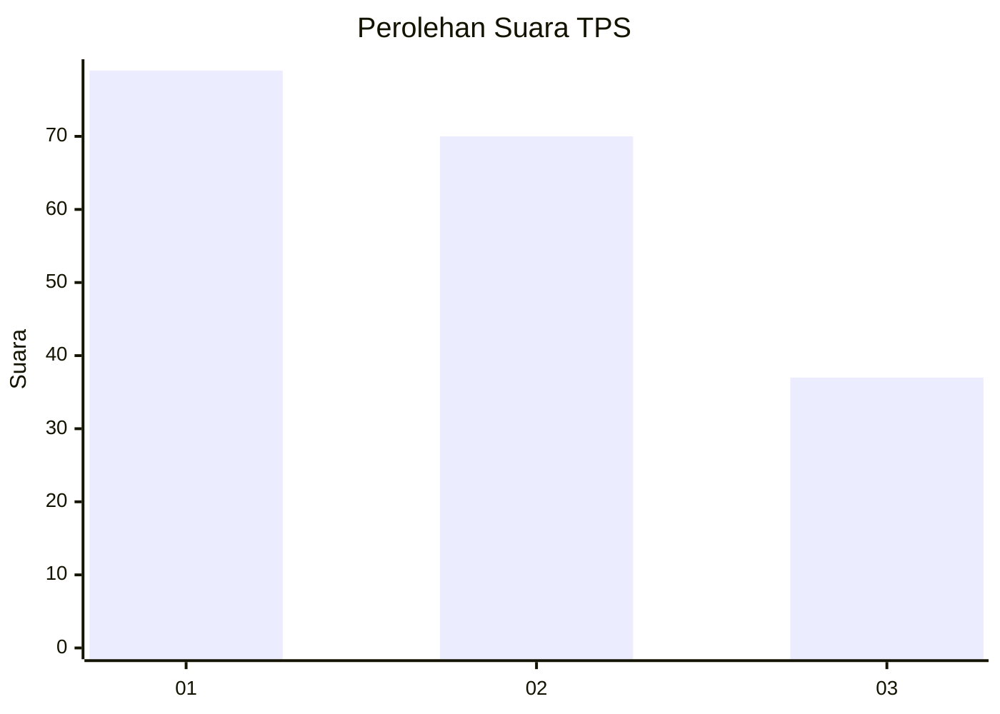
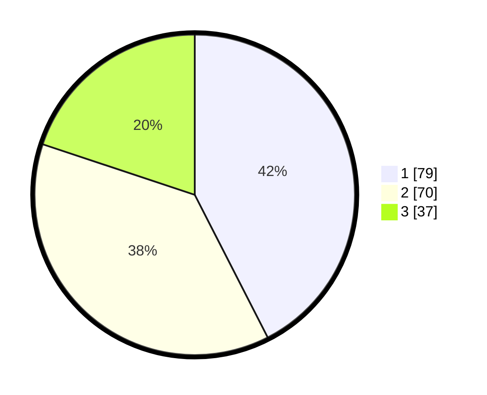

# Hasil

## Grafik

## Tabel

| No. | Nama Paslon    | Suara | Suara (raw) | Persentase |
|:--- |:-------------- | -----:| -----------:| ----------:|
| 1   | ANIES MUHAIMIN | 79    | [79][p-1]   | 42,47      |
| 2   | PRABOWO GIBRAN | 70    | [70][p-2]   | 37,63      |
| 3   | GANJAR MAHFUD  | 37    | [37][p-3]   | 19,89      |

[p-1]: https://github.com/gigit-pemilu/pemilu-2024-35-jawa-timur/blob/main/pilpres/hitung-suara/sub/35-jawa-timur/sub/09-jember/sub/03-sumberbaru/sub/2007-gelang/sub/017-tps/sub/paslon-1.txt
[p-2]: https://github.com/gigit-pemilu/pemilu-2024-35-jawa-timur/blob/main/pilpres/hitung-suara/sub/35-jawa-timur/sub/09-jember/sub/03-sumberbaru/sub/2007-gelang/sub/017-tps/sub/paslon-2.txt
[p-3]: https://github.com/gigit-pemilu/pemilu-2024-35-jawa-timur/blob/main/pilpres/hitung-suara/sub/35-jawa-timur/sub/09-jember/sub/03-sumberbaru/sub/2007-gelang/sub/017-tps/sub/paslon-3.txt

## Foto C Plano

https://sirekap-obj-formc.kpu.go.id/cc4c/pemilu/ppwp/35/09/03/20/07/3509032007017-20240214-192018--9f92e13d-bb4b-416e-b1f1-30ae8a7d187a.jpg

https://sirekap-obj-formc.kpu.go.id/cc4c/pemilu/ppwp/35/09/03/20/07/3509032007017-20240214-192037--2a16a115-4a3e-45c8-a906-1693fb2a99fc.jpg

https://sirekap-obj-formc.kpu.go.id/cc4c/pemilu/ppwp/35/09/03/20/07/3509032007017-20240214-192046--bddd3ade-4279-4f95-8a96-b5e86a6509cf.jpg

## Metadata

| Key        | Value               |
| ---------- | ------------------- |
| Time Stamp | 2024-02-15 12:00:28 |

