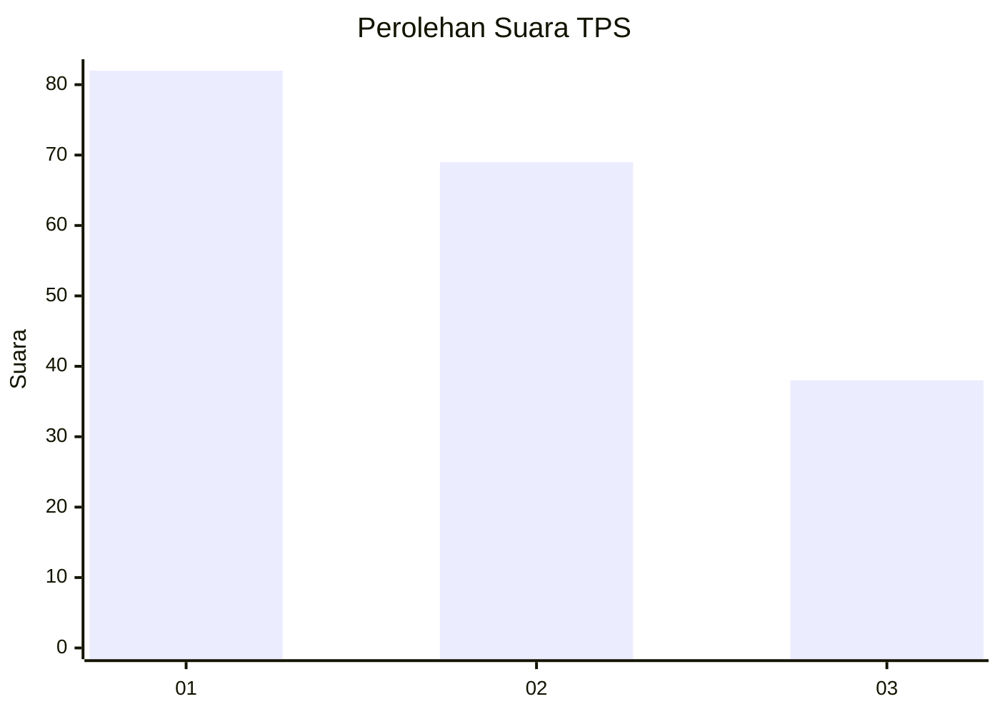
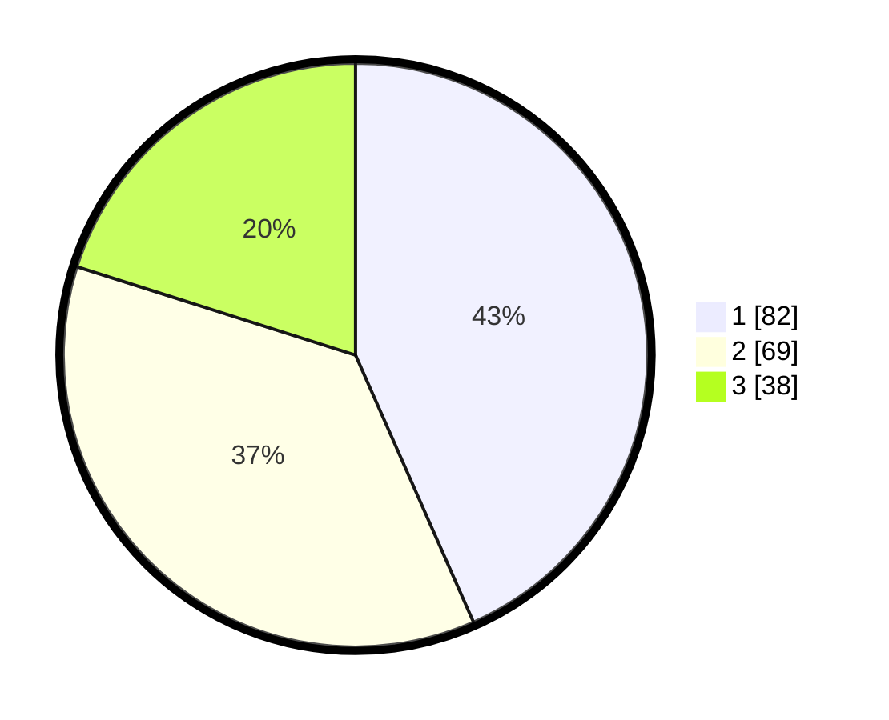

# Hasil

## Grafik

## Tabel

| No. | Nama Paslon    | Suara | Suara (raw) | Persentase |
|:--- |:-------------- | -----:| -----------:| ----------:|
| 1   | ANIES MUHAIMIN | 82    | [82][p-1]   | 43,39      |
| 2   | PRABOWO GIBRAN | 69    | [69][p-2]   | 36,51      |
| 3   | GANJAR MAHFUD  | 38    | [38][p-3]   | 20,11      |

[p-1]: https://github.com/gigit-pemilu/pemilu-2024-35-jawa-timur/blob/main/pilpres/hitung-suara/sub/35-jawa-timur/sub/09-jember/sub/03-sumberbaru/sub/2007-gelang/sub/019-tps/sub/paslon-1.txt
[p-2]: https://github.com/gigit-pemilu/pemilu-2024-35-jawa-timur/blob/main/pilpres/hitung-suara/sub/35-jawa-timur/sub/09-jember/sub/03-sumberbaru/sub/2007-gelang/sub/019-tps/sub/paslon-2.txt
[p-3]: https://github.com/gigit-pemilu/pemilu-2024-35-jawa-timur/blob/main/pilpres/hitung-suara/sub/35-jawa-timur/sub/09-jember/sub/03-sumberbaru/sub/2007-gelang/sub/019-tps/sub/paslon-3.txt

## Foto C Plano

https://sirekap-obj-formc.kpu.go.id/cd48/pemilu/ppwp/35/09/03/20/07/3509032007019-20240214-155559--c292b68c-0b58-4e60-a39e-9f6e5fc71ccd.jpg

https://sirekap-obj-formc.kpu.go.id/cd48/pemilu/ppwp/35/09/03/20/07/3509032007019-20240214-162228--76f4b3b5-0d8a-4f79-94ee-0886afde8be0.jpg

https://sirekap-obj-formc.kpu.go.id/cd48/pemilu/ppwp/35/09/03/20/07/3509032007019-20240214-162232--1d711f80-29b8-4a90-9d67-7f760092972b.jpg

## Metadata

| Key        | Value               |
| ---------- | ------------------- |
| Time Stamp | 2024-02-15 12:00:28 |

