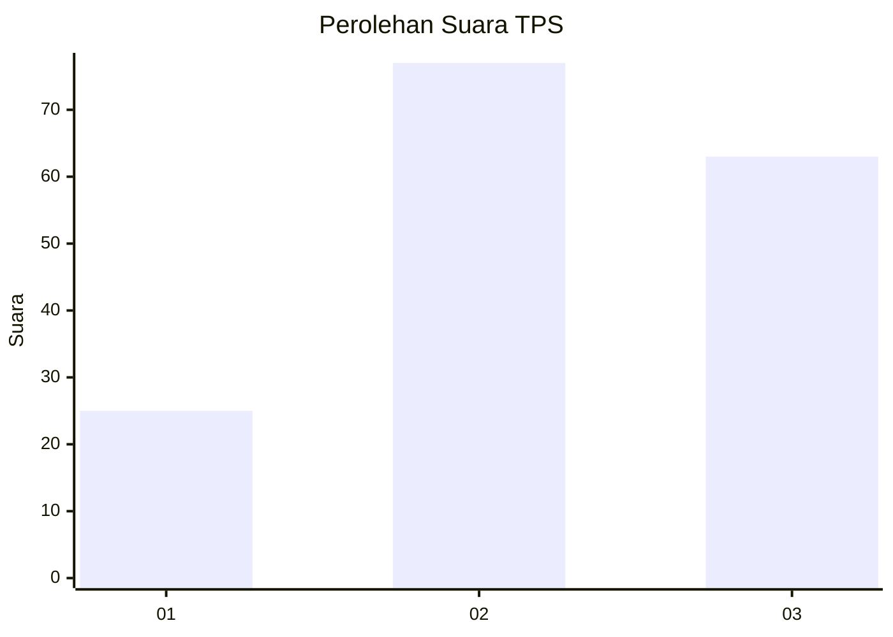
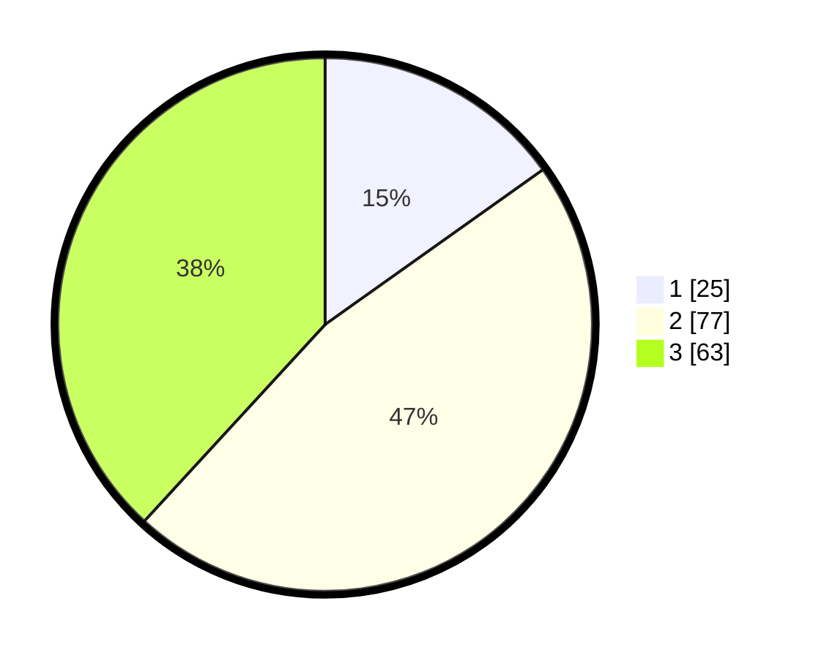

# Hasil

## Grafik

## Tabel

| No. | Nama Paslon    | Suara | Suara (raw) | Persentase |
|:--- |:-------------- | -----:| -----------:| ----------:|
| 1   | ANIES MUHAIMIN | 25    | [25][p-1]   | 15,15      |
| 2   | PRABOWO GIBRAN | 77    | [77][p-2]   | 46,67      |
| 3   | GANJAR MAHFUD  | 63    | [63][p-3]   | 38,18      |

[p-1]: https://github.com/gigit-pemilu/pemilu-2024/blob/main/pilpres/hitung-suara/sub/35-jawa-timur/sub/09-jember/sub/03-sumberbaru/sub/2007-gelang/sub/022-tps/sub/paslon-1.txt
[p-2]: https://github.com/gigit-pemilu/pemilu-2024/blob/main/pilpres/hitung-suara/sub/35-jawa-timur/sub/09-jember/sub/03-sumberbaru/sub/2007-gelang/sub/022-tps/sub/paslon-2.txt
[p-3]: https://github.com/gigit-pemilu/pemilu-2024/blob/main/pilpres/hitung-suara/sub/35-jawa-timur/sub/09-jember/sub/03-sumberbaru/sub/2007-gelang/sub/022-tps/sub/paslon-3.txt

## Foto C Plano

https://sirekap-obj-formc.kpu.go.id/53f2/pemilu/ppwp/35/09/03/20/07/3509032007022-20240215-091045--6461bf24-119f-46a9-8835-3bf1c9ae2dca.jpg

https://sirekap-obj-formc.kpu.go.id/53f2/pemilu/ppwp/35/09/03/20/07/3509032007022-20240214-132116--77e80d34-8224-46e7-b23f-9d9c1127a2c5.jpg

https://sirekap-obj-formc.kpu.go.id/53f2/pemilu/ppwp/35/09/03/20/07/3509032007022-20240215-000035--600779d7-a2f6-4f49-a92a-d7a6cd2f8dee.jpg

## Metadata

| Key        | Value               |
| ---------- | ------------------- |
| Time Stamp | 2024-02-16 12:51:22 |

