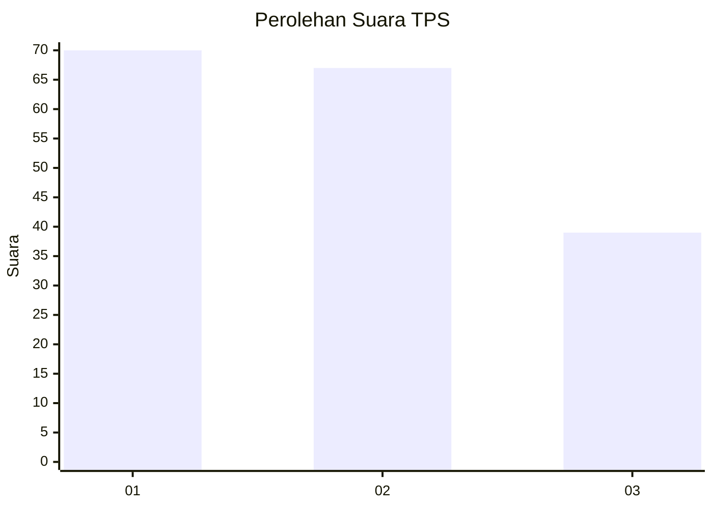
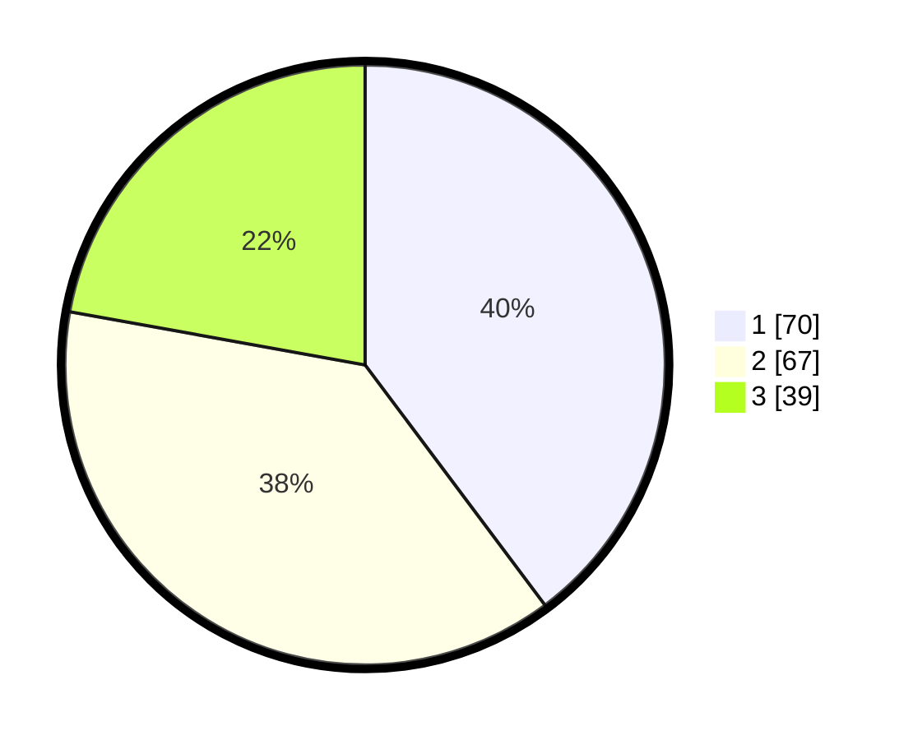

# Hasil

## Grafik

## Tabel

| No. | Nama Paslon    | Suara | Suara (raw) | Persentase |
|:--- |:-------------- | -----:| -----------:| ----------:|
| 1   | ANIES MUHAIMIN | 70    | [70][p-1]   | 39,77      |
| 2   | PRABOWO GIBRAN | 67    | [67][p-2]   | 38,07      |
| 3   | GANJAR MAHFUD  | 39    | [39][p-3]   | 22,16      |

[p-1]: https://github.com/gigit-pemilu/pemilu-2024-35-jawa-timur/blob/main/pilpres/hitung-suara/sub/35-jawa-timur/sub/09-jember/sub/03-sumberbaru/sub/2007-gelang/sub/023-tps/sub/paslon-1.txt
[p-2]: https://github.com/gigit-pemilu/pemilu-2024-35-jawa-timur/blob/main/pilpres/hitung-suara/sub/35-jawa-timur/sub/09-jember/sub/03-sumberbaru/sub/2007-gelang/sub/023-tps/sub/paslon-2.txt
[p-3]: https://github.com/gigit-pemilu/pemilu-2024-35-jawa-timur/blob/main/pilpres/hitung-suara/sub/35-jawa-timur/sub/09-jember/sub/03-sumberbaru/sub/2007-gelang/sub/023-tps/sub/paslon-3.txt

## Foto C Plano

https://sirekap-obj-formc.kpu.go.id/c4bc/pemilu/ppwp/35/09/03/20/07/3509032007023-20240215-095740--665d471b-a39e-4ba9-b9a0-b5bc43878575.jpg

https://sirekap-obj-formc.kpu.go.id/c4bc/pemilu/ppwp/35/09/03/20/07/3509032007023-20240215-100239--78b4bda6-d2d2-455d-a5fd-3a3772d5956f.jpg

https://sirekap-obj-formc.kpu.go.id/c4bc/pemilu/ppwp/35/09/03/20/07/3509032007023-20240215-100609--0f20f62f-7160-42b0-8f76-bd43781d0d0d.jpg

## Metadata

| Key        | Value               |
| ---------- | ------------------- |
| Time Stamp | 2024-02-15 12:00:28 |

