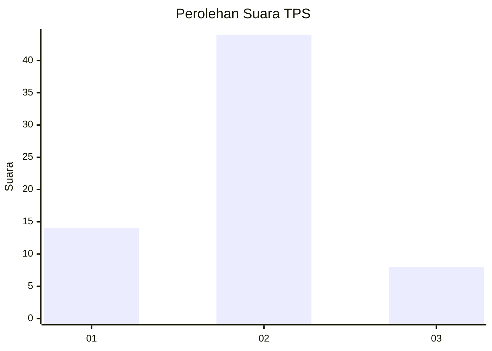
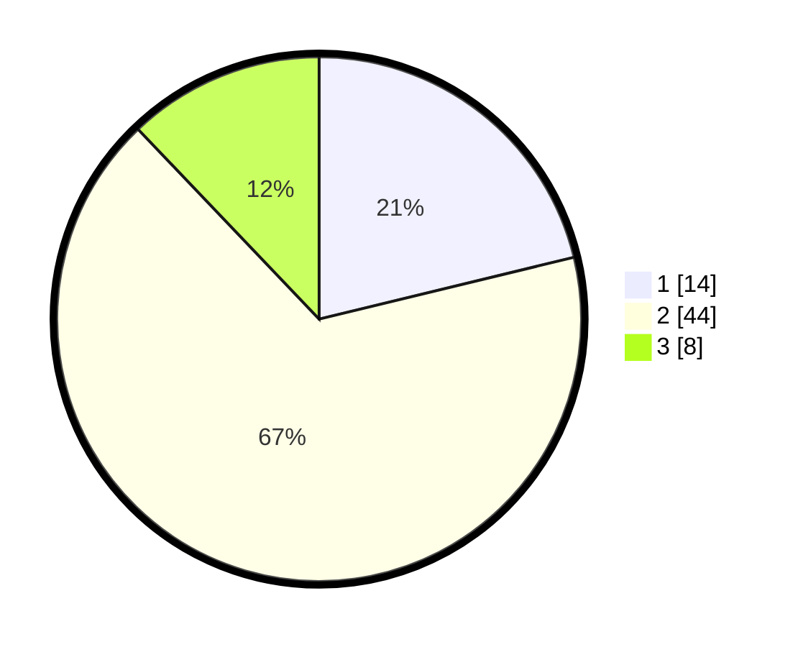

# Hasil

## Grafik

## Tabel

| No. | Nama Paslon    | Suara | Suara (raw) | Persentase |
|:--- |:-------------- | -----:| -----------:| ----------:|
| 1   | ANIES MUHAIMIN | 14    | [14][p-1]   | 21,21      |
| 2   | PRABOWO GIBRAN | 44    | [44][p-2]   | 66,67      |
| 3   | GANJAR MAHFUD  | 8     | [8][p-3]    | 12,12      |

[p-1]: https://github.com/gigit-pemilu/pemilu-2024/blob/main/pilpres/hitung-suara/sub/35-jawa-timur/sub/09-jember/sub/03-sumberbaru/sub/2007-gelang/sub/025-tps/sub/paslon-1.txt
[p-2]: https://github.com/gigit-pemilu/pemilu-2024/blob/main/pilpres/hitung-suara/sub/35-jawa-timur/sub/09-jember/sub/03-sumberbaru/sub/2007-gelang/sub/025-tps/sub/paslon-2.txt
[p-3]: https://github.com/gigit-pemilu/pemilu-2024/blob/main/pilpres/hitung-suara/sub/35-jawa-timur/sub/09-jember/sub/03-sumberbaru/sub/2007-gelang/sub/025-tps/sub/paslon-3.txt

## Foto C Plano

https://sirekap-obj-formc.kpu.go.id/2ace/pemilu/ppwp/35/09/03/20/07/3509032007025-20240214-190129--c679aeeb-4a33-4403-be96-d13f05832f67.jpg

https://sirekap-obj-formc.kpu.go.id/2ace/pemilu/ppwp/35/09/03/20/07/3509032007025-20240214-211851--f4eaeaa2-b97d-4b6b-8046-9109dd06f538.jpg

https://sirekap-obj-formc.kpu.go.id/2ace/pemilu/ppwp/35/09/03/20/07/3509032007025-20240214-221900--71de40ea-f547-4406-b710-c28d87cef240.jpg

## Metadata

| Key        | Value               |
| ---------- | ------------------- |
| Time Stamp | 2024-02-15 15:00:29 |

