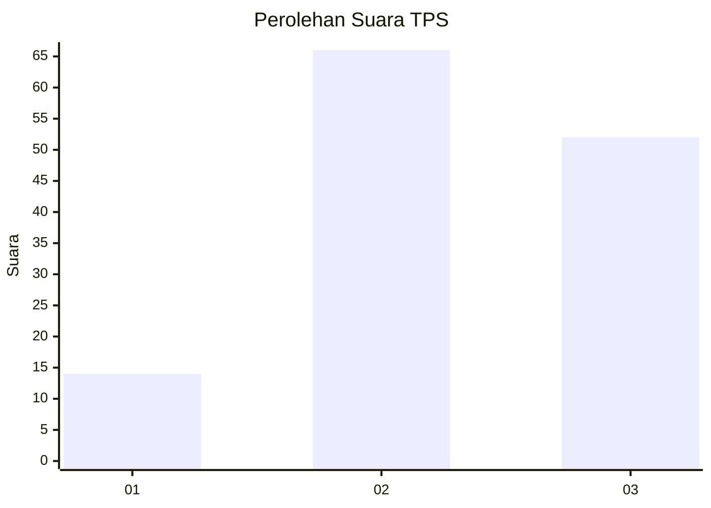
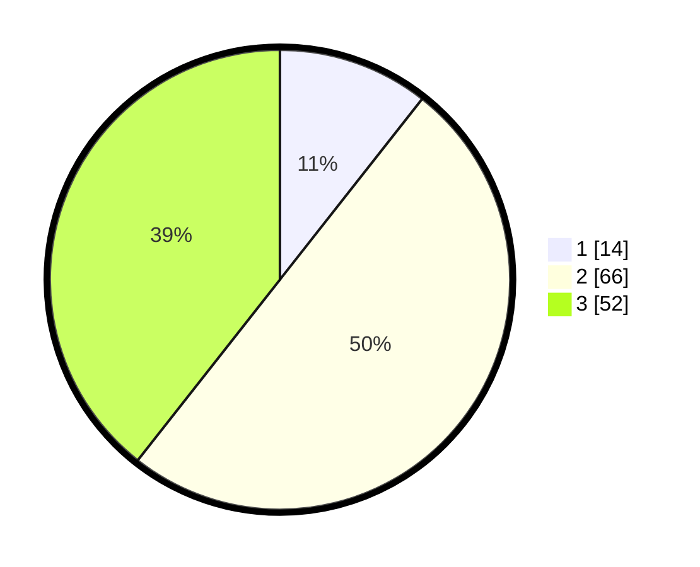

# Hasil

## Grafik

## Tabel

| No. | Nama Paslon    | Suara | Suara (raw) | Persentase |
|:--- |:-------------- | -----:| -----------:| ----------:|
| 1   | ANIES MUHAIMIN | 14    | [14][p-1]   | 10,61      |
| 2   | PRABOWO GIBRAN | 66    | [66][p-2]   | 50,00      |
| 3   | GANJAR MAHFUD  | 52    | [52][p-3]   | 39,39      |

[p-1]: https://github.com/gigit-pemilu/pemilu-2024-35-jawa-timur/blob/main/pilpres/hitung-suara/sub/35-jawa-timur/sub/09-jember/sub/03-sumberbaru/sub/2007-gelang/sub/026-tps/sub/paslon-1.txt
[p-2]: https://github.com/gigit-pemilu/pemilu-2024-35-jawa-timur/blob/main/pilpres/hitung-suara/sub/35-jawa-timur/sub/09-jember/sub/03-sumberbaru/sub/2007-gelang/sub/026-tps/sub/paslon-2.txt
[p-3]: https://github.com/gigit-pemilu/pemilu-2024-35-jawa-timur/blob/main/pilpres/hitung-suara/sub/35-jawa-timur/sub/09-jember/sub/03-sumberbaru/sub/2007-gelang/sub/026-tps/sub/paslon-3.txt

## Foto C Plano

https://sirekap-obj-formc.kpu.go.id/2619/pemilu/ppwp/35/09/03/20/07/3509032007026-20240215-011603--21a9bd34-263d-466e-83a7-5feb83e51ed5.jpg

https://sirekap-obj-formc.kpu.go.id/2619/pemilu/ppwp/35/09/03/20/07/3509032007026-20240215-011701--181a7c21-b56e-4a9c-b68f-b736b9c2d08a.jpg

https://sirekap-obj-formc.kpu.go.id/2619/pemilu/ppwp/35/09/03/20/07/3509032007026-20240215-011756--d7a01363-41e2-4b97-ba97-10d2c65d31a3.jpg

## Metadata

| Key        | Value               |
| ---------- | ------------------- |
| Time Stamp | 2024-02-24 23:00:00 |

