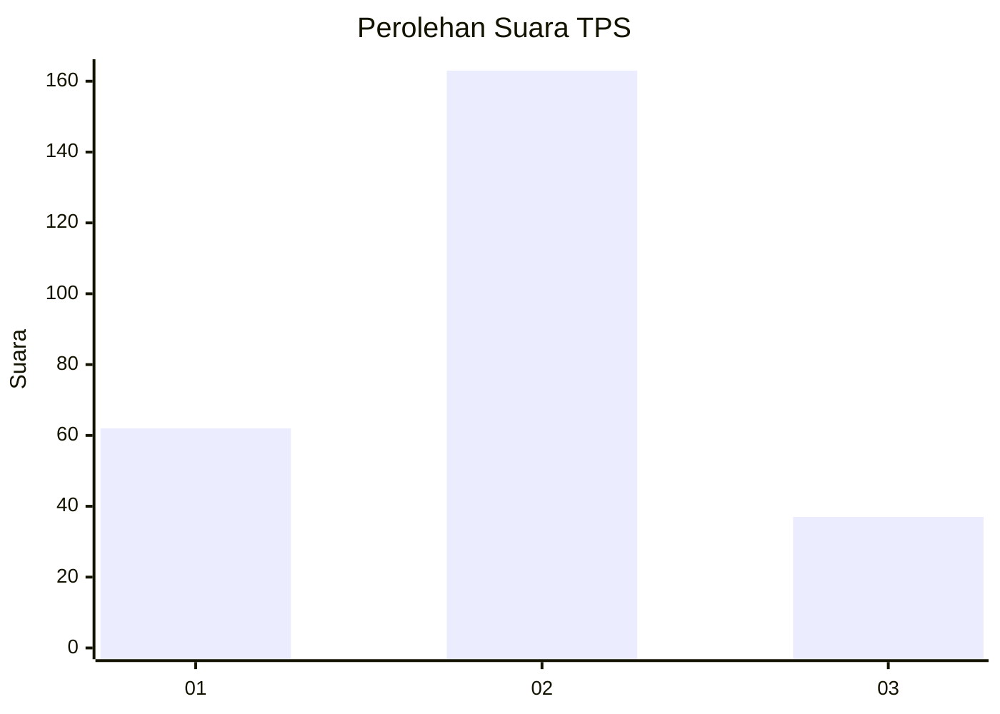
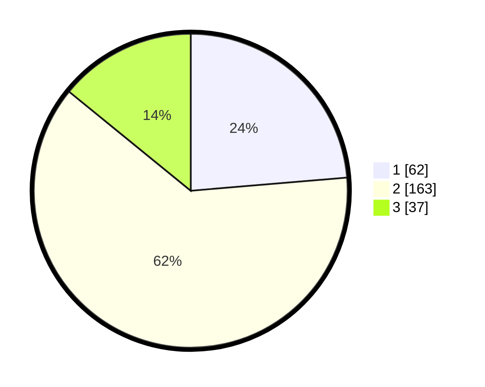

# Hasil

## Grafik

## Tabel

| No. | Nama Paslon    | Suara | Suara (raw) | Persentase |
|:--- |:-------------- | -----:| -----------:| ----------:|
| 1   | ANIES MUHAIMIN | 62    | [62][p-1]   | 23,66      |
| 2   | PRABOWO GIBRAN | 163   | [163][p-2]  | 62,21      |
| 3   | GANJAR MAHFUD  | 37    | [37][p-3]   | 14,12      |

[p-1]: https://github.com/gigit-pemilu/pemilu-2024/blob/main/pilpres/hitung-suara/sub/35-jawa-timur/sub/09-jember/sub/03-sumberbaru/sub/2007-gelang/sub/035-tps/sub/paslon-1.txt
[p-2]: https://github.com/gigit-pemilu/pemilu-2024/blob/main/pilpres/hitung-suara/sub/35-jawa-timur/sub/09-jember/sub/03-sumberbaru/sub/2007-gelang/sub/035-tps/sub/paslon-2.txt
[p-3]: https://github.com/gigit-pemilu/pemilu-2024/blob/main/pilpres/hitung-suara/sub/35-jawa-timur/sub/09-jember/sub/03-sumberbaru/sub/2007-gelang/sub/035-tps/sub/paslon-3.txt

## Foto C Plano

https://sirekap-obj-formc.kpu.go.id/7e57/pemilu/ppwp/35/09/03/20/07/3509032007035-20240214-212854--91c63c4a-4e3e-479e-b060-5783af3792b8.jpg

https://sirekap-obj-formc.kpu.go.id/7e57/pemilu/ppwp/35/09/03/20/07/3509032007035-20240214-213112--69a03e0f-bafe-41b4-9ad0-6802dc6a00b9.jpg

https://sirekap-obj-formc.kpu.go.id/7e57/pemilu/ppwp/35/09/03/20/07/3509032007035-20240214-213328--c0d24b8b-1b20-466f-a470-17d867000c11.jpg

## Metadata

| Key        | Value               |
| ---------- | ------------------- |
| Time Stamp | 2024-02-15 15:00:29 |

