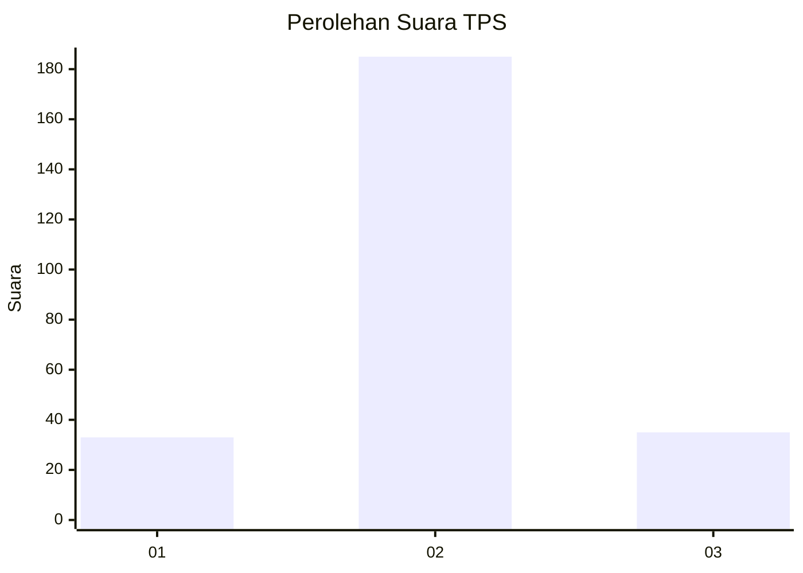
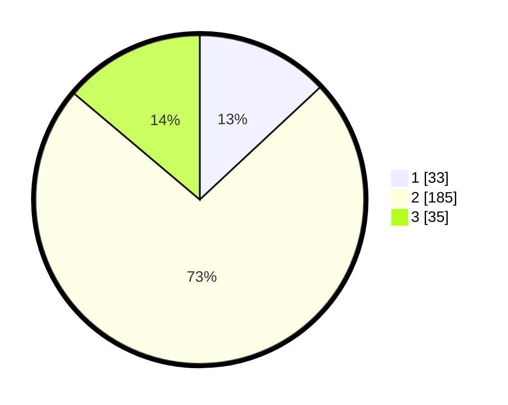

# Hasil

## Grafik

## Tabel

| No. | Nama Paslon    | Suara | Suara (raw) | Persentase |
|:--- |:-------------- | -----:| -----------:| ----------:|
| 1   | ANIES MUHAIMIN | 33    | [33][p-1]   | 13,04      |
| 2   | PRABOWO GIBRAN | 185   | [185][p-2]  | 73,12      |
| 3   | GANJAR MAHFUD  | 35    | [35][p-3]   | 13,83      |

[p-1]: https://github.com/gigit-pemilu/pemilu-2024-35-jawa-timur/blob/main/pilpres/hitung-suara/sub/35-jawa-timur/sub/09-jember/sub/03-sumberbaru/sub/2007-gelang/sub/037-tps/sub/paslon-1.txt
[p-2]: https://github.com/gigit-pemilu/pemilu-2024-35-jawa-timur/blob/main/pilpres/hitung-suara/sub/35-jawa-timur/sub/09-jember/sub/03-sumberbaru/sub/2007-gelang/sub/037-tps/sub/paslon-2.txt
[p-3]: https://github.com/gigit-pemilu/pemilu-2024-35-jawa-timur/blob/main/pilpres/hitung-suara/sub/35-jawa-timur/sub/09-jember/sub/03-sumberbaru/sub/2007-gelang/sub/037-tps/sub/paslon-3.txt

## Foto C Plano

https://sirekap-obj-formc.kpu.go.id/4ceb/pemilu/ppwp/35/09/03/20/07/3509032007037-20240215-000727--1d2ca660-d116-4c35-a945-d9290016a1af.jpg

https://sirekap-obj-formc.kpu.go.id/4ceb/pemilu/ppwp/35/09/03/20/07/3509032007037-20240215-000610--6cc5ac82-8ad9-4efc-970c-d11066c3f6e9.jpg

https://sirekap-obj-formc.kpu.go.id/4ceb/pemilu/ppwp/35/09/03/20/07/3509032007037-20240215-001013--924fbd5c-6030-4d59-93b2-6a74526f21d9.jpg

## Metadata

| Key        | Value               |
| ---------- | ------------------- |
| Time Stamp | 2024-02-15 15:00:29 |

