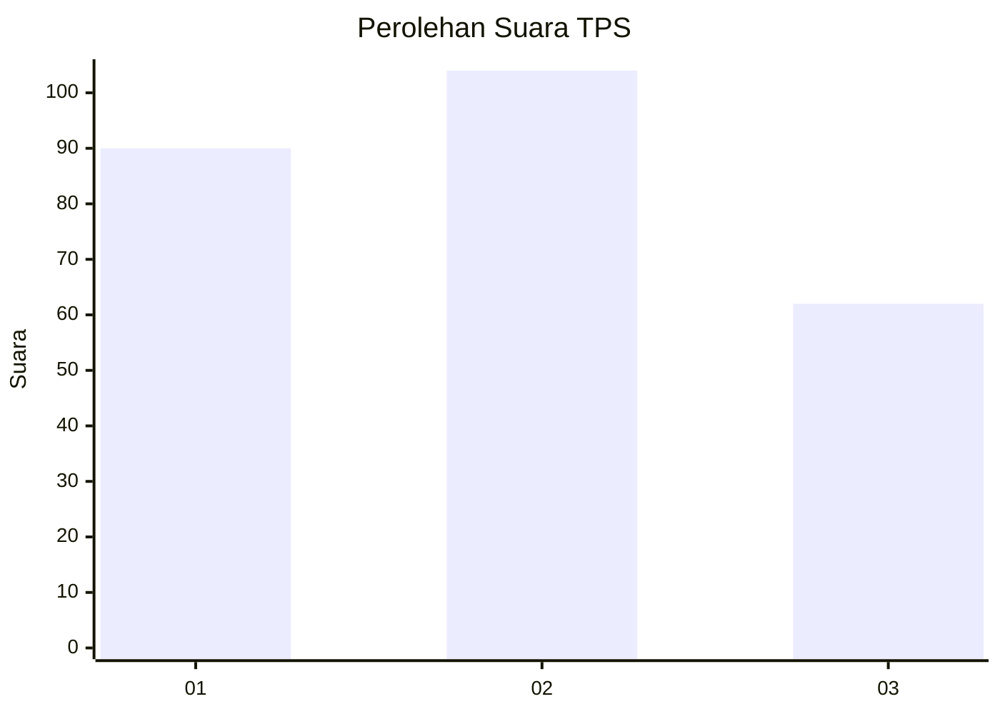
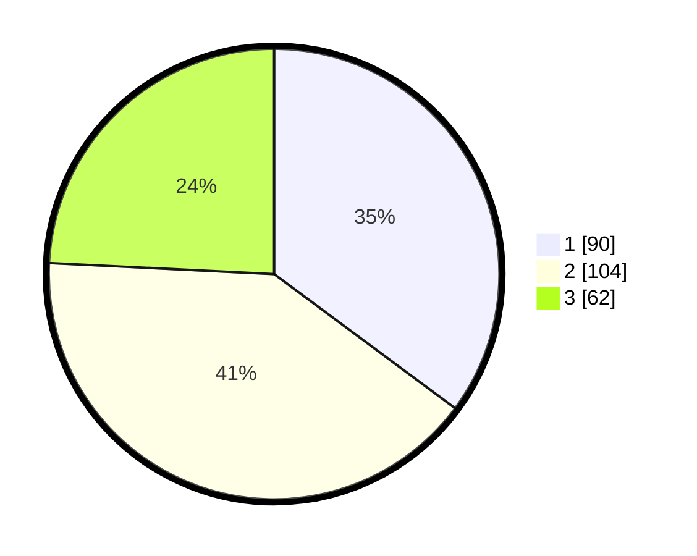

# Hasil

## Grafik

## Tabel

| No. | Nama Paslon    | Suara | Suara (raw) | Persentase |
|:--- |:-------------- | -----:| -----------:| ----------:|
| 1   | ANIES MUHAIMIN | 90    | [90][p-1]   | 35,16      |
| 2   | PRABOWO GIBRAN | 104   | [104][p-2]  | 40,63      |
| 3   | GANJAR MAHFUD  | 62    | [62][p-3]   | 24,22      |

[p-1]: https://github.com/gigit-pemilu/pemilu-2024-35-jawa-timur/blob/main/pilpres/hitung-suara/sub/35-jawa-timur/sub/09-jember/sub/03-sumberbaru/sub/2007-gelang/sub/043-tps/sub/paslon-1.txt
[p-2]: https://github.com/gigit-pemilu/pemilu-2024-35-jawa-timur/blob/main/pilpres/hitung-suara/sub/35-jawa-timur/sub/09-jember/sub/03-sumberbaru/sub/2007-gelang/sub/043-tps/sub/paslon-2.txt
[p-3]: https://github.com/gigit-pemilu/pemilu-2024-35-jawa-timur/blob/main/pilpres/hitung-suara/sub/35-jawa-timur/sub/09-jember/sub/03-sumberbaru/sub/2007-gelang/sub/043-tps/sub/paslon-3.txt

## Foto C Plano

https://sirekap-obj-formc.kpu.go.id/74d9/pemilu/ppwp/35/09/03/20/07/3509032007043-20240214-224043--f2a67623-1d56-450a-8f1b-5b7e28f52e26.jpg

https://sirekap-obj-formc.kpu.go.id/74d9/pemilu/ppwp/35/09/03/20/07/3509032007043-20240214-224246--de838c41-991a-4fc3-9aa5-f6195e2271d7.jpg

https://sirekap-obj-formc.kpu.go.id/74d9/pemilu/ppwp/35/09/03/20/07/3509032007043-20240214-204406--4bc05c85-e8be-4e35-ab2f-c0bc745a7940.jpg

## Metadata

| Key        | Value               |
| ---------- | ------------------- |
| Time Stamp | 2024-02-15 21:01:18 |

