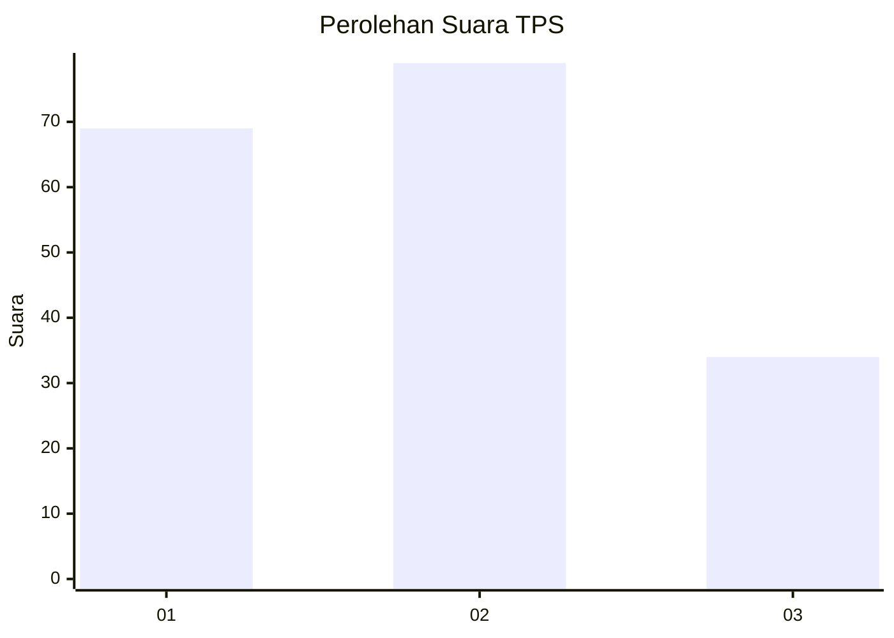
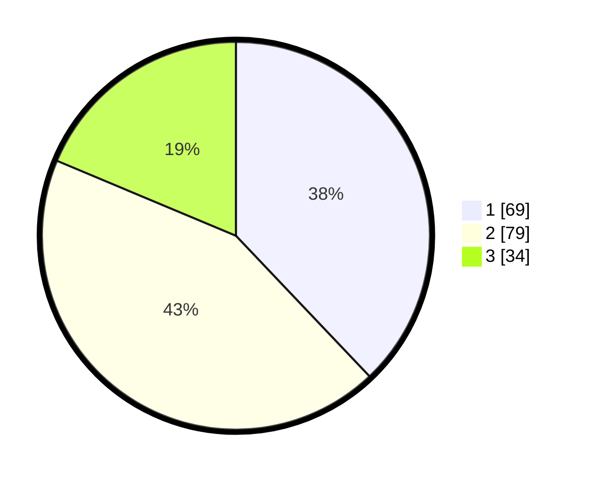

# Hasil

## Grafik

## Tabel

| No. | Nama Paslon    | Suara | Suara (raw) | Persentase |
|:--- |:-------------- | -----:| -----------:| ----------:|
| 1   | ANIES MUHAIMIN | 69    | [69][p-1]   | 37,91      |
| 2   | PRABOWO GIBRAN | 79    | [79][p-2]   | 43,41      |
| 3   | GANJAR MAHFUD  | 34    | [34][p-3]   | 18,68      |

[p-1]: https://github.com/gigit-pemilu/pemilu-2024-35-jawa-timur/blob/main/pilpres/hitung-suara/sub/35-jawa-timur/sub/09-jember/sub/03-sumberbaru/sub/2007-gelang/sub/044-tps/sub/paslon-1.txt
[p-2]: https://github.com/gigit-pemilu/pemilu-2024-35-jawa-timur/blob/main/pilpres/hitung-suara/sub/35-jawa-timur/sub/09-jember/sub/03-sumberbaru/sub/2007-gelang/sub/044-tps/sub/paslon-2.txt
[p-3]: https://github.com/gigit-pemilu/pemilu-2024-35-jawa-timur/blob/main/pilpres/hitung-suara/sub/35-jawa-timur/sub/09-jember/sub/03-sumberbaru/sub/2007-gelang/sub/044-tps/sub/paslon-3.txt

## Foto C Plano

https://sirekap-obj-formc.kpu.go.id/39aa/pemilu/ppwp/35/09/03/20/07/3509032007044-20240215-004850--1c2d920d-ed0c-4aef-a4db-fe9a3aaef534.jpg

https://sirekap-obj-formc.kpu.go.id/39aa/pemilu/ppwp/35/09/03/20/07/3509032007044-20240215-004648--032ffaf9-18d8-4441-b0d4-949693ad4a38.jpg

https://sirekap-obj-formc.kpu.go.id/39aa/pemilu/ppwp/35/09/03/20/07/3509032007044-20240215-005317--8c375b98-5c0c-4668-bb2a-179ae1fe1518.jpg

## Metadata

| Key        | Value               |
| ---------- | ------------------- |
| Time Stamp | 2024-02-25 12:00:00 |

