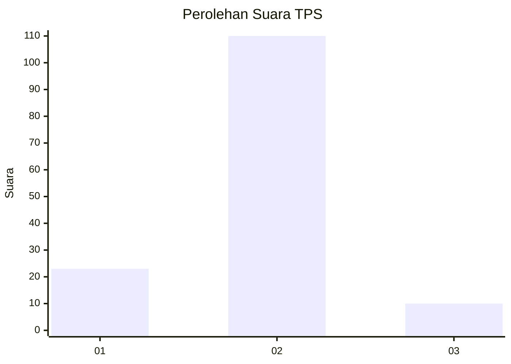
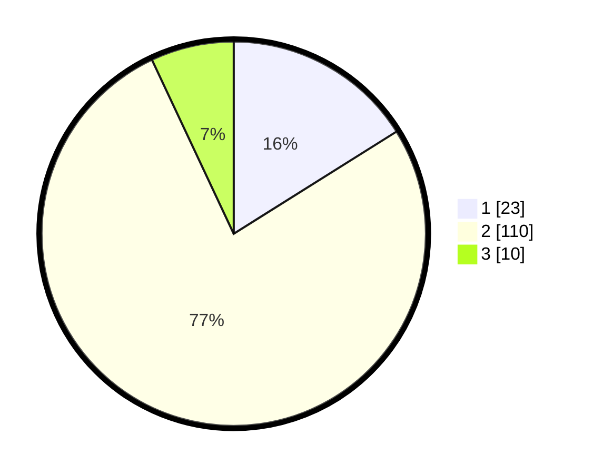

# Hasil

## Grafik

## Tabel

| No. | Nama Paslon    | Suara | Suara (raw) | Persentase |
|:--- |:-------------- | -----:| -----------:| ----------:|
| 1   | ANIES MUHAIMIN | 23    | [23][p-1]   | 16,08      |
| 2   | PRABOWO GIBRAN | 110   | [110][p-2]  | 76,92      |
| 3   | GANJAR MAHFUD  | 10    | [10][p-3]   | 6,99       |

[p-1]: https://github.com/gigit-pemilu/pemilu-2024/blob/main/pilpres/hitung-suara/sub/35-jawa-timur/sub/09-jember/sub/03-sumberbaru/sub/2007-gelang/sub/050-tps/sub/paslon-1.txt
[p-2]: https://github.com/gigit-pemilu/pemilu-2024/blob/main/pilpres/hitung-suara/sub/35-jawa-timur/sub/09-jember/sub/03-sumberbaru/sub/2007-gelang/sub/050-tps/sub/paslon-2.txt
[p-3]: https://github.com/gigit-pemilu/pemilu-2024/blob/main/pilpres/hitung-suara/sub/35-jawa-timur/sub/09-jember/sub/03-sumberbaru/sub/2007-gelang/sub/050-tps/sub/paslon-3.txt

## Foto C Plano

https://sirekap-obj-formc.kpu.go.id/a0db/pemilu/ppwp/35/09/03/20/07/3509032007050-20240215-001934--4c4e8b09-93f9-41c2-82c7-fea4bb5d2f29.jpg

https://sirekap-obj-formc.kpu.go.id/a0db/pemilu/ppwp/35/09/03/20/07/3509032007050-20240215-002016--ee71dd27-d67a-4928-9bd5-461b2c457e27.jpg

https://sirekap-obj-formc.kpu.go.id/a0db/pemilu/ppwp/35/09/03/20/07/3509032007050-20240215-002059--09aefedd-bf1c-4551-a16c-3951cb288246.jpg

## Metadata

| Key        | Value               |
| ---------- | ------------------- |
| Time Stamp | 2024-02-24 22:31:28 |

