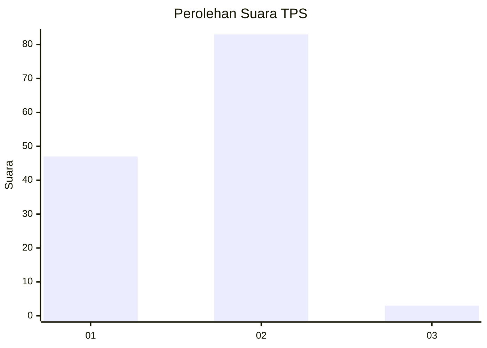
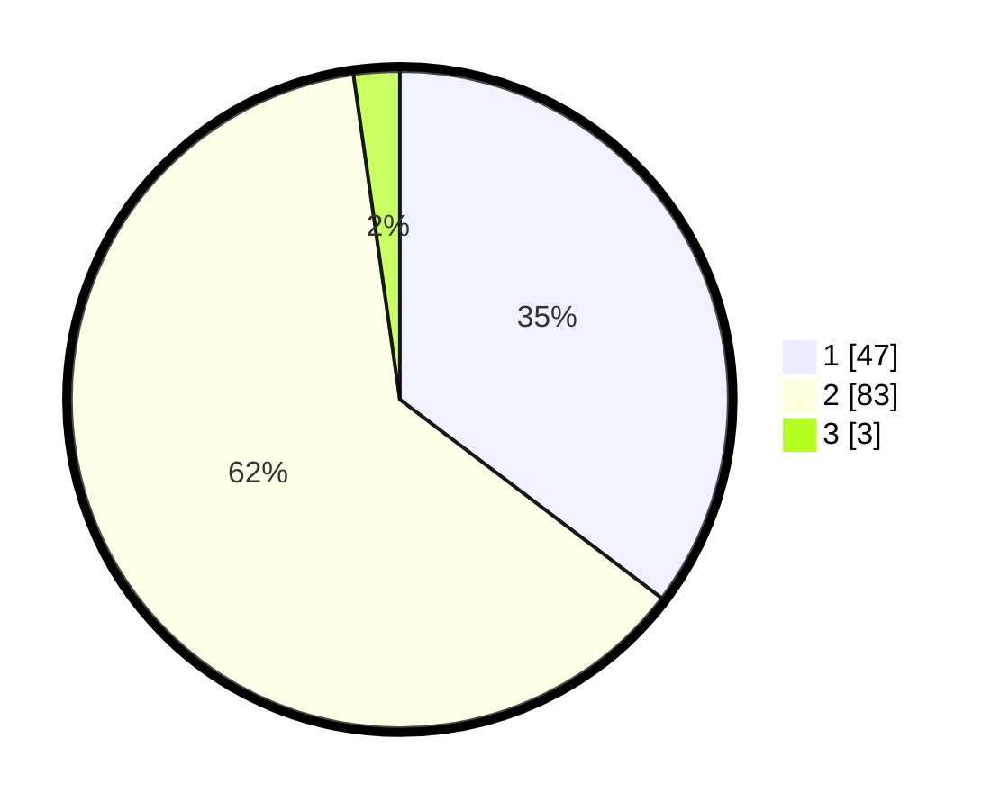

# Hasil

## Grafik

## Tabel

| No. | Nama Paslon    | Suara | Suara (raw) | Persentase |
|:--- |:-------------- | -----:| -----------:| ----------:|
| 1   | ANIES MUHAIMIN | 47    | [47][p-1]   | 35,34      |
| 2   | PRABOWO GIBRAN | 83    | [83][p-2]   | 62,41      |
| 3   | GANJAR MAHFUD  | 3     | [3][p-3]    | 2,26       |

[p-1]: https://github.com/gigit-pemilu/pemilu-2024/blob/main/pilpres/hitung-suara/sub/35-jawa-timur/sub/09-jember/sub/03-sumberbaru/sub/2007-gelang/sub/051-tps/sub/paslon-1.txt
[p-2]: https://github.com/gigit-pemilu/pemilu-2024/blob/main/pilpres/hitung-suara/sub/35-jawa-timur/sub/09-jember/sub/03-sumberbaru/sub/2007-gelang/sub/051-tps/sub/paslon-2.txt
[p-3]: https://github.com/gigit-pemilu/pemilu-2024/blob/main/pilpres/hitung-suara/sub/35-jawa-timur/sub/09-jember/sub/03-sumberbaru/sub/2007-gelang/sub/051-tps/sub/paslon-3.txt

## Foto C Plano

https://sirekap-obj-formc.kpu.go.id/0c9e/pemilu/ppwp/35/09/03/20/07/3509032007051-20240214-160116--fa68e210-d915-4891-9600-32cc5f285281.jpg

https://sirekap-obj-formc.kpu.go.id/0c9e/pemilu/ppwp/35/09/03/20/07/3509032007051-20240214-155620--17655956-2fec-4992-8957-79544c12e1d5.jpg

https://sirekap-obj-formc.kpu.go.id/0c9e/pemilu/ppwp/35/09/03/20/07/3509032007051-20240214-141347--08dffd6e-a5c4-4d78-9932-518323340cb1.jpg

## Metadata

| Key        | Value               |
| ---------- | ------------------- |
| Time Stamp | 2024-02-14 21:46:01 |

