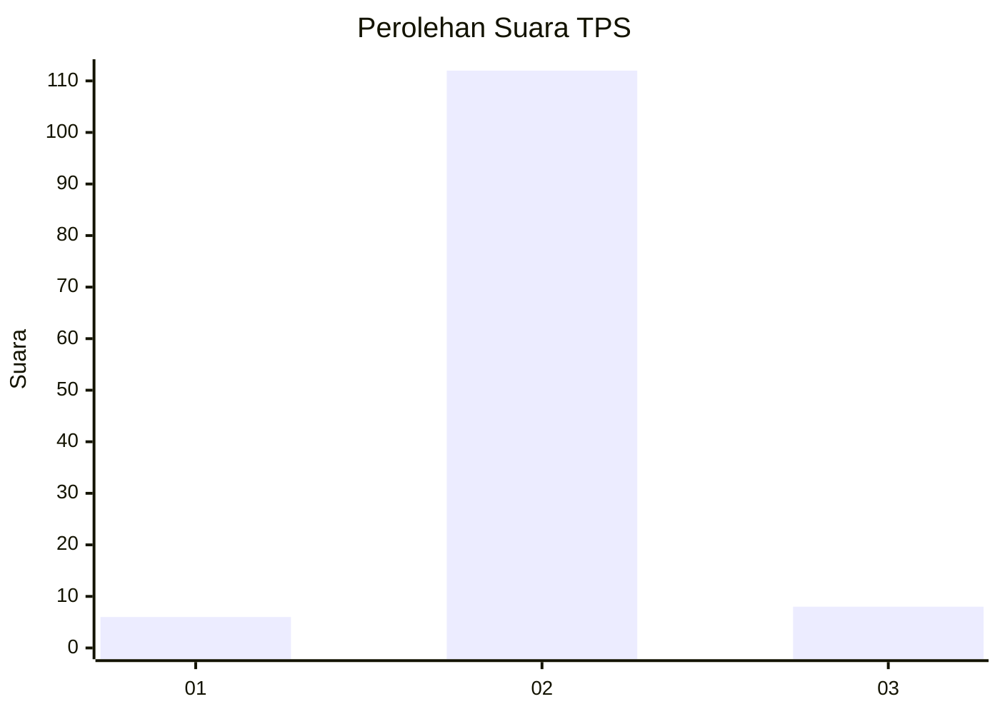
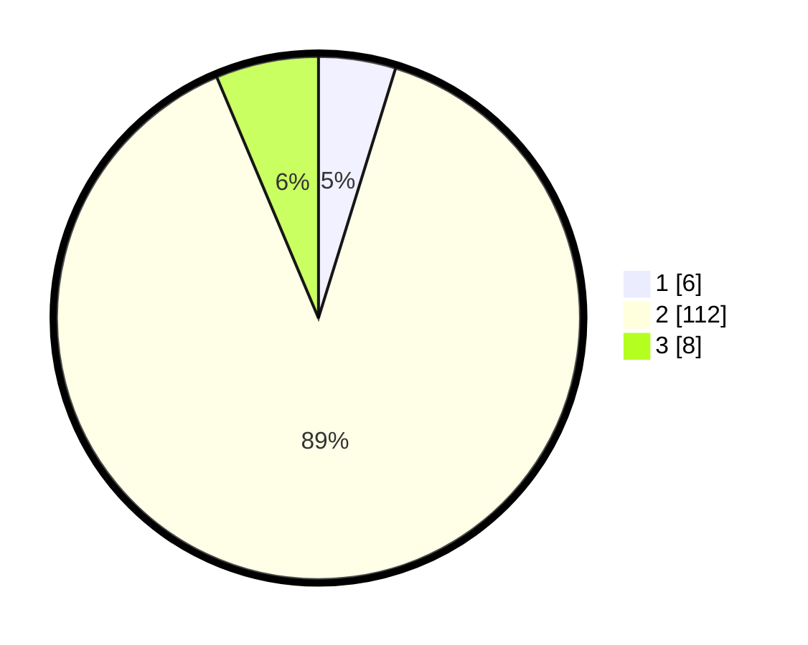

# Hasil

## Grafik

## Tabel

| No. | Nama Paslon    | Suara | Suara (raw) | Persentase |
|:--- |:-------------- | -----:| -----------:| ----------:|
| 1   | ANIES MUHAIMIN | 6     | [6][p-1]    | 4,76       |
| 2   | PRABOWO GIBRAN | 112   | [112][p-2]  | 88,89      |
| 3   | GANJAR MAHFUD  | 8     | [8][p-3]    | 6,35       |

[p-1]: https://github.com/gigit-pemilu/pemilu-2024/blob/main/pilpres/hitung-suara/sub/35-jawa-timur/sub/09-jember/sub/03-sumberbaru/sub/2007-gelang/sub/053-tps/sub/paslon-1.txt
[p-2]: https://github.com/gigit-pemilu/pemilu-2024/blob/main/pilpres/hitung-suara/sub/35-jawa-timur/sub/09-jember/sub/03-sumberbaru/sub/2007-gelang/sub/053-tps/sub/paslon-2.txt
[p-3]: https://github.com/gigit-pemilu/pemilu-2024/blob/main/pilpres/hitung-suara/sub/35-jawa-timur/sub/09-jember/sub/03-sumberbaru/sub/2007-gelang/sub/053-tps/sub/paslon-3.txt

## Foto C Plano

https://sirekap-obj-formc.kpu.go.id/5e2e/pemilu/ppwp/35/09/03/20/07/3509032007053-20240214-155352--a4787d8d-109e-41f2-a0c0-41bbb9d28f7b.jpg

https://sirekap-obj-formc.kpu.go.id/5e2e/pemilu/ppwp/35/09/03/20/07/3509032007053-20240214-155224--312b3c7e-b6d9-4561-b026-84d62cb669b6.jpg

https://sirekap-obj-formc.kpu.go.id/5e2e/pemilu/ppwp/35/09/03/20/07/3509032007053-20240214-155314--0e077b44-eb87-4717-9dc1-ae3a10f55790.jpg

## Metadata

| Key        | Value               |
| ---------- | ------------------- |
| Time Stamp | 2024-02-14 21:46:01 |

