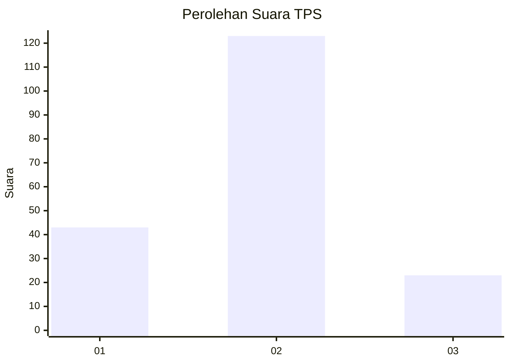
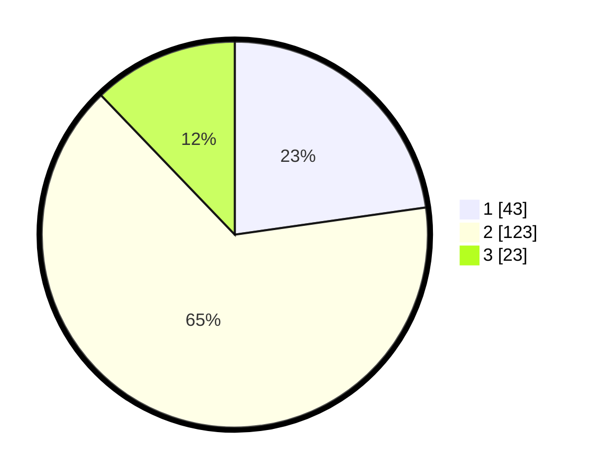

# Hasil

## Grafik

## Tabel

| No. | Nama Paslon    | Suara | Suara (raw) | Persentase |
|:--- |:-------------- | -----:| -----------:| ----------:|
| 1   | ANIES MUHAIMIN | 43    | [43][p-1]   | 22,75      |
| 2   | PRABOWO GIBRAN | 123   | [123][p-2]  | 65,08      |
| 3   | GANJAR MAHFUD  | 23    | [23][p-3]   | 12,17      |

[p-1]: https://github.com/gigit-pemilu/pemilu-2024-35-jawa-timur/blob/main/pilpres/hitung-suara/sub/35-jawa-timur/sub/09-jember/sub/03-sumberbaru/sub/2008-rowotengah/sub/008-tps/sub/paslon-1.txt
[p-2]: https://github.com/gigit-pemilu/pemilu-2024-35-jawa-timur/blob/main/pilpres/hitung-suara/sub/35-jawa-timur/sub/09-jember/sub/03-sumberbaru/sub/2008-rowotengah/sub/008-tps/sub/paslon-2.txt
[p-3]: https://github.com/gigit-pemilu/pemilu-2024-35-jawa-timur/blob/main/pilpres/hitung-suara/sub/35-jawa-timur/sub/09-jember/sub/03-sumberbaru/sub/2008-rowotengah/sub/008-tps/sub/paslon-3.txt

## Foto C Plano

https://sirekap-obj-formc.kpu.go.id/c95b/pemilu/ppwp/35/09/03/20/08/3509032008008-20240214-203858--18953962-3c94-4970-afb3-c7e3c180be3e.jpg

https://sirekap-obj-formc.kpu.go.id/c95b/pemilu/ppwp/35/09/03/20/08/3509032008008-20240214-204117--a22da012-8905-498f-b71f-e79f9ea67fe1.jpg

https://sirekap-obj-formc.kpu.go.id/c95b/pemilu/ppwp/35/09/03/20/08/3509032008008-20240214-204154--a31e0ba4-63c8-4bd1-aa5b-aab007d1d8a2.jpg

## Metadata

| Key        | Value               |
| ---------- | ------------------- |
| Time Stamp | 2024-02-15 00:41:44 |

## DATA PEMILIH TETAP

Jumlah pemilih dalam DPT: **268**.
 * L: **630**.
 * P: **438**.

## DATA PENGGUNA HAK PILIH

Jumlah pengguna hak pilih dalam DPT: **842**.
 * L: **95**.
 * P: **43**.

Jumlah pengguna hak pilih dalam DPTb: **8**.
 * L: **8**.
 * P: **80**.

Jumlah pengguna hak pilih dalam DPK: **0**.
 * L: **0**.
 * P: **0**.

Jumlah pengguna hak pilih: **192**.
 * L: **95**.
 * P: **37**.

## JUMLAH SUARA SAH DAN TIDAK SAH

JUMLAH SELURUH SUARA SAH: **189**.

JUMLAH SUARA TIDAK SAH: **3**.

JUMLAH SELURUH SUARA SAH DAN SUARA TIDAK SAH: **192**.

