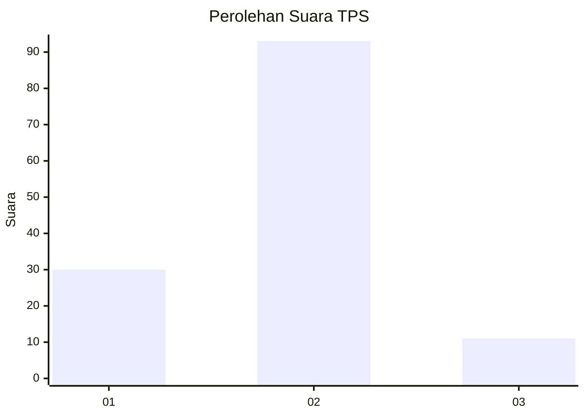
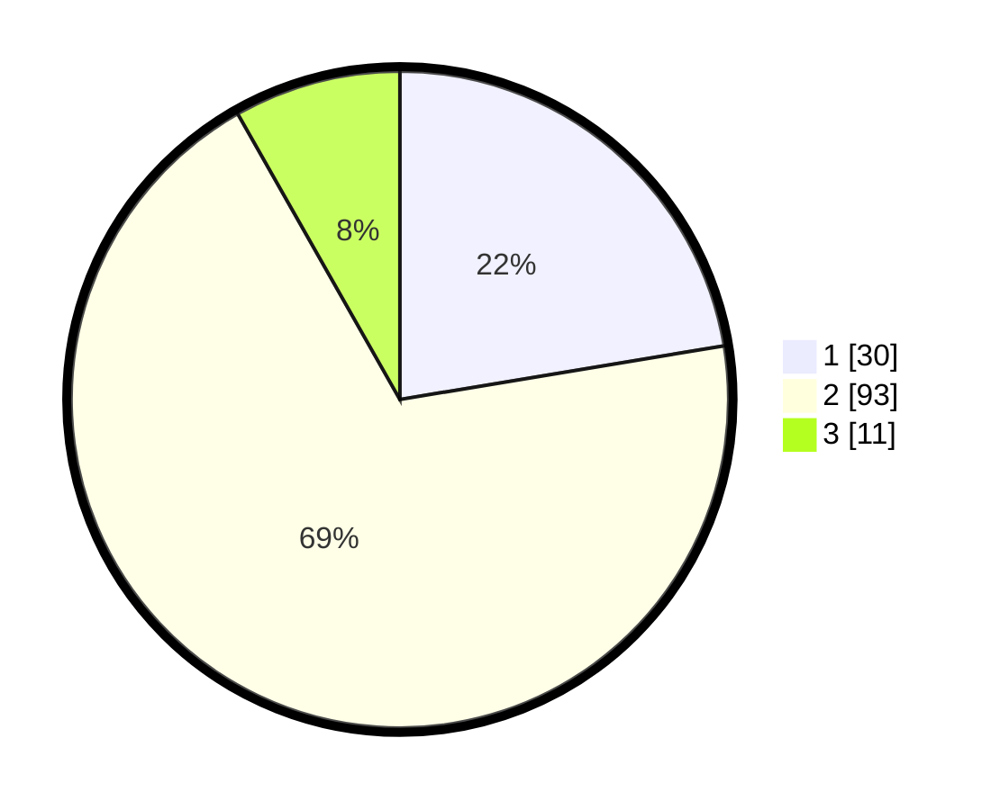

# Hasil

## Grafik

## Tabel

| No. | Nama Paslon    | Suara | Suara (raw) | Persentase |
|:--- |:-------------- | -----:| -----------:| ----------:|
| 1   | ANIES MUHAIMIN | 30    | [30][p-1]   | 22,39      |
| 2   | PRABOWO GIBRAN | 93    | [93][p-2]   | 69,40      |
| 3   | GANJAR MAHFUD  | 11    | [11][p-3]   | 8,21       |

[p-1]: https://github.com/gigit-pemilu/pemilu-2024/blob/main/pilpres/hitung-suara/sub/35-jawa-timur/sub/09-jember/sub/03-sumberbaru/sub/2008-rowotengah/sub/011-tps/sub/paslon-1.txt
[p-2]: https://github.com/gigit-pemilu/pemilu-2024/blob/main/pilpres/hitung-suara/sub/35-jawa-timur/sub/09-jember/sub/03-sumberbaru/sub/2008-rowotengah/sub/011-tps/sub/paslon-2.txt
[p-3]: https://github.com/gigit-pemilu/pemilu-2024/blob/main/pilpres/hitung-suara/sub/35-jawa-timur/sub/09-jember/sub/03-sumberbaru/sub/2008-rowotengah/sub/011-tps/sub/paslon-3.txt

## Foto C Plano

https://sirekap-obj-formc.kpu.go.id/e362/pemilu/ppwp/35/09/03/20/08/3509032008011-20240214-162234--5bd839dc-a7cd-4b9a-9fd5-cebbd6884a97.jpg

https://sirekap-obj-formc.kpu.go.id/e362/pemilu/ppwp/35/09/03/20/08/3509032008011-20240214-155805--087993c6-4df7-4a76-b8e1-cde3c1d3e1c7.jpg

## Metadata

| Key        | Value               |
| ---------- | ------------------- |
| Time Stamp | 2024-02-24 22:31:28 |

