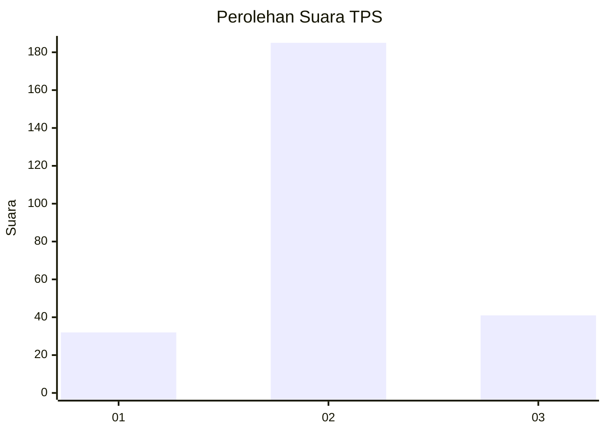
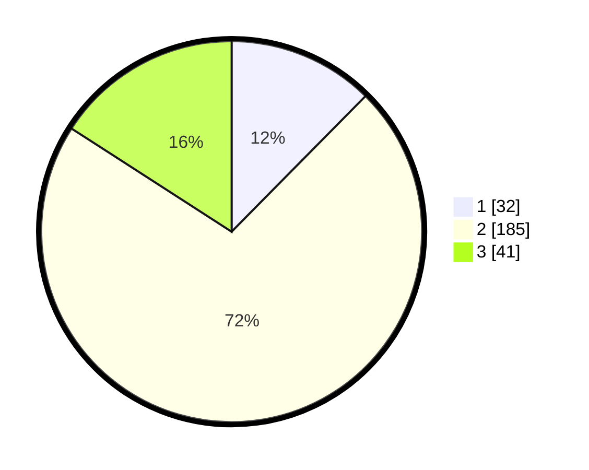

# Hasil

## Grafik

## Tabel

| No. | Nama Paslon    | Suara | Suara (raw) | Persentase |
|:--- |:-------------- | -----:| -----------:| ----------:|
| 1   | ANIES MUHAIMIN | 32    | [32][p-1]   | 12,40      |
| 2   | PRABOWO GIBRAN | 185   | [185][p-2]  | 71,71      |
| 3   | GANJAR MAHFUD  | 41    | [41][p-3]   | 15,89      |

[p-1]: https://github.com/gigit-pemilu/pemilu-2024-35-jawa-timur/blob/main/pilpres/hitung-suara/sub/35-jawa-timur/sub/09-jember/sub/03-sumberbaru/sub/2008-rowotengah/sub/014-tps/sub/paslon-1.txt
[p-2]: https://github.com/gigit-pemilu/pemilu-2024-35-jawa-timur/blob/main/pilpres/hitung-suara/sub/35-jawa-timur/sub/09-jember/sub/03-sumberbaru/sub/2008-rowotengah/sub/014-tps/sub/paslon-2.txt
[p-3]: https://github.com/gigit-pemilu/pemilu-2024-35-jawa-timur/blob/main/pilpres/hitung-suara/sub/35-jawa-timur/sub/09-jember/sub/03-sumberbaru/sub/2008-rowotengah/sub/014-tps/sub/paslon-3.txt

## Foto C Plano

https://sirekap-obj-formc.kpu.go.id/52ba/pemilu/ppwp/35/09/03/20/08/3509032008014-20240214-212206--e5e23af0-2f36-4980-bc9e-3cd8fcad6eaa.jpg

https://sirekap-obj-formc.kpu.go.id/52ba/pemilu/ppwp/35/09/03/20/08/3509032008014-20240214-212341--e6411b90-4f85-47e6-87bc-44bae7f93b3c.jpg

https://sirekap-obj-formc.kpu.go.id/52ba/pemilu/ppwp/35/09/03/20/08/3509032008014-20240214-212554--b7a71b5c-faed-4df8-9149-28e78f4375aa.jpg

## Metadata

| Key        | Value               |
| ---------- | ------------------- |
| Time Stamp | 2024-02-15 15:00:29 |

