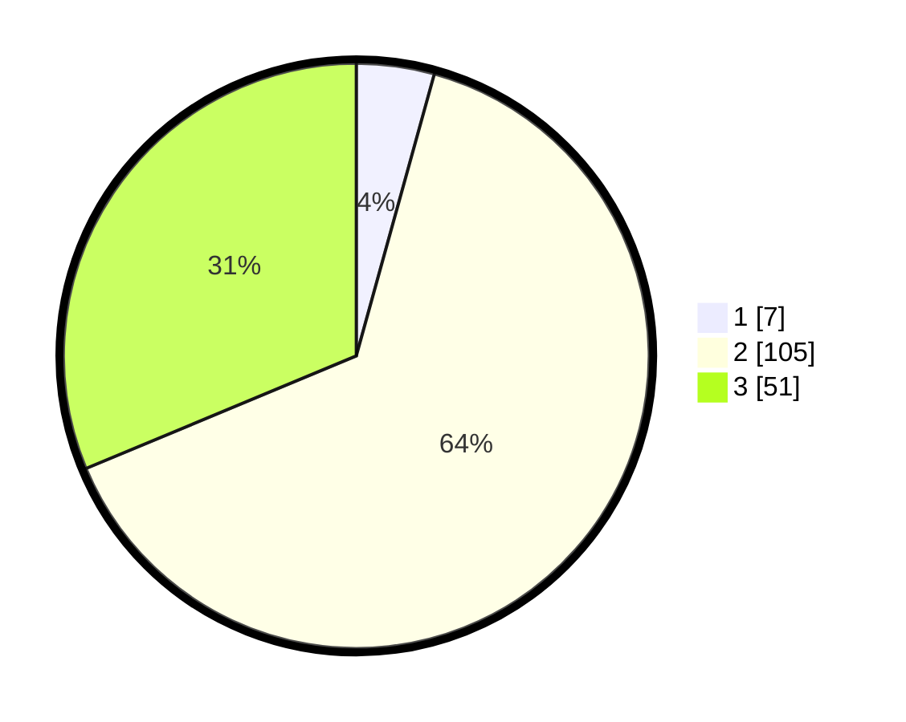

# Hasil

## Grafik

## Tabel

| No. | Nama Paslon    | Suara | Suara (raw) | Persentase |
|:--- |:-------------- | -----:| -----------:| ----------:|
| 1   | ANIES MUHAIMIN | 7     | [7][p-1]    | 4,29       |
| 2   | PRABOWO GIBRAN | 105   | [105][p-2]  | 64,42      |
| 3   | GANJAR MAHFUD  | 51    | [51][p-3]   | 31,29      |

[p-1]: https://github.com/gigit-pemilu/pemilu-2024-35-jawa-timur/blob/main/pilpres/hitung-suara/sub/35-jawa-timur/sub/09-jember/sub/03-sumberbaru/sub/2008-rowotengah/sub/019-tps/sub/paslon-1.txt
[p-2]: https://github.com/gigit-pemilu/pemilu-2024-35-jawa-timur/blob/main/pilpres/hitung-suara/sub/35-jawa-timur/sub/09-jember/sub/03-sumberbaru/sub/2008-rowotengah/sub/019-tps/sub/paslon-2.txt
[p-3]: https://github.com/gigit-pemilu/pemilu-2024-35-jawa-timur/blob/main/pilpres/hitung-suara/sub/35-jawa-timur/sub/09-jember/sub/03-sumberbaru/sub/2008-rowotengah/sub/019-tps/sub/paslon-3.txt

## Foto C Plano

https://sirekap-obj-formc.kpu.go.id/bcf2/pemilu/ppwp/35/09/03/20/08/3509032008019-20240214-200234--162e28a3-40c9-4f0c-8c40-d7e975e5ed00.jpg

https://sirekap-obj-formc.kpu.go.id/bcf2/pemilu/ppwp/35/09/03/20/08/3509032008019-20240214-200553--9fb95ada-6456-401e-9015-72e24cac4e46.jpg

https://sirekap-obj-formc.kpu.go.id/bcf2/pemilu/ppwp/35/09/03/20/08/3509032008019-20240214-200711--16d749c3-f8ce-4ac9-8e0f-b99d02945f3a.jpg

## Metadata

| Key        | Value               |
| ---------- | ------------------- |
| Time Stamp | 2024-02-15 12:00:28 |

