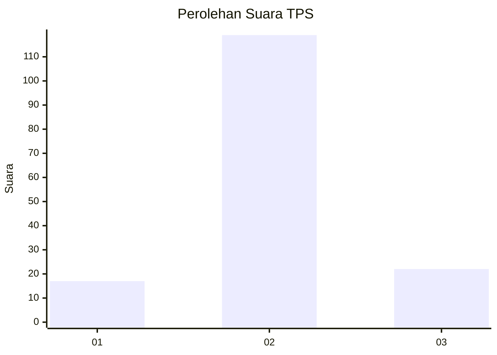
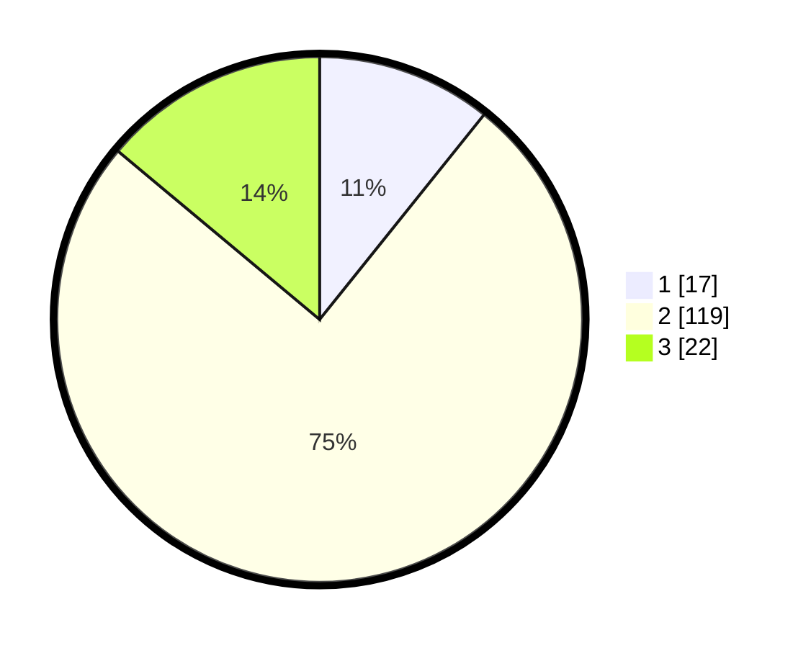

# Hasil

## Grafik

## Tabel

| No. | Nama Paslon    | Suara | Suara (raw) | Persentase |
|:--- |:-------------- | -----:| -----------:| ----------:|
| 1   | ANIES MUHAIMIN | 17    | [17][p-1]   | 10,76      |
| 2   | PRABOWO GIBRAN | 119   | [119][p-2]  | 75,32      |
| 3   | GANJAR MAHFUD  | 22    | [22][p-3]   | 13,92      |

[p-1]: https://github.com/gigit-pemilu/pemilu-2024-35-jawa-timur/blob/main/pilpres/hitung-suara/sub/35-jawa-timur/sub/09-jember/sub/03-sumberbaru/sub/2008-rowotengah/sub/022-tps/sub/paslon-1.txt
[p-2]: https://github.com/gigit-pemilu/pemilu-2024-35-jawa-timur/blob/main/pilpres/hitung-suara/sub/35-jawa-timur/sub/09-jember/sub/03-sumberbaru/sub/2008-rowotengah/sub/022-tps/sub/paslon-2.txt
[p-3]: https://github.com/gigit-pemilu/pemilu-2024-35-jawa-timur/blob/main/pilpres/hitung-suara/sub/35-jawa-timur/sub/09-jember/sub/03-sumberbaru/sub/2008-rowotengah/sub/022-tps/sub/paslon-3.txt

## Foto C Plano

https://sirekap-obj-formc.kpu.go.id/b7da/pemilu/ppwp/35/09/03/20/08/3509032008022-20240215-172929--7f72fb88-256f-4b6e-a78e-04f7761b3848.jpg

https://sirekap-obj-formc.kpu.go.id/b7da/pemilu/ppwp/35/09/03/20/08/3509032008022-20240215-172844--0a4751ec-c892-499c-a4b8-6fbf5fab5d07.jpg

https://sirekap-obj-formc.kpu.go.id/b7da/pemilu/ppwp/35/09/03/20/08/3509032008022-20240215-173042--6bdd1733-b557-43dc-bb83-5f8c564397f5.jpg

## Metadata

| Key        | Value               |
| ---------- | ------------------- |
| Time Stamp | 2024-02-15 21:01:18 |

