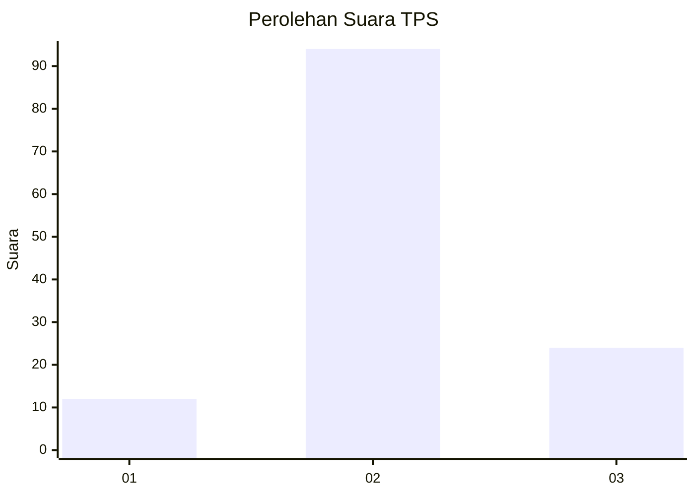
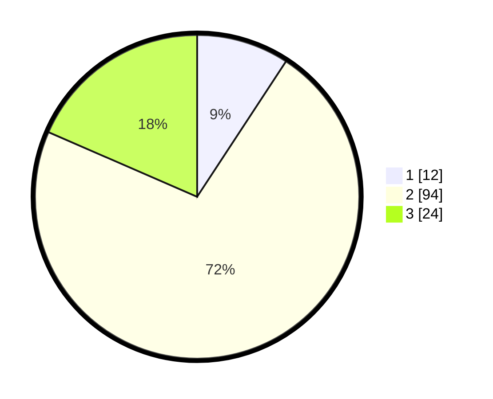

# Hasil

## Grafik

## Tabel

| No. | Nama Paslon    | Suara | Suara (raw) | Persentase |
|:--- |:-------------- | -----:| -----------:| ----------:|
| 1   | ANIES MUHAIMIN | 12    | [12][p-1]   | 9,23       |
| 2   | PRABOWO GIBRAN | 94    | [94][p-2]   | 72,31      |
| 3   | GANJAR MAHFUD  | 24    | [24][p-3]   | 18,46      |

[p-1]: https://github.com/gigit-pemilu/pemilu-2024-35-jawa-timur/blob/main/pilpres/hitung-suara/sub/35-jawa-timur/sub/09-jember/sub/03-sumberbaru/sub/2008-rowotengah/sub/026-tps/sub/paslon-1.txt
[p-2]: https://github.com/gigit-pemilu/pemilu-2024-35-jawa-timur/blob/main/pilpres/hitung-suara/sub/35-jawa-timur/sub/09-jember/sub/03-sumberbaru/sub/2008-rowotengah/sub/026-tps/sub/paslon-2.txt
[p-3]: https://github.com/gigit-pemilu/pemilu-2024-35-jawa-timur/blob/main/pilpres/hitung-suara/sub/35-jawa-timur/sub/09-jember/sub/03-sumberbaru/sub/2008-rowotengah/sub/026-tps/sub/paslon-3.txt

## Foto C Plano

https://sirekap-obj-formc.kpu.go.id/d45f/pemilu/ppwp/35/09/03/20/08/3509032008026-20240214-224750--33867eeb-253e-4105-b8f2-93b86c10e45b.jpg

https://sirekap-obj-formc.kpu.go.id/d45f/pemilu/ppwp/35/09/03/20/08/3509032008026-20240214-224840--5daee751-4d25-4b54-8ad3-7d1ee87f1909.jpg

https://sirekap-obj-formc.kpu.go.id/d45f/pemilu/ppwp/35/09/03/20/08/3509032008026-20240214-225226--0abc0b84-b9c7-427f-a718-e0a847cb18fa.jpg

## Metadata

| Key        | Value               |
| ---------- | ------------------- |
| Time Stamp | 2024-02-24 22:31:28 |

