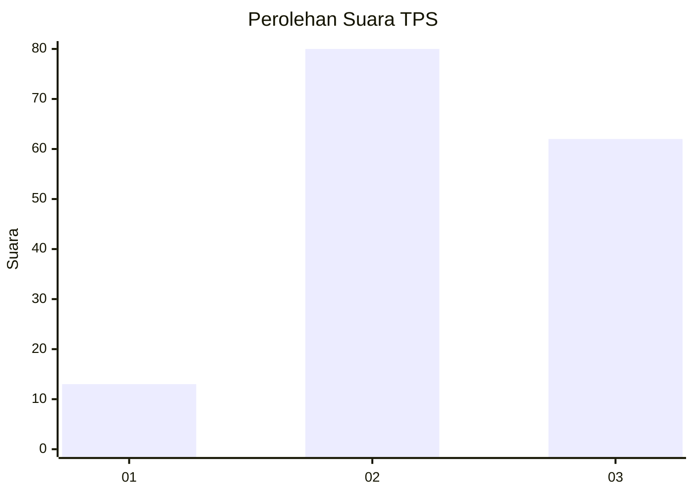
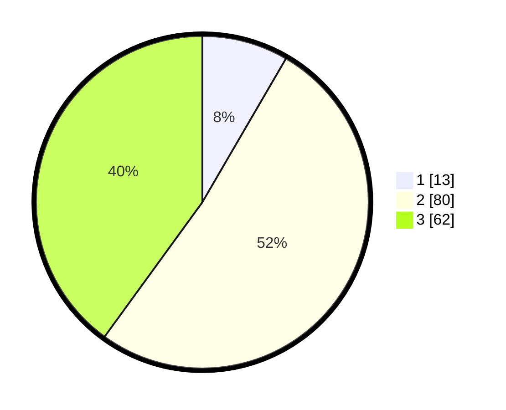

# Hasil

## Grafik

## Tabel

| No. | Nama Paslon    | Suara | Suara (raw) | Persentase |
|:--- |:-------------- | -----:| -----------:| ----------:|
| 1   | ANIES MUHAIMIN | 13    | [13][p-1]   | 8,39       |
| 2   | PRABOWO GIBRAN | 80    | [80][p-2]   | 51,61      |
| 3   | GANJAR MAHFUD  | 62    | [62][p-3]   | 40,00      |

[p-1]: https://github.com/gigit-pemilu/pemilu-2024/blob/main/pilpres/hitung-suara/sub/35-jawa-timur/sub/09-jember/sub/03-sumberbaru/sub/2008-rowotengah/sub/027-tps/sub/paslon-1.txt
[p-2]: https://github.com/gigit-pemilu/pemilu-2024/blob/main/pilpres/hitung-suara/sub/35-jawa-timur/sub/09-jember/sub/03-sumberbaru/sub/2008-rowotengah/sub/027-tps/sub/paslon-2.txt
[p-3]: https://github.com/gigit-pemilu/pemilu-2024/blob/main/pilpres/hitung-suara/sub/35-jawa-timur/sub/09-jember/sub/03-sumberbaru/sub/2008-rowotengah/sub/027-tps/sub/paslon-3.txt

## Foto C Plano

https://sirekap-obj-formc.kpu.go.id/d608/pemilu/ppwp/35/09/03/20/08/3509032008027-20240214-210753--894be771-239c-440b-99aa-181e582ee196.jpg

https://sirekap-obj-formc.kpu.go.id/d608/pemilu/ppwp/35/09/03/20/08/3509032008027-20240214-211009--4e6d9a3c-945f-46e3-a424-608e9e169dd4.jpg

https://sirekap-obj-formc.kpu.go.id/d608/pemilu/ppwp/35/09/03/20/08/3509032008027-20240214-212711--218f1c60-6144-4319-8d43-9523efd00064.jpg

## Metadata

| Key        | Value               |
| ---------- | ------------------- |
| Time Stamp | 2024-02-15 12:00:28 |

