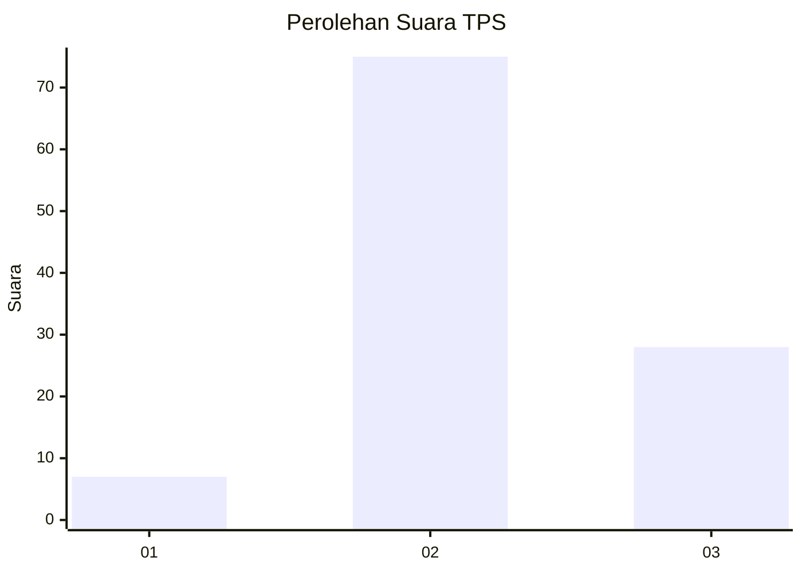
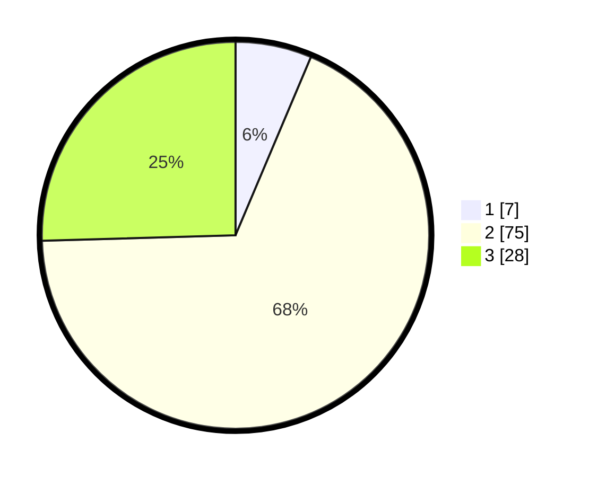

# Hasil

## Grafik

## Tabel

| No. | Nama Paslon    | Suara | Suara (raw) | Persentase |
|:--- |:-------------- | -----:| -----------:| ----------:|
| 1   | ANIES MUHAIMIN | 7     | [7][p-1]    | 6,36       |
| 2   | PRABOWO GIBRAN | 75    | [75][p-2]   | 68,18      |
| 3   | GANJAR MAHFUD  | 28    | [28][p-3]   | 25,45      |

[p-1]: https://github.com/gigit-pemilu/pemilu-2024-35-jawa-timur/blob/main/pilpres/hitung-suara/sub/35-jawa-timur/sub/09-jember/sub/03-sumberbaru/sub/2008-rowotengah/sub/032-tps/sub/paslon-1.txt
[p-2]: https://github.com/gigit-pemilu/pemilu-2024-35-jawa-timur/blob/main/pilpres/hitung-suara/sub/35-jawa-timur/sub/09-jember/sub/03-sumberbaru/sub/2008-rowotengah/sub/032-tps/sub/paslon-2.txt
[p-3]: https://github.com/gigit-pemilu/pemilu-2024-35-jawa-timur/blob/main/pilpres/hitung-suara/sub/35-jawa-timur/sub/09-jember/sub/03-sumberbaru/sub/2008-rowotengah/sub/032-tps/sub/paslon-3.txt

## Foto C Plano

https://sirekap-obj-formc.kpu.go.id/330c/pemilu/ppwp/35/09/03/20/08/3509032008032-20240214-233942--46699f97-ecc6-40a8-b094-bbadeae94971.jpg

https://sirekap-obj-formc.kpu.go.id/330c/pemilu/ppwp/35/09/03/20/08/3509032008032-20240214-234134--82c8b204-5006-4e06-a041-ab2e6d80d5f2.jpg

https://sirekap-obj-formc.kpu.go.id/330c/pemilu/ppwp/35/09/03/20/08/3509032008032-20240214-234539--e8d3f7de-ca33-4019-8802-78bdb63e9c69.jpg

## Metadata

| Key        | Value               |
| ---------- | ------------------- |
| Time Stamp | 2024-02-24 22:31:28 |

