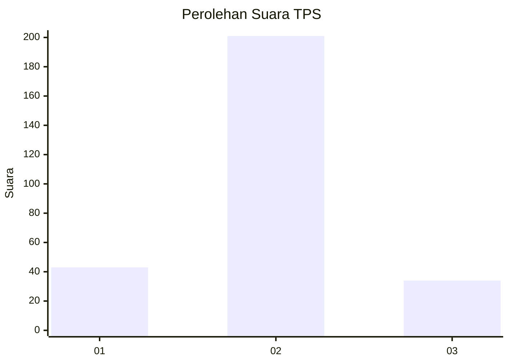
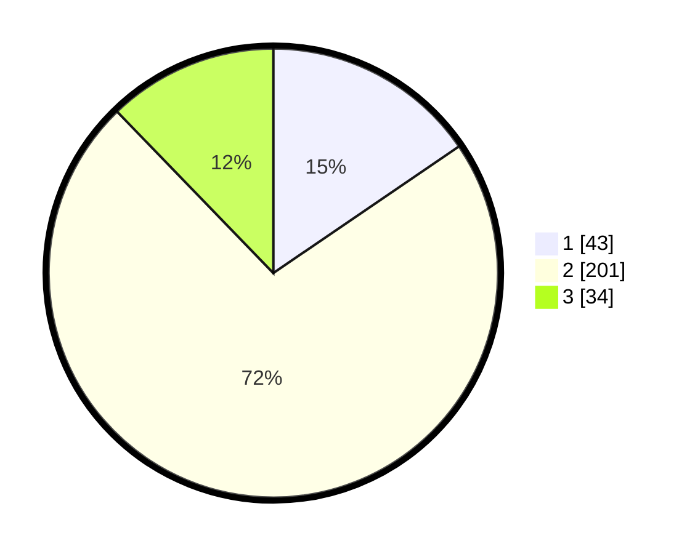

# Hasil

## Grafik

## Tabel

| No. | Nama Paslon    | Suara | Suara (raw) | Persentase |
|:--- |:-------------- | -----:| -----------:| ----------:|
| 1   | ANIES MUHAIMIN | 43    | [43][p-1]   | 15,47      |
| 2   | PRABOWO GIBRAN | 201   | [201][p-2]  | 72,30      |
| 3   | GANJAR MAHFUD  | 34    | [34][p-3]   | 12,23      |

[p-1]: https://github.com/gigit-pemilu/pemilu-2024-35-jawa-timur/blob/main/pilpres/hitung-suara/sub/35-jawa-timur/sub/09-jember/sub/03-sumberbaru/sub/2009-pringgowirawan/sub/006-tps/sub/paslon-1.txt
[p-2]: https://github.com/gigit-pemilu/pemilu-2024-35-jawa-timur/blob/main/pilpres/hitung-suara/sub/35-jawa-timur/sub/09-jember/sub/03-sumberbaru/sub/2009-pringgowirawan/sub/006-tps/sub/paslon-2.txt
[p-3]: https://github.com/gigit-pemilu/pemilu-2024-35-jawa-timur/blob/main/pilpres/hitung-suara/sub/35-jawa-timur/sub/09-jember/sub/03-sumberbaru/sub/2009-pringgowirawan/sub/006-tps/sub/paslon-3.txt

## Foto C Plano

https://sirekap-obj-formc.kpu.go.id/407b/pemilu/ppwp/35/09/03/20/09/3509032009006-20240215-122108--569ff134-1d22-45cb-87b5-b21c5c4f062b.jpg

https://sirekap-obj-formc.kpu.go.id/407b/pemilu/ppwp/35/09/03/20/09/3509032009006-20240215-122147--c802c8c4-3cba-4a22-87ea-ca24c071c2b9.jpg

## Metadata

| Key        | Value               |
| ---------- | ------------------- |
| Time Stamp | 2024-02-24 22:31:28 |

