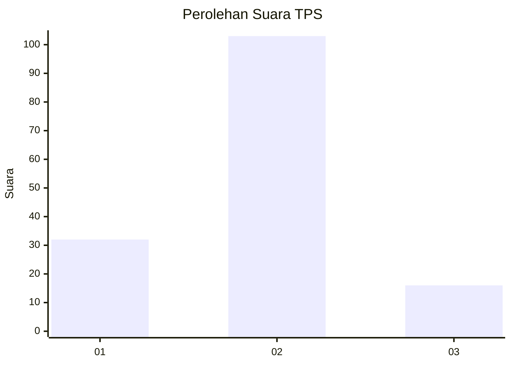
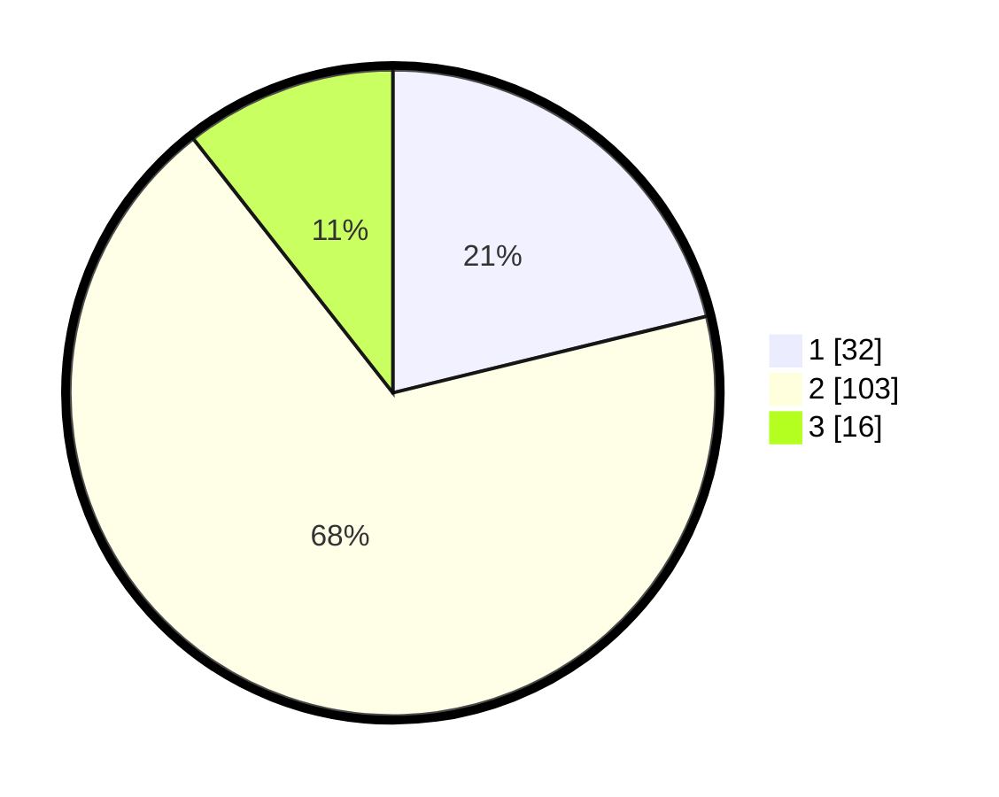

# Hasil

## Grafik

## Tabel

| No. | Nama Paslon    | Suara | Suara (raw) | Persentase |
|:--- |:-------------- | -----:| -----------:| ----------:|
| 1   | ANIES MUHAIMIN | 32    | [32][p-1]   | 21,19      |
| 2   | PRABOWO GIBRAN | 103   | [103][p-2]  | 68,21      |
| 3   | GANJAR MAHFUD  | 16    | [16][p-3]   | 10,60      |

[p-1]: https://github.com/gigit-pemilu/pemilu-2024/blob/main/pilpres/hitung-suara/sub/35-jawa-timur/sub/09-jember/sub/03-sumberbaru/sub/2009-pringgowirawan/sub/015-tps/sub/paslon-1.txt
[p-2]: https://github.com/gigit-pemilu/pemilu-2024/blob/main/pilpres/hitung-suara/sub/35-jawa-timur/sub/09-jember/sub/03-sumberbaru/sub/2009-pringgowirawan/sub/015-tps/sub/paslon-2.txt
[p-3]: https://github.com/gigit-pemilu/pemilu-2024/blob/main/pilpres/hitung-suara/sub/35-jawa-timur/sub/09-jember/sub/03-sumberbaru/sub/2009-pringgowirawan/sub/015-tps/sub/paslon-3.txt

## Foto C Plano

https://sirekap-obj-formc.kpu.go.id/a610/pemilu/ppwp/35/09/03/20/09/3509032009015-20240215-020930--f8421e4a-3d9c-4812-b6b2-8b4ad6945f49.jpg

https://sirekap-obj-formc.kpu.go.id/a610/pemilu/ppwp/35/09/03/20/09/3509032009015-20240215-101501--4cc46b0c-7915-49e8-9005-0edcfb5bbe86.jpg

https://sirekap-obj-formc.kpu.go.id/a610/pemilu/ppwp/35/09/03/20/09/3509032009015-20240215-021218--06d996df-f12b-44d1-afc3-edbe49b958c3.jpg

## Metadata

| Key        | Value               |
| ---------- | ------------------- |
| Time Stamp | 2024-02-15 12:00:28 |

