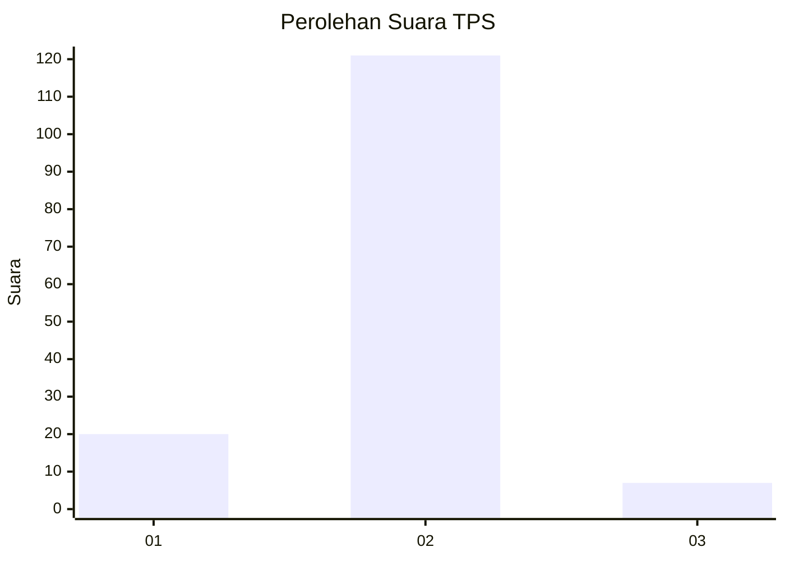
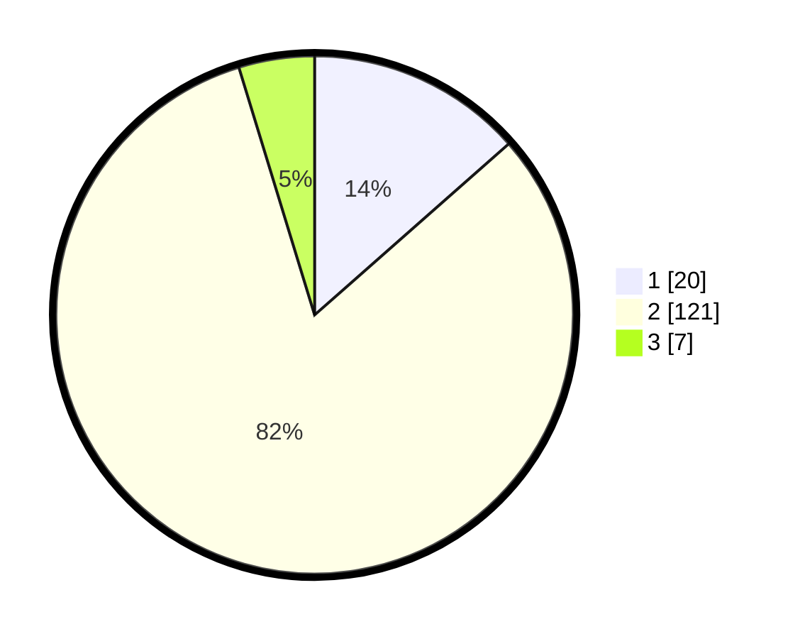

# Hasil

## Grafik

## Tabel

| No. | Nama Paslon    | Suara | Suara (raw) | Persentase |
|:--- |:-------------- | -----:| -----------:| ----------:|
| 1   | ANIES MUHAIMIN | 20    | [20][p-1]   | 13,51      |
| 2   | PRABOWO GIBRAN | 121   | [121][p-2]  | 81,76      |
| 3   | GANJAR MAHFUD  | 7     | [7][p-3]    | 4,73       |

[p-1]: https://github.com/gigit-pemilu/pemilu-2024/blob/main/pilpres/hitung-suara/sub/35-jawa-timur/sub/09-jember/sub/03-sumberbaru/sub/2009-pringgowirawan/sub/022-tps/sub/paslon-1.txt
[p-2]: https://github.com/gigit-pemilu/pemilu-2024/blob/main/pilpres/hitung-suara/sub/35-jawa-timur/sub/09-jember/sub/03-sumberbaru/sub/2009-pringgowirawan/sub/022-tps/sub/paslon-2.txt
[p-3]: https://github.com/gigit-pemilu/pemilu-2024/blob/main/pilpres/hitung-suara/sub/35-jawa-timur/sub/09-jember/sub/03-sumberbaru/sub/2009-pringgowirawan/sub/022-tps/sub/paslon-3.txt

## Foto C Plano

https://sirekap-obj-formc.kpu.go.id/7d10/pemilu/ppwp/35/09/03/20/09/3509032009022-20240214-214259--72a41de9-d798-40a8-911b-63ebc4525d1d.jpg

https://sirekap-obj-formc.kpu.go.id/7d10/pemilu/ppwp/35/09/03/20/09/3509032009022-20240214-214408--a8d2272a-1f6b-41de-b23d-19175eb7928c.jpg

https://sirekap-obj-formc.kpu.go.id/7d10/pemilu/ppwp/35/09/03/20/09/3509032009022-20240214-214508--61d6e5b5-05bd-4f3d-91ec-850a67d14be0.jpg

## Metadata

| Key        | Value               |
| ---------- | ------------------- |
| Time Stamp | 2024-02-15 15:00:29 |

