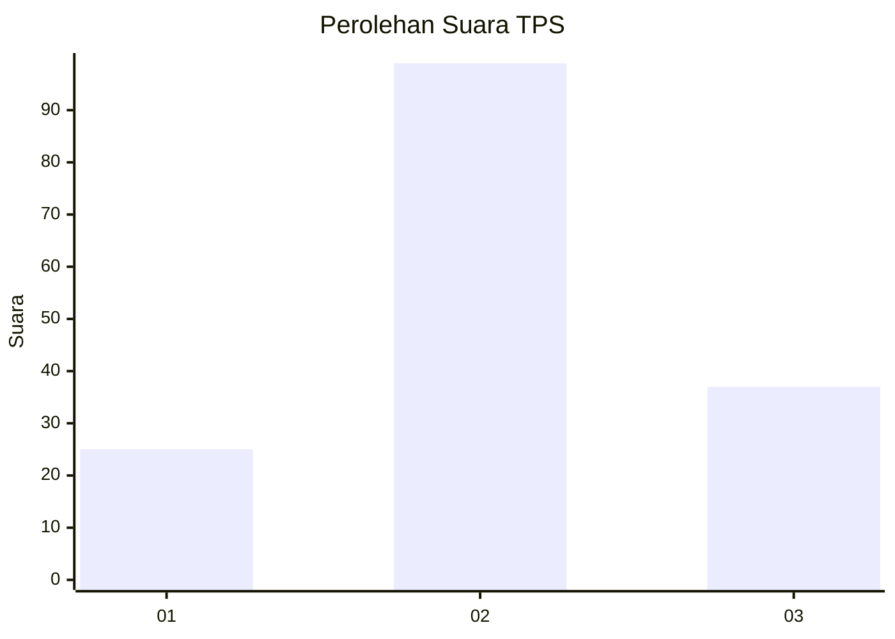
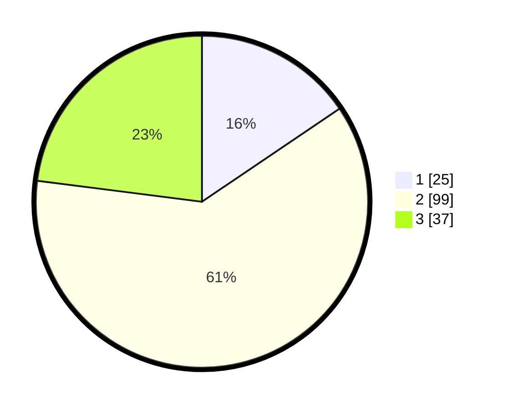

# Hasil

## Grafik

## Tabel

| No. | Nama Paslon    | Suara | Suara (raw) | Persentase |
|:--- |:-------------- | -----:| -----------:| ----------:|
| 1   | ANIES MUHAIMIN | 25    | [25][p-1]   | 15,53      |
| 2   | PRABOWO GIBRAN | 99    | [99][p-2]   | 61,49      |
| 3   | GANJAR MAHFUD  | 37    | [37][p-3]   | 22,98      |

[p-1]: https://github.com/gigit-pemilu/pemilu-2024-35-jawa-timur/blob/main/pilpres/hitung-suara/sub/35-jawa-timur/sub/09-jember/sub/03-sumberbaru/sub/2009-pringgowirawan/sub/029-tps/sub/paslon-1.txt
[p-2]: https://github.com/gigit-pemilu/pemilu-2024-35-jawa-timur/blob/main/pilpres/hitung-suara/sub/35-jawa-timur/sub/09-jember/sub/03-sumberbaru/sub/2009-pringgowirawan/sub/029-tps/sub/paslon-2.txt
[p-3]: https://github.com/gigit-pemilu/pemilu-2024-35-jawa-timur/blob/main/pilpres/hitung-suara/sub/35-jawa-timur/sub/09-jember/sub/03-sumberbaru/sub/2009-pringgowirawan/sub/029-tps/sub/paslon-3.txt

## Foto C Plano

https://sirekap-obj-formc.kpu.go.id/be25/pemilu/ppwp/35/09/03/20/09/3509032009029-20240214-205540--1ad06645-b04e-45db-b1d3-5ed4e6295b6d.jpg

https://sirekap-obj-formc.kpu.go.id/be25/pemilu/ppwp/35/09/03/20/09/3509032009029-20240214-214705--335daa53-ee57-4031-9a15-88b7e7908275.jpg

https://sirekap-obj-formc.kpu.go.id/be25/pemilu/ppwp/35/09/03/20/09/3509032009029-20240214-214843--12e032aa-3ef8-4807-be8d-6f2b16ba4dcd.jpg

## Metadata

| Key        | Value               |
| ---------- | ------------------- |
| Time Stamp | 2024-02-16 12:51:22 |

