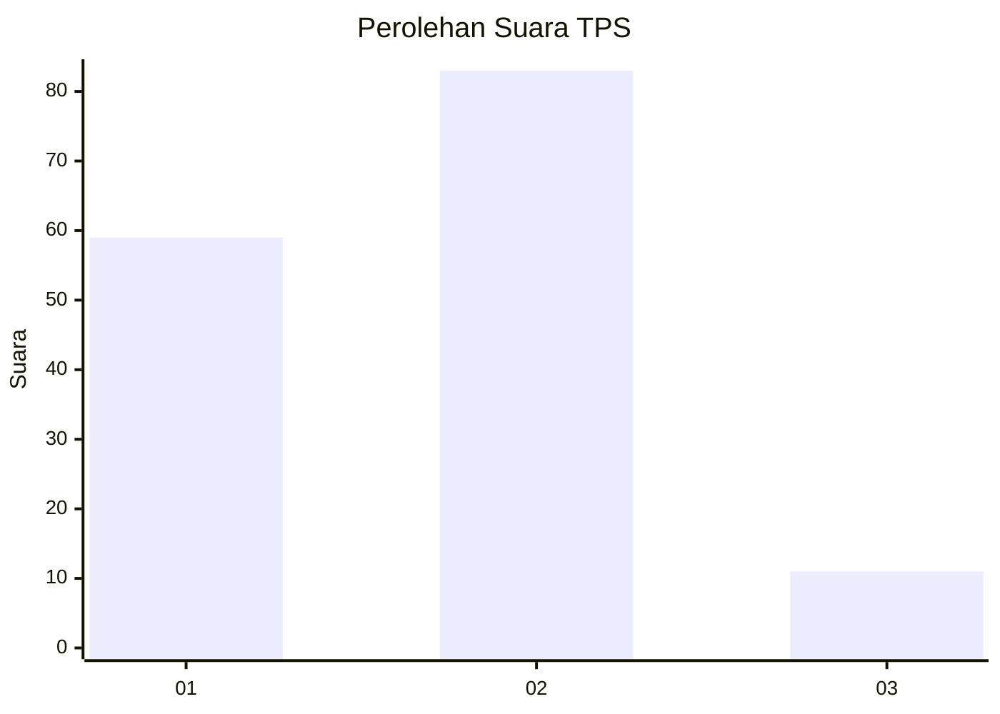
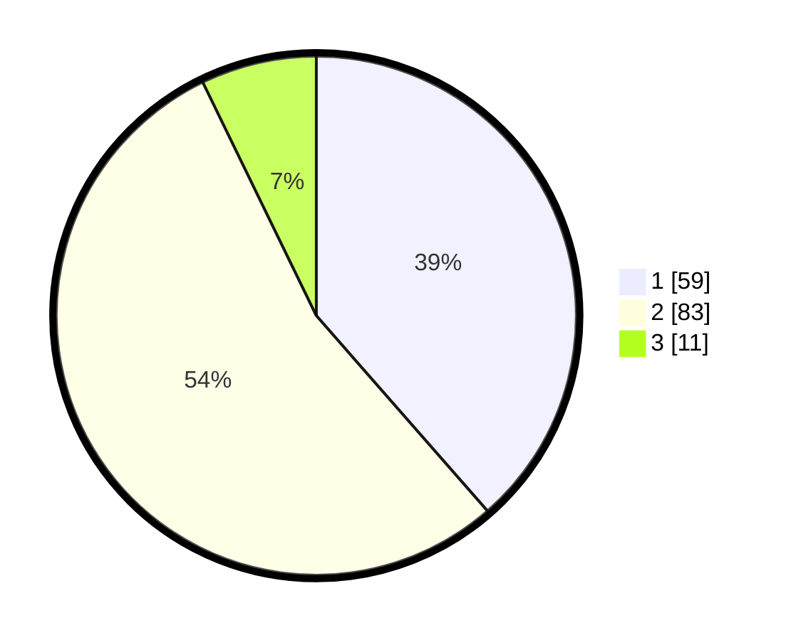

# Hasil

## Grafik

## Tabel

| No. | Nama Paslon    | Suara | Suara (raw) | Persentase |
|:--- |:-------------- | -----:| -----------:| ----------:|
| 1   | ANIES MUHAIMIN | 59    | [59][p-1]   | 38,56      |
| 2   | PRABOWO GIBRAN | 83    | [83][p-2]   | 54,25      |
| 3   | GANJAR MAHFUD  | 11    | [11][p-3]   | 7,19       |

[p-1]: https://github.com/gigit-pemilu/pemilu-2024/blob/main/pilpres/hitung-suara/sub/35-jawa-timur/sub/09-jember/sub/03-sumberbaru/sub/2009-pringgowirawan/sub/033-tps/sub/paslon-1.txt
[p-2]: https://github.com/gigit-pemilu/pemilu-2024/blob/main/pilpres/hitung-suara/sub/35-jawa-timur/sub/09-jember/sub/03-sumberbaru/sub/2009-pringgowirawan/sub/033-tps/sub/paslon-2.txt
[p-3]: https://github.com/gigit-pemilu/pemilu-2024/blob/main/pilpres/hitung-suara/sub/35-jawa-timur/sub/09-jember/sub/03-sumberbaru/sub/2009-pringgowirawan/sub/033-tps/sub/paslon-3.txt

## Foto C Plano

https://sirekap-obj-formc.kpu.go.id/c4e3/pemilu/ppwp/35/09/03/20/09/3509032009033-20240214-221451--271618c7-3c21-4862-8518-d36fa1cbefcf.jpg

https://sirekap-obj-formc.kpu.go.id/c4e3/pemilu/ppwp/35/09/03/20/09/3509032009033-20240214-221501--3857f830-336a-4537-b816-96fd8e87b913.jpg

https://sirekap-obj-formc.kpu.go.id/c4e3/pemilu/ppwp/35/09/03/20/09/3509032009033-20240214-221509--e9c2b65c-5561-43eb-9ef6-dca16d6cbbf8.jpg

## Metadata

| Key        | Value               |
| ---------- | ------------------- |
| Time Stamp | 2024-02-16 12:51:22 |

