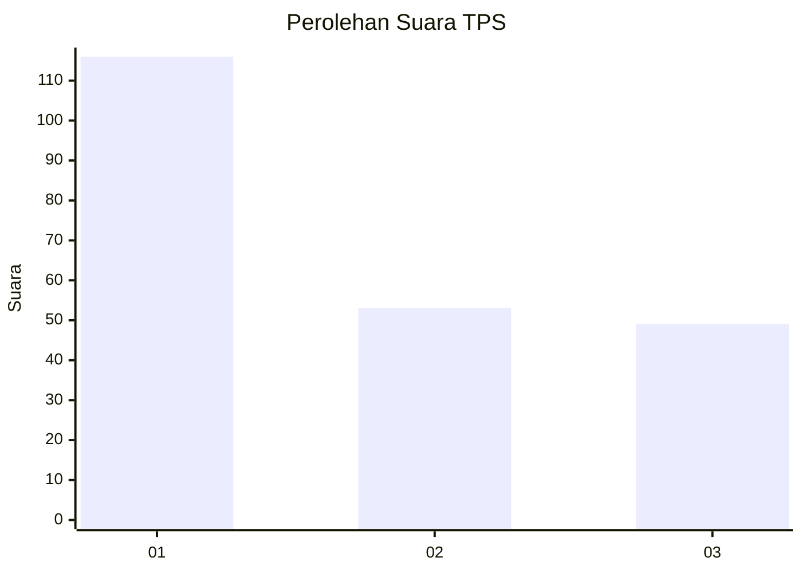
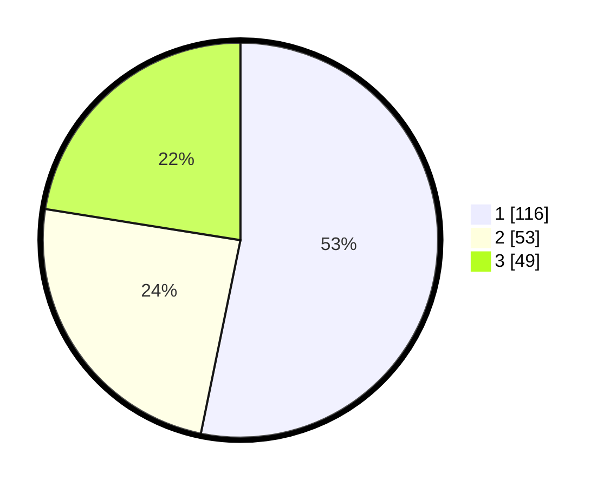

# Hasil

## Grafik

## Tabel

| No. | Nama Paslon    | Suara | Suara (raw) | Persentase |
|:--- |:-------------- | -----:| -----------:| ----------:|
| 1   | ANIES MUHAIMIN | 116   | [116][p-1]  | 53,21      |
| 2   | PRABOWO GIBRAN | 53    | [53][p-2]   | 24,31      |
| 3   | GANJAR MAHFUD  | 49    | [49][p-3]   | 22,48      |

[p-1]: https://github.com/gigit-pemilu/pemilu-2024-35-jawa-timur/blob/main/pilpres/hitung-suara/sub/35-jawa-timur/sub/09-jember/sub/03-sumberbaru/sub/2009-pringgowirawan/sub/034-tps/sub/paslon-1.txt
[p-2]: https://github.com/gigit-pemilu/pemilu-2024-35-jawa-timur/blob/main/pilpres/hitung-suara/sub/35-jawa-timur/sub/09-jember/sub/03-sumberbaru/sub/2009-pringgowirawan/sub/034-tps/sub/paslon-2.txt
[p-3]: https://github.com/gigit-pemilu/pemilu-2024-35-jawa-timur/blob/main/pilpres/hitung-suara/sub/35-jawa-timur/sub/09-jember/sub/03-sumberbaru/sub/2009-pringgowirawan/sub/034-tps/sub/paslon-3.txt

## Foto C Plano

https://sirekap-obj-formc.kpu.go.id/c80d/pemilu/ppwp/35/09/03/20/09/3509032009034-20240214-235108--a8cbf57a-405c-4252-8e06-a15b6abcf65e.jpg

https://sirekap-obj-formc.kpu.go.id/c80d/pemilu/ppwp/35/09/03/20/09/3509032009034-20240214-234713--66c33818-bf4c-4440-90ca-2231f04621e4.jpg

https://sirekap-obj-formc.kpu.go.id/c80d/pemilu/ppwp/35/09/03/20/09/3509032009034-20240214-235304--33647ecc-3823-429c-83e5-15b9d7719e63.jpg

## Metadata

| Key        | Value               |
| ---------- | ------------------- |
| Time Stamp | 2024-02-24 22:31:28 |

