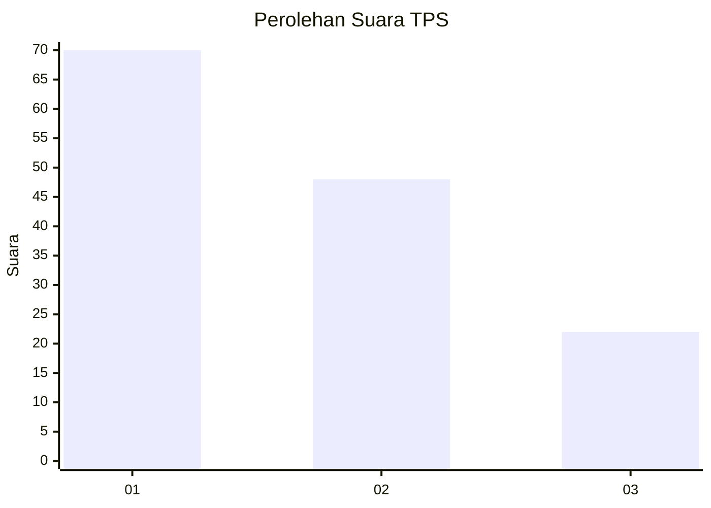
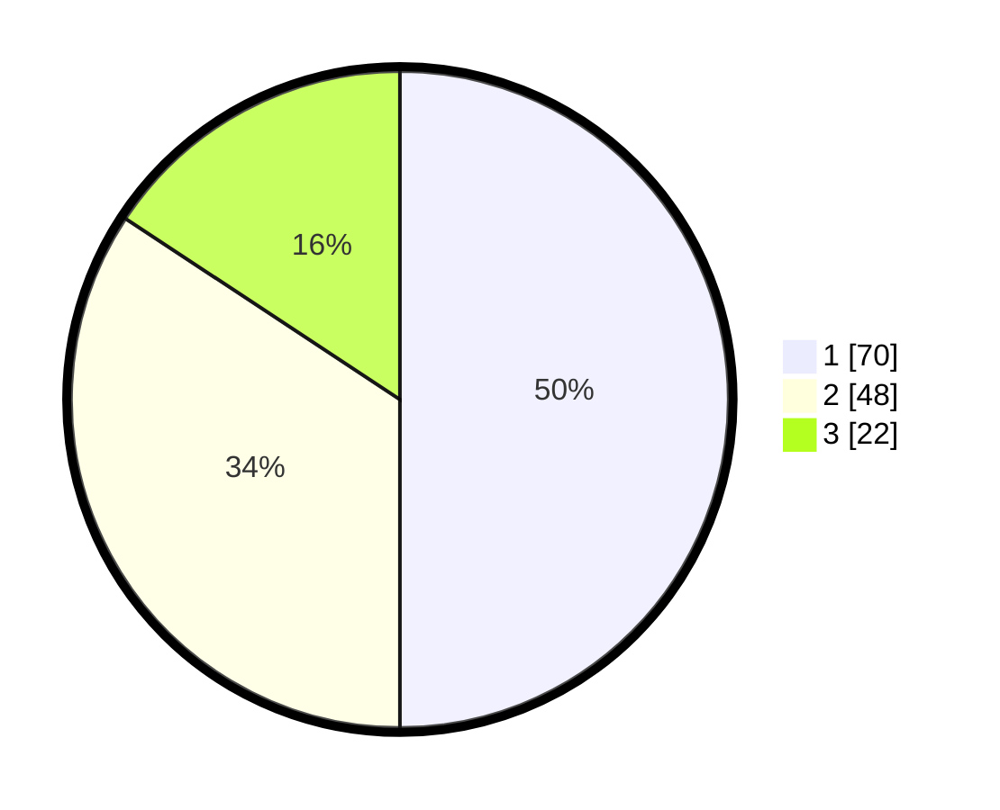

# Hasil

## Grafik

## Tabel

| No. | Nama Paslon    | Suara | Suara (raw) | Persentase |
|:--- |:-------------- | -----:| -----------:| ----------:|
| 1   | ANIES MUHAIMIN | 70    | [70][p-1]   | 50,00      |
| 2   | PRABOWO GIBRAN | 48    | [48][p-2]   | 34,29      |
| 3   | GANJAR MAHFUD  | 22    | [22][p-3]   | 15,71      |

[p-1]: https://github.com/gigit-pemilu/pemilu-2024/blob/main/pilpres/hitung-suara/sub/35-jawa-timur/sub/09-jember/sub/03-sumberbaru/sub/2009-pringgowirawan/sub/036-tps/sub/paslon-1.txt
[p-2]: https://github.com/gigit-pemilu/pemilu-2024/blob/main/pilpres/hitung-suara/sub/35-jawa-timur/sub/09-jember/sub/03-sumberbaru/sub/2009-pringgowirawan/sub/036-tps/sub/paslon-2.txt
[p-3]: https://github.com/gigit-pemilu/pemilu-2024/blob/main/pilpres/hitung-suara/sub/35-jawa-timur/sub/09-jember/sub/03-sumberbaru/sub/2009-pringgowirawan/sub/036-tps/sub/paslon-3.txt

## Foto C Plano

https://sirekap-obj-formc.kpu.go.id/ef21/pemilu/ppwp/35/09/03/20/09/3509032009036-20240214-231554--0f7632f7-d8dc-43a2-8d82-7cd207501601.jpg

https://sirekap-obj-formc.kpu.go.id/ef21/pemilu/ppwp/35/09/03/20/09/3509032009036-20240214-222814--a2b9b84a-7d99-4690-9f10-a133e8feffa8.jpg

https://sirekap-obj-formc.kpu.go.id/ef21/pemilu/ppwp/35/09/03/20/09/3509032009036-20240214-222954--8da25871-a5f4-4d63-a934-88254f3d27f4.jpg

## Metadata

| Key        | Value               |
| ---------- | ------------------- |
| Time Stamp | 2024-02-16 12:51:22 |

