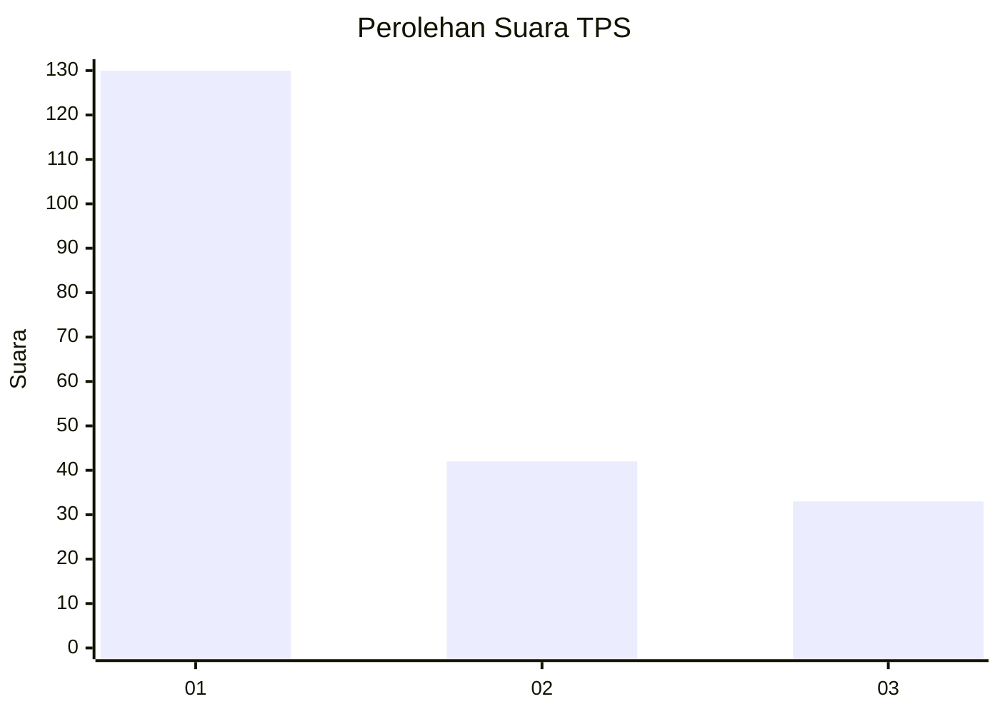
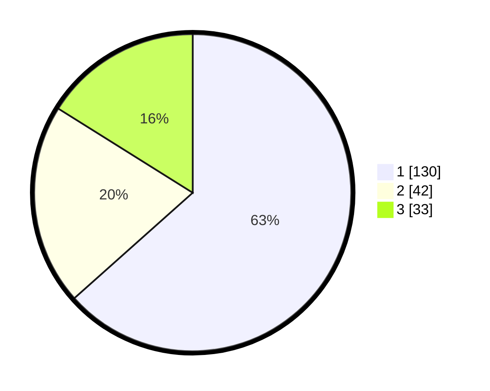

# Hasil

## Grafik

## Tabel

| No. | Nama Paslon    | Suara | Suara (raw) | Persentase |
|:--- |:-------------- | -----:| -----------:| ----------:|
| 1   | ANIES MUHAIMIN | 130   | [130][p-1]  | 63,41      |
| 2   | PRABOWO GIBRAN | 42    | [42][p-2]   | 20,49      |
| 3   | GANJAR MAHFUD  | 33    | [33][p-3]   | 16,10      |

[p-1]: https://github.com/gigit-pemilu/pemilu-2024-35-jawa-timur/blob/main/pilpres/hitung-suara/sub/35-jawa-timur/sub/09-jember/sub/03-sumberbaru/sub/2009-pringgowirawan/sub/037-tps/sub/paslon-1.txt
[p-2]: https://github.com/gigit-pemilu/pemilu-2024-35-jawa-timur/blob/main/pilpres/hitung-suara/sub/35-jawa-timur/sub/09-jember/sub/03-sumberbaru/sub/2009-pringgowirawan/sub/037-tps/sub/paslon-2.txt
[p-3]: https://github.com/gigit-pemilu/pemilu-2024-35-jawa-timur/blob/main/pilpres/hitung-suara/sub/35-jawa-timur/sub/09-jember/sub/03-sumberbaru/sub/2009-pringgowirawan/sub/037-tps/sub/paslon-3.txt

## Foto C Plano

https://sirekap-obj-formc.kpu.go.id/7651/pemilu/ppwp/35/09/03/20/09/3509032009037-20240215-000732--37501416-2c5f-4440-a93f-4c0a11cb789a.jpg

https://sirekap-obj-formc.kpu.go.id/7651/pemilu/ppwp/35/09/03/20/09/3509032009037-20240215-000942--bea524dd-65b9-4f8c-8a1c-119665eb3ad7.jpg

https://sirekap-obj-formc.kpu.go.id/7651/pemilu/ppwp/35/09/03/20/09/3509032009037-20240215-001111--1ab1c856-b7f3-4307-915d-9b78da32204c.jpg

## Metadata

| Key        | Value               |
| ---------- | ------------------- |
| Time Stamp | 2024-02-15 15:00:29 |

