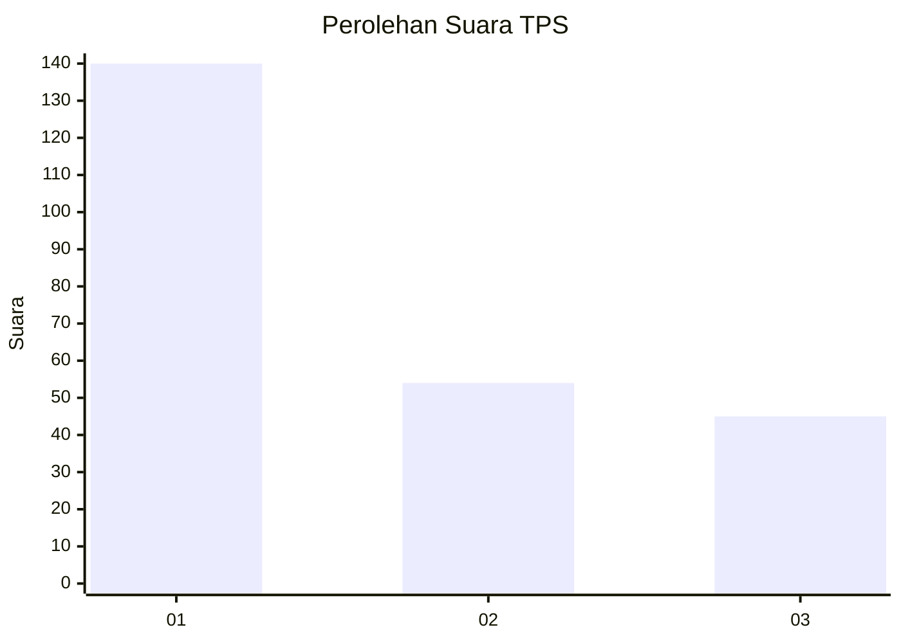
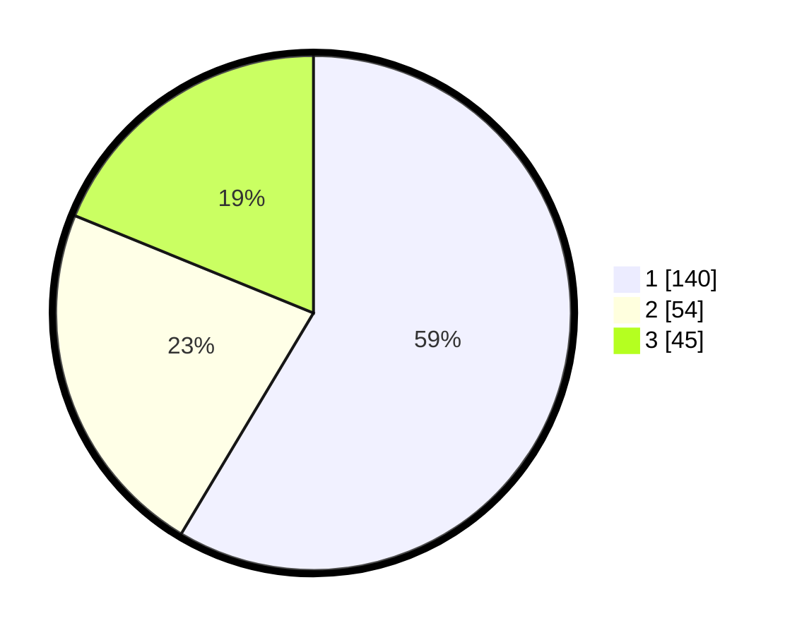

# Hasil

## Grafik

## Tabel

| No. | Nama Paslon    | Suara | Suara (raw) | Persentase |
|:--- |:-------------- | -----:| -----------:| ----------:|
| 1   | ANIES MUHAIMIN | 140   | [140][p-1]  | 58,58      |
| 2   | PRABOWO GIBRAN | 54    | [54][p-2]   | 22,59      |
| 3   | GANJAR MAHFUD  | 45    | [45][p-3]   | 18,83      |

[p-1]: https://github.com/gigit-pemilu/pemilu-2024/blob/main/pilpres/hitung-suara/sub/35-jawa-timur/sub/09-jember/sub/03-sumberbaru/sub/2009-pringgowirawan/sub/038-tps/sub/paslon-1.txt
[p-2]: https://github.com/gigit-pemilu/pemilu-2024/blob/main/pilpres/hitung-suara/sub/35-jawa-timur/sub/09-jember/sub/03-sumberbaru/sub/2009-pringgowirawan/sub/038-tps/sub/paslon-2.txt
[p-3]: https://github.com/gigit-pemilu/pemilu-2024/blob/main/pilpres/hitung-suara/sub/35-jawa-timur/sub/09-jember/sub/03-sumberbaru/sub/2009-pringgowirawan/sub/038-tps/sub/paslon-3.txt

## Foto C Plano

https://sirekap-obj-formc.kpu.go.id/1228/pemilu/ppwp/35/09/03/20/09/3509032009038-20240215-024643--ea557eb1-0bc9-49d3-beed-2a20566ccd3e.jpg

https://sirekap-obj-formc.kpu.go.id/1228/pemilu/ppwp/35/09/03/20/09/3509032009038-20240215-024824--d29ae7e1-1d12-45e7-97a0-ad89437cec9e.jpg

https://sirekap-obj-formc.kpu.go.id/1228/pemilu/ppwp/35/09/03/20/09/3509032009038-20240215-025204--9612caa6-b291-47c6-926f-42ea1b42836f.jpg

## Metadata

| Key        | Value               |
| ---------- | ------------------- |
| Time Stamp | 2024-02-15 15:00:29 |

