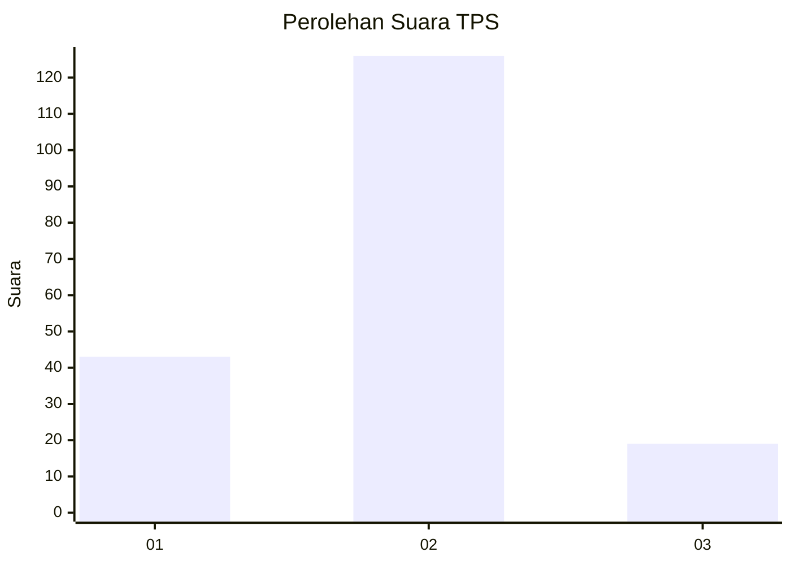

# Hasil

## Grafik

## Tabel

| No. | Nama Paslon    | Suara | Suara (raw) | Persentase |
|:--- |:-------------- | -----:| -----------:| ----------:|
| 1   | ANIES MUHAIMIN | 43    | [43][p-1]   | 22,87      |
| 2   | PRABOWO GIBRAN | 126   | [126][p-2]  | 67,02      |
| 3   | GANJAR MAHFUD  | 19    | [19][p-3]   | 10,11      |

[p-1]: https://github.com/gigit-pemilu/pemilu-2024/blob/main/pilpres/hitung-suara/sub/35-jawa-timur/sub/09-jember/sub/03-sumberbaru/sub/2009-pringgowirawan/sub/040-tps/sub/paslon-1.txt
[p-2]: https://github.com/gigit-pemilu/pemilu-2024/blob/main/pilpres/hitung-suara/sub/35-jawa-timur/sub/09-jember/sub/03-sumberbaru/sub/2009-pringgowirawan/sub/040-tps/sub/paslon-2.txt
[p-3]: https://github.com/gigit-pemilu/pemilu-2024/blob/main/pilpres/hitung-suara/sub/35-jawa-timur/sub/09-jember/sub/03-sumberbaru/sub/2009-pringgowirawan/sub/040-tps/sub/paslon-3.txt

## Foto C Plano

https://sirekap-obj-formc.kpu.go.id/8b52/pemilu/ppwp/35/09/03/20/09/3509032009040-20240215-110157--6c32c365-a0e0-4ff3-b9e4-6bbfcbc50163.jpg

https://sirekap-obj-formc.kpu.go.id/8b52/pemilu/ppwp/35/09/03/20/09/3509032009040-20240214-222519--b02bd949-193c-4b15-bd2d-6130f3530f5b.jpg

https://sirekap-obj-formc.kpu.go.id/8b52/pemilu/ppwp/35/09/03/20/09/3509032009040-20240215-111301--e28bafd5-15bb-4f80-91c8-8d9cc4c0c3b6.jpg

## Metadata

| Key        | Value               |
| ---------- | ------------------- |
| Time Stamp | 2024-02-24 22:31:28 |

