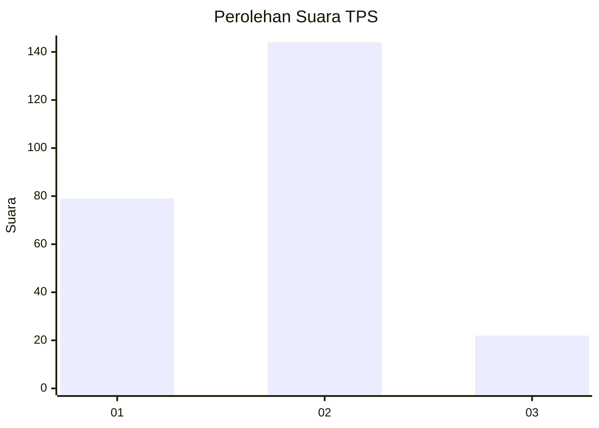
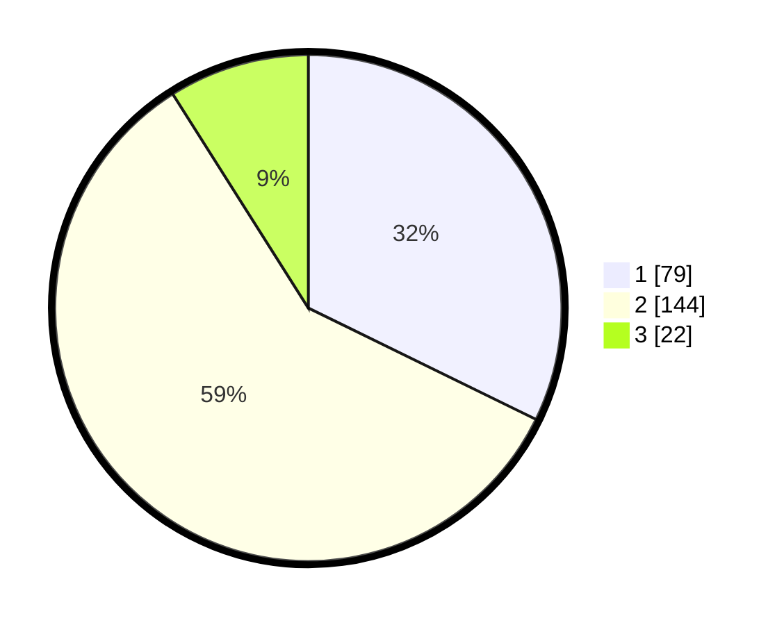

# Hasil

## Grafik

## Tabel

| No. | Nama Paslon    | Suara | Suara (raw) | Persentase |
|:--- |:-------------- | -----:| -----------:| ----------:|
| 1   | ANIES MUHAIMIN | 79    | [79][p-1]   | 32,24      |
| 2   | PRABOWO GIBRAN | 144   | [144][p-2]  | 58,78      |
| 3   | GANJAR MAHFUD  | 22    | [22][p-3]   | 8,98       |

[p-1]: https://github.com/gigit-pemilu/pemilu-2024/blob/main/pilpres/hitung-suara/sub/35-jawa-timur/sub/09-jember/sub/03-sumberbaru/sub/2010-karangbayat/sub/001-tps/sub/paslon-1.txt
[p-2]: https://github.com/gigit-pemilu/pemilu-2024/blob/main/pilpres/hitung-suara/sub/35-jawa-timur/sub/09-jember/sub/03-sumberbaru/sub/2010-karangbayat/sub/001-tps/sub/paslon-2.txt
[p-3]: https://github.com/gigit-pemilu/pemilu-2024/blob/main/pilpres/hitung-suara/sub/35-jawa-timur/sub/09-jember/sub/03-sumberbaru/sub/2010-karangbayat/sub/001-tps/sub/paslon-3.txt

## Foto C Plano

https://sirekap-obj-formc.kpu.go.id/1068/pemilu/ppwp/35/09/03/20/10/3509032010001-20240215-073835--dc0d634e-1725-4ba9-a322-ce175bc960c2.jpg

https://sirekap-obj-formc.kpu.go.id/1068/pemilu/ppwp/35/09/03/20/10/3509032010001-20240215-073841--721be30d-f696-430a-bdf0-b944317018cb.jpg

https://sirekap-obj-formc.kpu.go.id/1068/pemilu/ppwp/35/09/03/20/10/3509032010001-20240215-073845--8b9bb871-9d86-4518-8878-2a8b6411b52e.jpg

## Metadata

| Key        | Value               |
| ---------- | ------------------- |
| Time Stamp | 2024-02-15 12:00:28 |

