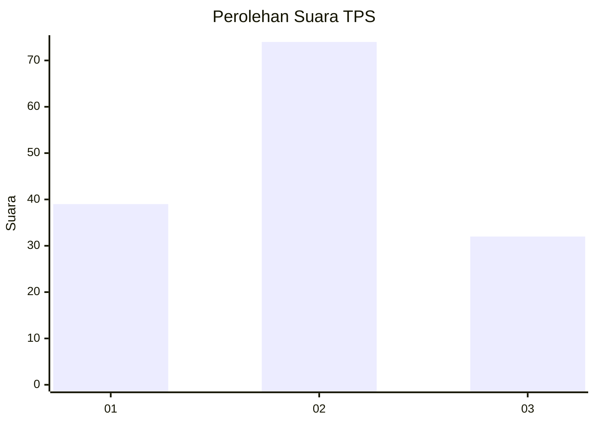
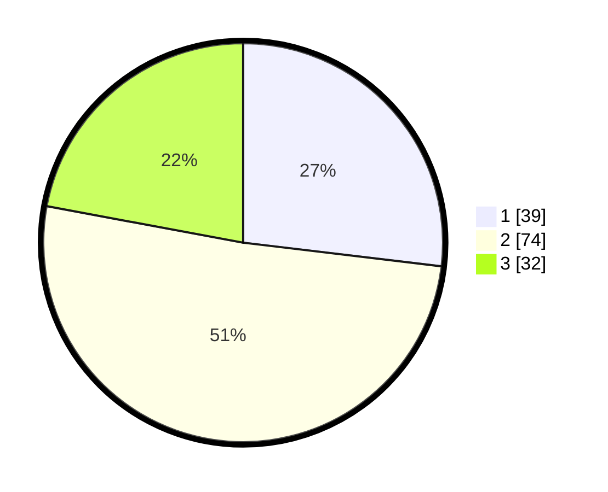

# Hasil

## Grafik

## Tabel

| No. | Nama Paslon    | Suara | Suara (raw) | Persentase |
|:--- |:-------------- | -----:| -----------:| ----------:|
| 1   | ANIES MUHAIMIN | 39    | [39][p-1]   | 26,90      |
| 2   | PRABOWO GIBRAN | 74    | [74][p-2]   | 51,03      |
| 3   | GANJAR MAHFUD  | 32    | [32][p-3]   | 22,07      |

[p-1]: https://github.com/gigit-pemilu/pemilu-2024-35-jawa-timur/blob/main/pilpres/hitung-suara/sub/35-jawa-timur/sub/09-jember/sub/03-sumberbaru/sub/2010-karangbayat/sub/002-tps/sub/paslon-1.txt
[p-2]: https://github.com/gigit-pemilu/pemilu-2024-35-jawa-timur/blob/main/pilpres/hitung-suara/sub/35-jawa-timur/sub/09-jember/sub/03-sumberbaru/sub/2010-karangbayat/sub/002-tps/sub/paslon-2.txt
[p-3]: https://github.com/gigit-pemilu/pemilu-2024-35-jawa-timur/blob/main/pilpres/hitung-suara/sub/35-jawa-timur/sub/09-jember/sub/03-sumberbaru/sub/2010-karangbayat/sub/002-tps/sub/paslon-3.txt

## Foto C Plano

https://sirekap-obj-formc.kpu.go.id/801c/pemilu/ppwp/35/09/03/20/10/3509032010002-20240215-154225--7c041351-048b-4712-92e9-8a5af0b87eca.jpg

https://sirekap-obj-formc.kpu.go.id/801c/pemilu/ppwp/35/09/03/20/10/3509032010002-20240215-110359--9a6187ac-b583-43d4-b28c-36534e11f8b3.jpg

https://sirekap-obj-formc.kpu.go.id/801c/pemilu/ppwp/35/09/03/20/10/3509032010002-20240215-111107--5c5d2a9c-f8a6-4643-b81a-db5c7bc8845d.jpg

## Metadata

| Key        | Value               |
| ---------- | ------------------- |
| Time Stamp | 2024-02-24 22:31:28 |

