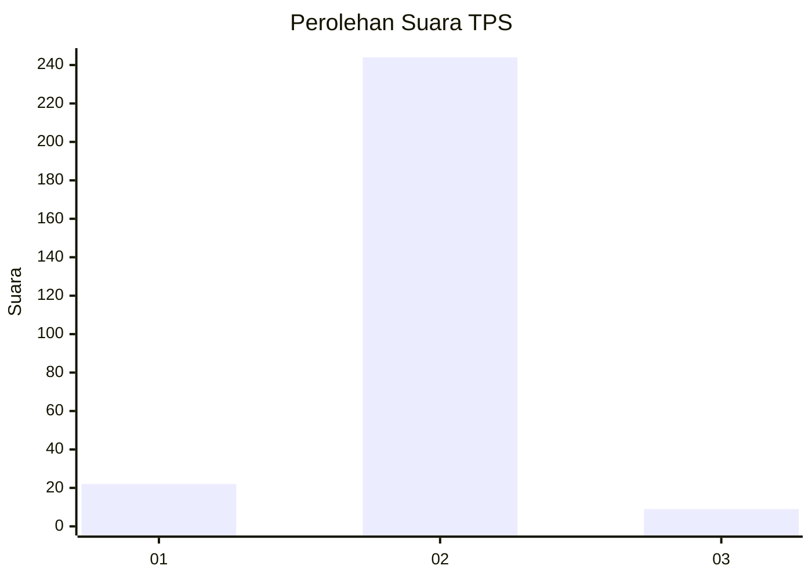
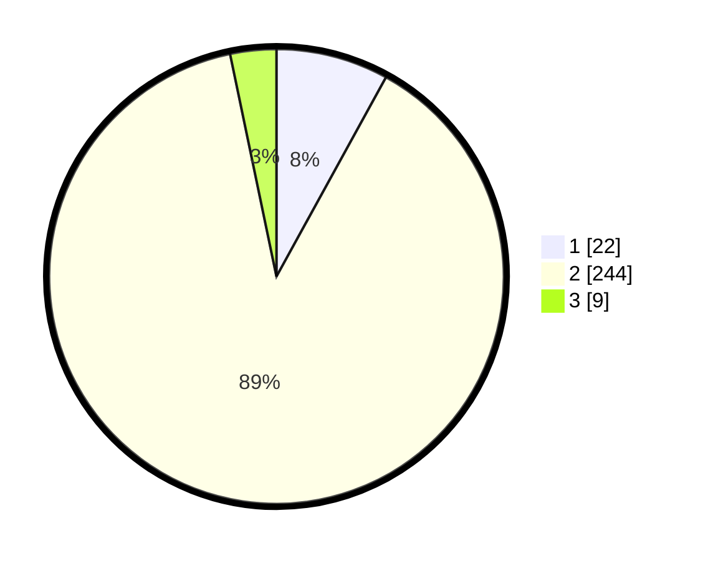

# Hasil

## Grafik

## Tabel

| No. | Nama Paslon    | Suara | Suara (raw) | Persentase |
|:--- |:-------------- | -----:| -----------:| ----------:|
| 1   | ANIES MUHAIMIN | 22    | [22][p-1]   | 8,00       |
| 2   | PRABOWO GIBRAN | 244   | [244][p-2]  | 88,73      |
| 3   | GANJAR MAHFUD  | 9     | [9][p-3]    | 3,27       |

[p-1]: https://github.com/gigit-pemilu/pemilu-2024-35-jawa-timur/blob/main/pilpres/hitung-suara/sub/35-jawa-timur/sub/09-jember/sub/03-sumberbaru/sub/2010-karangbayat/sub/006-tps/sub/paslon-1.txt
[p-2]: https://github.com/gigit-pemilu/pemilu-2024-35-jawa-timur/blob/main/pilpres/hitung-suara/sub/35-jawa-timur/sub/09-jember/sub/03-sumberbaru/sub/2010-karangbayat/sub/006-tps/sub/paslon-2.txt
[p-3]: https://github.com/gigit-pemilu/pemilu-2024-35-jawa-timur/blob/main/pilpres/hitung-suara/sub/35-jawa-timur/sub/09-jember/sub/03-sumberbaru/sub/2010-karangbayat/sub/006-tps/sub/paslon-3.txt

## Foto C Plano

https://sirekap-obj-formc.kpu.go.id/96e4/pemilu/ppwp/35/09/03/20/10/3509032010006-20240215-082915--35681aff-81b5-4031-88c6-6e0cf18f4f28.jpg

https://sirekap-obj-formc.kpu.go.id/96e4/pemilu/ppwp/35/09/03/20/10/3509032010006-20240215-083131--cb95ae34-446a-4554-acce-b2e8aa3aea40.jpg

https://sirekap-obj-formc.kpu.go.id/96e4/pemilu/ppwp/35/09/03/20/10/3509032010006-20240215-083301--afba5fc6-12e3-4e9b-8a52-ee7f1c9aa59e.jpg

## Metadata

| Key        | Value               |
| ---------- | ------------------- |
| Time Stamp | 2024-02-24 22:31:28 |

