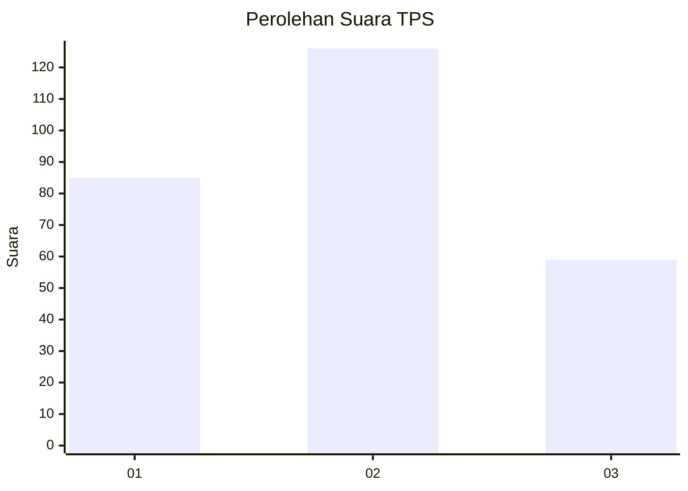
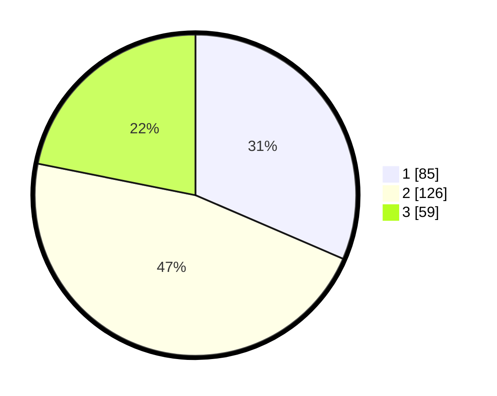

# Hasil

## Grafik

## Tabel

| No. | Nama Paslon    | Suara | Suara (raw) | Persentase |
|:--- |:-------------- | -----:| -----------:| ----------:|
| 1   | ANIES MUHAIMIN | 85    | [85][p-1]   | 31,48      |
| 2   | PRABOWO GIBRAN | 126   | [126][p-2]  | 46,67      |
| 3   | GANJAR MAHFUD  | 59    | [59][p-3]   | 21,85      |

[p-1]: https://github.com/gigit-pemilu/pemilu-2024/blob/main/pilpres/hitung-suara/sub/35-jawa-timur/sub/09-jember/sub/03-sumberbaru/sub/2010-karangbayat/sub/017-tps/sub/paslon-1.txt
[p-2]: https://github.com/gigit-pemilu/pemilu-2024/blob/main/pilpres/hitung-suara/sub/35-jawa-timur/sub/09-jember/sub/03-sumberbaru/sub/2010-karangbayat/sub/017-tps/sub/paslon-2.txt
[p-3]: https://github.com/gigit-pemilu/pemilu-2024/blob/main/pilpres/hitung-suara/sub/35-jawa-timur/sub/09-jember/sub/03-sumberbaru/sub/2010-karangbayat/sub/017-tps/sub/paslon-3.txt

## Foto C Plano

https://sirekap-obj-formc.kpu.go.id/edb5/pemilu/ppwp/35/09/03/20/10/3509032010017-20240215-030019--c2f171b8-e3c7-4a56-9621-5f8fe2754191.jpg

https://sirekap-obj-formc.kpu.go.id/edb5/pemilu/ppwp/35/09/03/20/10/3509032010017-20240215-030111--63b84eac-84ec-4ec6-98c0-3e68e1ea3d42.jpg

https://sirekap-obj-formc.kpu.go.id/edb5/pemilu/ppwp/35/09/03/20/10/3509032010017-20240215-030147--651c8a56-fee7-48aa-a59c-9aef0cdd0023.jpg

## Metadata

| Key        | Value               |
| ---------- | ------------------- |
| Time Stamp | 2024-02-15 15:00:29 |

