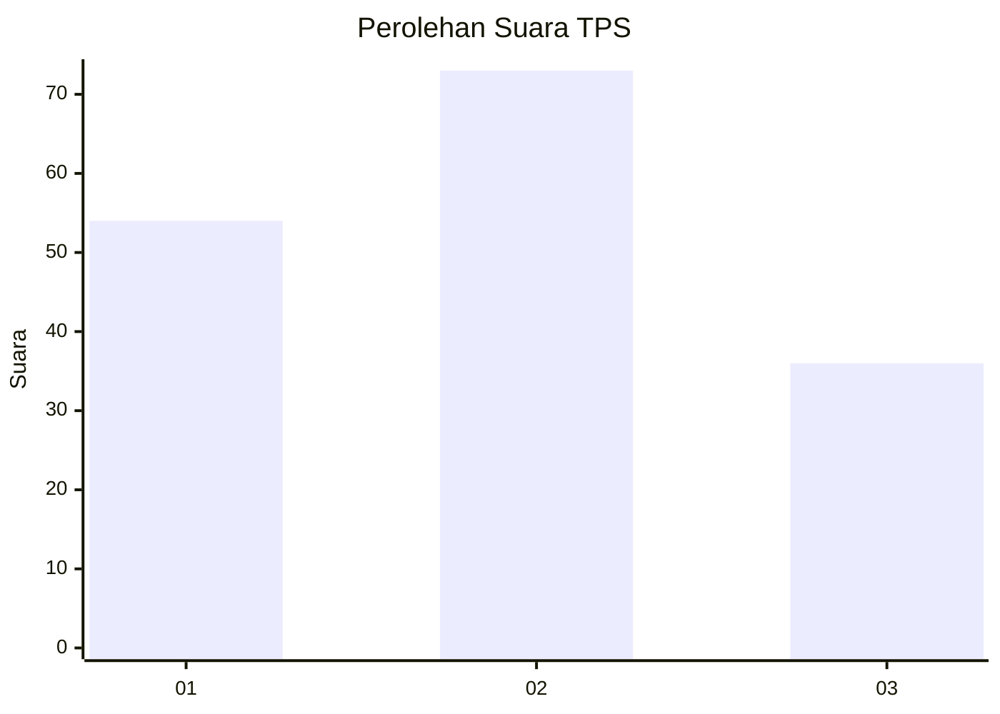
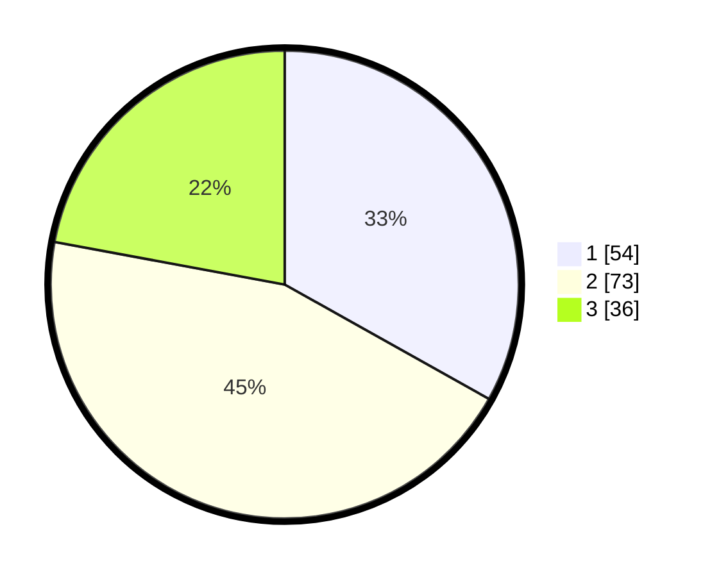

# Hasil

## Grafik

## Tabel

| No. | Nama Paslon    | Suara | Suara (raw) | Persentase |
|:--- |:-------------- | -----:| -----------:| ----------:|
| 1   | ANIES MUHAIMIN | 54    | [54][p-1]   | 33,13      |
| 2   | PRABOWO GIBRAN | 73    | [73][p-2]   | 44,79      |
| 3   | GANJAR MAHFUD  | 36    | [36][p-3]   | 22,09      |

[p-1]: https://github.com/gigit-pemilu/pemilu-2024-35-jawa-timur/blob/main/pilpres/hitung-suara/sub/35-jawa-timur/sub/09-jember/sub/03-sumberbaru/sub/2010-karangbayat/sub/019-tps/sub/paslon-1.txt
[p-2]: https://github.com/gigit-pemilu/pemilu-2024-35-jawa-timur/blob/main/pilpres/hitung-suara/sub/35-jawa-timur/sub/09-jember/sub/03-sumberbaru/sub/2010-karangbayat/sub/019-tps/sub/paslon-2.txt
[p-3]: https://github.com/gigit-pemilu/pemilu-2024-35-jawa-timur/blob/main/pilpres/hitung-suara/sub/35-jawa-timur/sub/09-jember/sub/03-sumberbaru/sub/2010-karangbayat/sub/019-tps/sub/paslon-3.txt

## Foto C Plano

https://sirekap-obj-formc.kpu.go.id/e489/pemilu/ppwp/35/09/03/20/10/3509032010019-20240214-214508--161f9e9e-aeb3-4717-be79-3b8fd3e7d7fa.jpg

https://sirekap-obj-formc.kpu.go.id/e489/pemilu/ppwp/35/09/03/20/10/3509032010019-20240215-094323--9e5736c2-ca39-46d3-879e-fd099e4e5097.jpg

https://sirekap-obj-formc.kpu.go.id/e489/pemilu/ppwp/35/09/03/20/10/3509032010019-20240214-214451--adca59c8-42b1-43be-b7da-916b5e00b99f.jpg

## Metadata

| Key        | Value               |
| ---------- | ------------------- |
| Time Stamp | 2024-02-25 11:00:00 |

