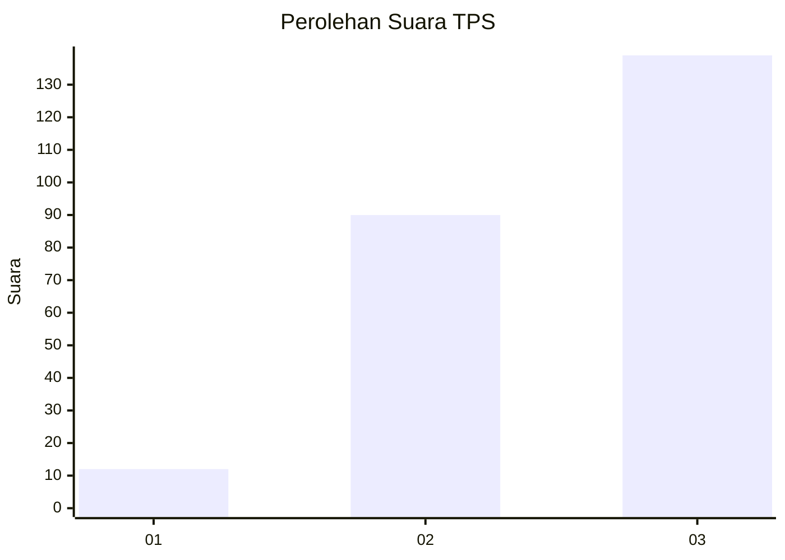
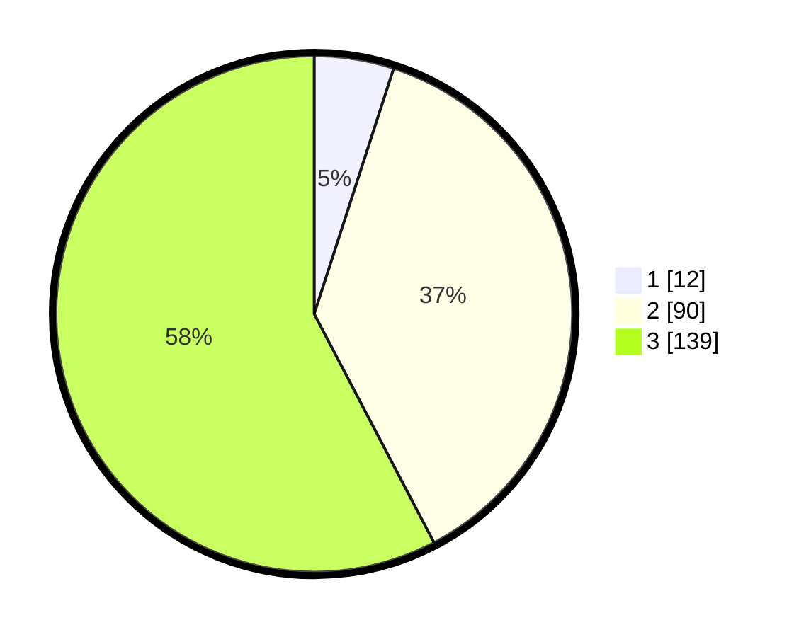

# Hasil

## Grafik

## Tabel

| No. | Nama Paslon    | Suara | Suara (raw) | Persentase |
|:--- |:-------------- | -----:| -----------:| ----------:|
| 1   | ANIES MUHAIMIN | 12    | [12][p-1]   | 4,98       |
| 2   | PRABOWO GIBRAN | 90    | [90][p-2]   | 37,34      |
| 3   | GANJAR MAHFUD  | 139   | [139][p-3]  | 57,68      |

[p-1]: https://github.com/gigit-pemilu/pemilu-2024-35-jawa-timur/blob/main/pilpres/hitung-suara/sub/35-jawa-timur/sub/09-jember/sub/03-sumberbaru/sub/2010-karangbayat/sub/022-tps/sub/paslon-1.txt
[p-2]: https://github.com/gigit-pemilu/pemilu-2024-35-jawa-timur/blob/main/pilpres/hitung-suara/sub/35-jawa-timur/sub/09-jember/sub/03-sumberbaru/sub/2010-karangbayat/sub/022-tps/sub/paslon-2.txt
[p-3]: https://github.com/gigit-pemilu/pemilu-2024-35-jawa-timur/blob/main/pilpres/hitung-suara/sub/35-jawa-timur/sub/09-jember/sub/03-sumberbaru/sub/2010-karangbayat/sub/022-tps/sub/paslon-3.txt

## Foto C Plano

https://sirekap-obj-formc.kpu.go.id/9453/pemilu/ppwp/35/09/03/20/10/3509032010022-20240215-131257--55e8d9d5-cd78-4e6d-85cc-7bea10d22751.jpg

https://sirekap-obj-formc.kpu.go.id/9453/pemilu/ppwp/35/09/03/20/10/3509032010022-20240215-130445--2a9768cf-e21f-41fd-aac6-74dcfc3b5d42.jpg

https://sirekap-obj-formc.kpu.go.id/9453/pemilu/ppwp/35/09/03/20/10/3509032010022-20240215-131507--ea327366-491f-4091-b556-a119a15f8fca.jpg

## Metadata

| Key        | Value               |
| ---------- | ------------------- |
| Time Stamp | 2024-02-25 17:00:00 |

