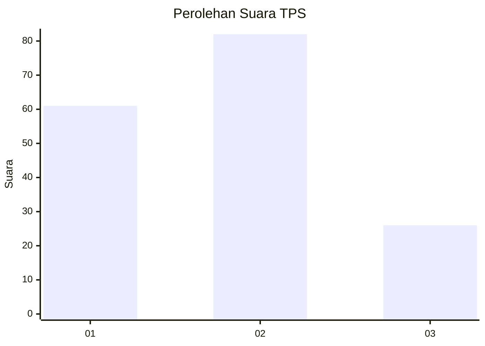
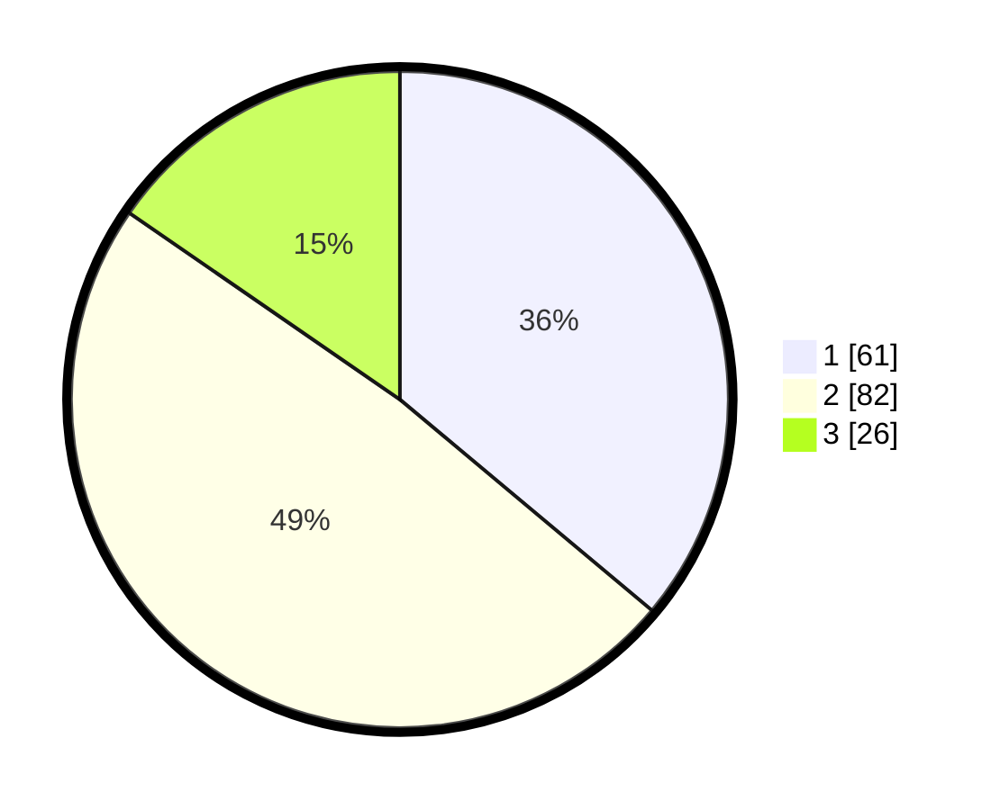

# Hasil

## Grafik

## Tabel

| No. | Nama Paslon    | Suara | Suara (raw) | Persentase |
|:--- |:-------------- | -----:| -----------:| ----------:|
| 1   | ANIES MUHAIMIN | 61    | [61][p-1]   | 36,09      |
| 2   | PRABOWO GIBRAN | 82    | [82][p-2]   | 48,52      |
| 3   | GANJAR MAHFUD  | 26    | [26][p-3]   | 15,38      |

[p-1]: https://github.com/gigit-pemilu/pemilu-2024-35-jawa-timur/blob/main/pilpres/hitung-suara/sub/35-jawa-timur/sub/09-jember/sub/03-sumberbaru/sub/2010-karangbayat/sub/023-tps/sub/paslon-1.txt
[p-2]: https://github.com/gigit-pemilu/pemilu-2024-35-jawa-timur/blob/main/pilpres/hitung-suara/sub/35-jawa-timur/sub/09-jember/sub/03-sumberbaru/sub/2010-karangbayat/sub/023-tps/sub/paslon-2.txt
[p-3]: https://github.com/gigit-pemilu/pemilu-2024-35-jawa-timur/blob/main/pilpres/hitung-suara/sub/35-jawa-timur/sub/09-jember/sub/03-sumberbaru/sub/2010-karangbayat/sub/023-tps/sub/paslon-3.txt

## Foto C Plano

https://sirekap-obj-formc.kpu.go.id/4dfd/pemilu/ppwp/35/09/03/20/10/3509032010023-20240215-093535--06705074-0a6d-41b4-80c7-29925ea57947.jpg

https://sirekap-obj-formc.kpu.go.id/4dfd/pemilu/ppwp/35/09/03/20/10/3509032010023-20240215-093718--64552504-353e-4231-b344-b5e36efa7440.jpg

https://sirekap-obj-formc.kpu.go.id/4dfd/pemilu/ppwp/35/09/03/20/10/3509032010023-20240215-093824--cbbbeb6b-ba87-46c0-8e12-9b024d8f3a32.jpg

## Metadata

| Key        | Value               |
| ---------- | ------------------- |
| Time Stamp | 2024-02-15 12:00:28 |

