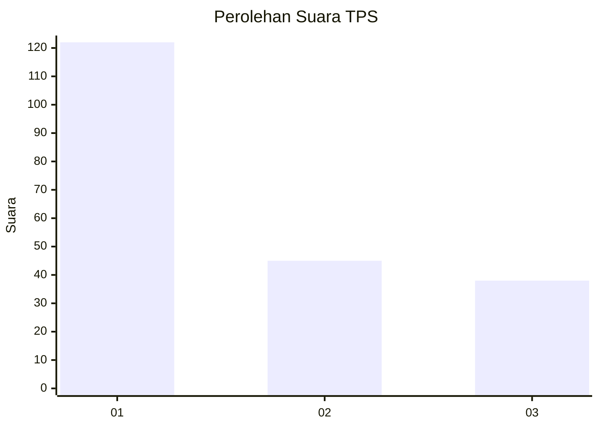
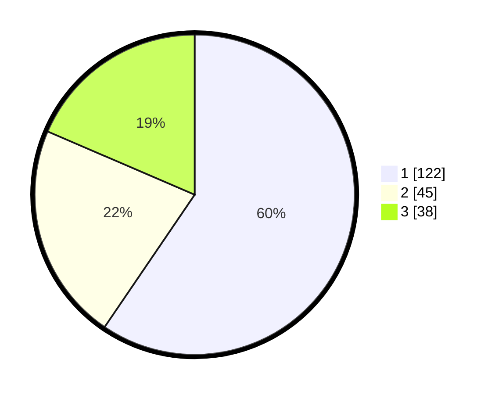

# Hasil

## Grafik

## Tabel

| No. | Nama Paslon    | Suara | Suara (raw) | Persentase |
|:--- |:-------------- | -----:| -----------:| ----------:|
| 1   | ANIES MUHAIMIN | 122   | [122][p-1]  | 59,51      |
| 2   | PRABOWO GIBRAN | 45    | [45][p-2]   | 21,95      |
| 3   | GANJAR MAHFUD  | 38    | [38][p-3]   | 18,54      |

[p-1]: https://github.com/gigit-pemilu/pemilu-2024/blob/main/pilpres/hitung-suara/sub/35-jawa-timur/sub/09-jember/sub/03-sumberbaru/sub/2010-karangbayat/sub/025-tps/sub/paslon-1.txt
[p-2]: https://github.com/gigit-pemilu/pemilu-2024/blob/main/pilpres/hitung-suara/sub/35-jawa-timur/sub/09-jember/sub/03-sumberbaru/sub/2010-karangbayat/sub/025-tps/sub/paslon-2.txt
[p-3]: https://github.com/gigit-pemilu/pemilu-2024/blob/main/pilpres/hitung-suara/sub/35-jawa-timur/sub/09-jember/sub/03-sumberbaru/sub/2010-karangbayat/sub/025-tps/sub/paslon-3.txt

## Foto C Plano

https://sirekap-obj-formc.kpu.go.id/f276/pemilu/ppwp/35/09/03/20/10/3509032010025-20240214-200805--4b09f8c6-9b11-49ca-a6e8-11923581d130.jpg

https://sirekap-obj-formc.kpu.go.id/f276/pemilu/ppwp/35/09/03/20/10/3509032010025-20240214-201412--97e704f6-e705-43b9-8416-c987bc5b2643.jpg

https://sirekap-obj-formc.kpu.go.id/f276/pemilu/ppwp/35/09/03/20/10/3509032010025-20240214-201538--214b922e-776a-43f0-b457-4d3fde50b300.jpg

## Metadata

| Key        | Value               |
| ---------- | ------------------- |
| Time Stamp | 2024-02-15 15:00:29 |

