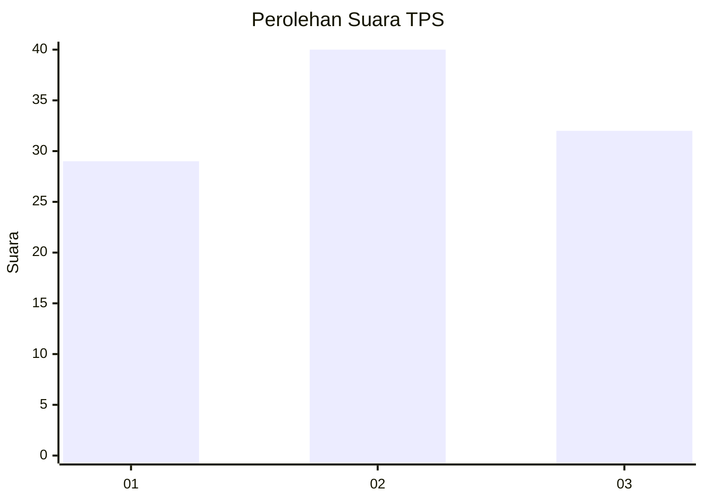
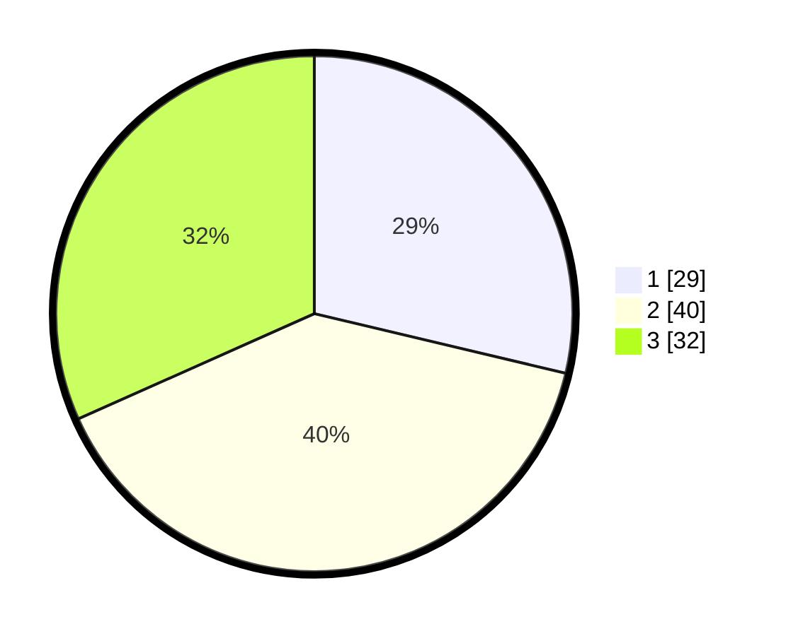

# Hasil

## Grafik

## Tabel

| No. | Nama Paslon    | Suara | Suara (raw) | Persentase |
|:--- |:-------------- | -----:| -----------:| ----------:|
| 1   | ANIES MUHAIMIN | 29    | [29][p-1]   | 28,71      |
| 2   | PRABOWO GIBRAN | 40    | [40][p-2]   | 39,60      |
| 3   | GANJAR MAHFUD  | 32    | [32][p-3]   | 31,68      |

[p-1]: https://github.com/gigit-pemilu/pemilu-2024-35-jawa-timur/blob/main/pilpres/hitung-suara/sub/35-jawa-timur/sub/09-jember/sub/03-sumberbaru/sub/2010-karangbayat/sub/027-tps/sub/paslon-1.txt
[p-2]: https://github.com/gigit-pemilu/pemilu-2024-35-jawa-timur/blob/main/pilpres/hitung-suara/sub/35-jawa-timur/sub/09-jember/sub/03-sumberbaru/sub/2010-karangbayat/sub/027-tps/sub/paslon-2.txt
[p-3]: https://github.com/gigit-pemilu/pemilu-2024-35-jawa-timur/blob/main/pilpres/hitung-suara/sub/35-jawa-timur/sub/09-jember/sub/03-sumberbaru/sub/2010-karangbayat/sub/027-tps/sub/paslon-3.txt

## Foto C Plano

https://sirekap-obj-formc.kpu.go.id/c0b8/pemilu/ppwp/35/09/03/20/10/3509032010027-20240214-221809--6cb119ac-569a-45e9-958c-af4efc474f0b.jpg

https://sirekap-obj-formc.kpu.go.id/c0b8/pemilu/ppwp/35/09/03/20/10/3509032010027-20240214-221919--7cec96f0-cc03-4962-861a-1426e929b91f.jpg

https://sirekap-obj-formc.kpu.go.id/c0b8/pemilu/ppwp/35/09/03/20/10/3509032010027-20240214-222012--bf554818-b069-4cfd-b70d-0871803c764c.jpg

## Metadata

| Key        | Value               |
| ---------- | ------------------- |
| Time Stamp | 2024-02-15 15:00:29 |

