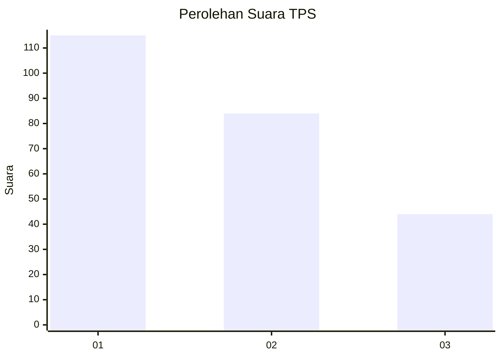
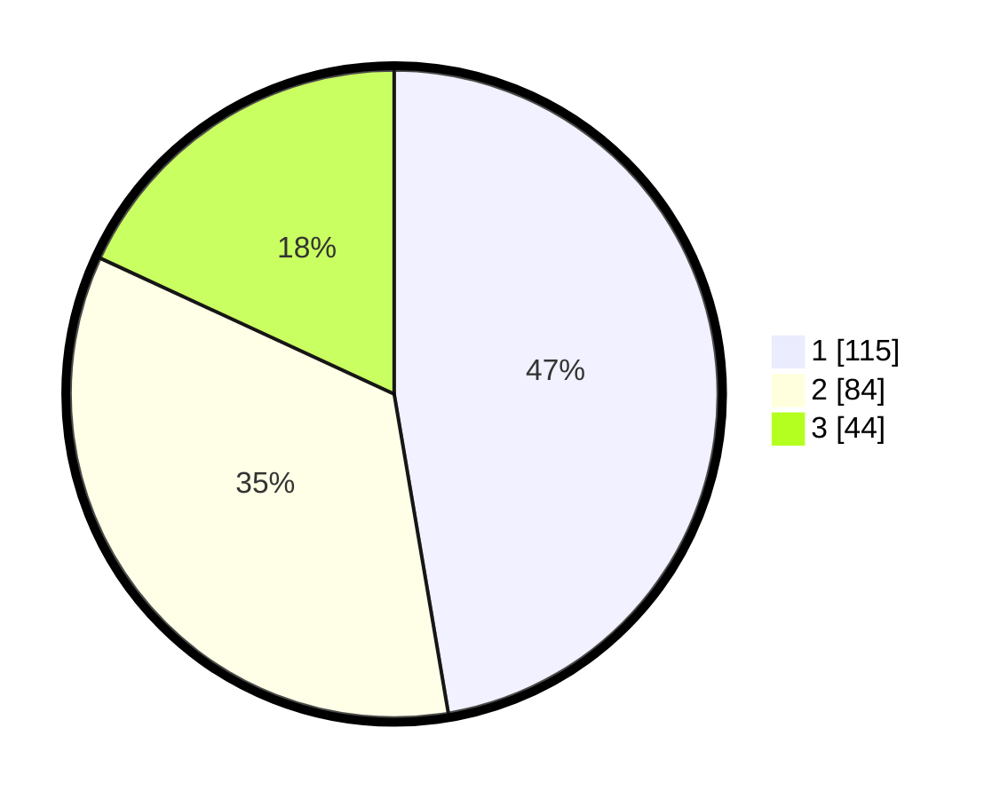

# Hasil

## Grafik

## Tabel

| No. | Nama Paslon    | Suara | Suara (raw) | Persentase |
|:--- |:-------------- | -----:| -----------:| ----------:|
| 1   | ANIES MUHAIMIN | 115   | [115][p-1]  | 47,33      |
| 2   | PRABOWO GIBRAN | 84    | [84][p-2]   | 34,57      |
| 3   | GANJAR MAHFUD  | 44    | [44][p-3]   | 18,11      |

[p-1]: https://github.com/gigit-pemilu/pemilu-2024-35-jawa-timur/blob/main/pilpres/hitung-suara/sub/35-jawa-timur/sub/09-jember/sub/03-sumberbaru/sub/2010-karangbayat/sub/029-tps/sub/paslon-1.txt
[p-2]: https://github.com/gigit-pemilu/pemilu-2024-35-jawa-timur/blob/main/pilpres/hitung-suara/sub/35-jawa-timur/sub/09-jember/sub/03-sumberbaru/sub/2010-karangbayat/sub/029-tps/sub/paslon-2.txt
[p-3]: https://github.com/gigit-pemilu/pemilu-2024-35-jawa-timur/blob/main/pilpres/hitung-suara/sub/35-jawa-timur/sub/09-jember/sub/03-sumberbaru/sub/2010-karangbayat/sub/029-tps/sub/paslon-3.txt

## Foto C Plano

https://sirekap-obj-formc.kpu.go.id/262a/pemilu/ppwp/35/09/03/20/10/3509032010029-20240214-231951--03b32d59-74a9-40ab-8165-cb1479a17c49.jpg

https://sirekap-obj-formc.kpu.go.id/262a/pemilu/ppwp/35/09/03/20/10/3509032010029-20240214-232523--64731792-3633-4a27-9166-04ce78920d77.jpg

https://sirekap-obj-formc.kpu.go.id/262a/pemilu/ppwp/35/09/03/20/10/3509032010029-20240215-080425--6df0296a-eef3-40f1-8c99-e68780bd4a50.jpg

## Metadata

| Key        | Value               |
| ---------- | ------------------- |
| Time Stamp | 2024-02-16 13:00:29 |

